# ABDB Economy Simulation — Methodology Reference

**Audience:** an LLM (or human) continuing this work. It explains HOW every source is simulated,
how the calendar drives cadence and duration, how segmentation flows through everything, and the
conceptual differences between leaderboard, streak, and milestone events. It reflects the code as
shipped in `EcoGainsSim_v4.gs` / `EcoGainsSim_Daily.gs` / `EcoGainsSim_PBP.gs` /
`SimPerSegmentFill.gs` against workbook `NEW_LIVEOPS_CALENDAR_ECO (10).xlsx`.

**Reading order for a new session:** `HAND_OFF.md` (project history) → `SIMULATION_PLAN.md`
(per-source specs + decisions log D1–D15) → this document (method) → `source_docs/` (per-source
game mechanics) → the code. `CLAUDE.md` holds workspace conventions.

**How this document is organised**
- **Part A — Model & machinery** (§1–§5): the core equation, the [variable glossary](#3-variables--data-sources-the-glossary) (every formula symbol links here), and the shared machinery.
- **Part B — Per-source simulations** (§6): one subsection per source, each written as **Overview → Flow chart → Step by step → In plain words → The formula → How did you simulate this?** (In plain words = a low-jargon ELI-11 recap; The formula = the source's full math with every variable linked to the [glossary](#3-variables--data-sources-the-glossary), expanded sub-formulas, a plain-word key, and Wikipedia links for the maths terms; How did you simulate this? = a first-person "first I… then I…" walkthrough for a reader with no project context, closing with two worked examples hand-traced from real workbook (10) data). The three families you most often touch have their own clearly-named sections:
  - [§6.4 Score-based leaderboards: Kite Festival & Target Day](#64-score-based-leaderboards-kite-festival--target-day)
  - [§6.5 Rank leaderboards: Bomb's / Chuck's / Red's Challenge, Level Race, Flash Race](#65-rank-leaderboards-bombs--chucks--reds-challenge-level-race-flash-race)
  - [§6.6 Collections: Hatchling Hideaway, Jigsaw, Bomb's Ballet, Photoshoot](#66-collections-hatchling-hideaway-jigsaw-bombs-ballet-photoshoot)
- **Part C — Views, plumbing, verification** (§7–§13). Includes the [§13 Sim per Segment rollup](#13-the-sim-per-segment-rollup-simpersegmentfillgs--the-sim-per-segment-sheet) (gains + per-active-player NET).

**Data-source markers (used throughout Part B):** 📊 = a telemetry sheet (`data_*`, the measured / statistical inputs) · ⚙️ = a config/ladder sheet (rewards, requirements, durations) · 🗓️ = a calendar grid (`cal_curr` / `cal_new`).

---

# Part A — Model & machinery

## 1. The core idea: anchor on telemetry, simulate only what changed

The simulation compares two 33-day LiveOps calendars — `cal_curr` (what runs today) and `cal_new`
(the redesign) — per **engagement segment × payer flag × source category × resource**. The output
unit is **per-earner gains over the 33-day window** ("what a player who earned this resource from
this source got, on average").

The central equation for anchored sources is:

> **[SIMULATED](#measured)\[res] = [measured](#measured)\[res] × [R](#r-reward-ratio)\[res] × [D](#d-duration-multiplier) × [T](#t-cadence-and-reach)**

Anchoring means we never price a live event's rewards bottom-up from config when telemetry exists;
we only *scale reality* by what changed. This automatically absorbs mechanics we can't model
(matchmaking, rank distributions, endless gates, loop grinding) because they are already inside the
measured number.

**Three departures from anchoring:**
- **Carried sources** (nothing changed / no schedule): SIMULATED = measured, DIFF = 0.
- **Bottom-up sources** (no valid anchor): [Rainbow Maker](#68-rainbow-maker) (brand-new, measured ≈ 0) and [Night Sky](#67-night-sky) (measured is A/B-diluted) are priced from their config ladder × a population distribution instead of a measured anchor.
- **Removal**: a simulated event with zero `cal_new` instances gets SIMULATED = 0 ([River Rush](#69-river-rush)).

**[DIFF](#measured) = SIMULATED − measured** is the deliverable: the real per-earner movement caused
by the redesign. Cadence differences are *supposed* to show up there.

---

## 2. Registry & dispatch (one function per source — decision D15)

`CATEGORY_ORDER` (25 rows, must match the `EcoGainsSim_HC` block rows 8–32) drives the spill order.
The `SOURCES` registry maps each category → its own named simulator; **anything unlisted is
carried**:

| Category | Simulator | §  | Model |
|---|---|---|---|
| Ads, Core, Other, Team Event, Team Race, FlowerCoop, IAPs, Flock Flurry | *(carried)* | [6.1](#61-carried-sources) | = measured |
| Season Pass (Free) | `simSeasonPass` | [6.11](#611-season-pass-spt-tier-coupling) | measured × tier-cum ratio × R_challenge × T (D=1) — since 2026-07-10 (D16) |
| Core | `simCore` | [6.2](#62-core--saga) | = measured (carried) |
| Saga | `simSaga` | [6.2](#62-core--saga) | measured × per-resource ratio |
| Daily Gift | `simDailyGift` | [6.3](#63-daily-gift) | measured, HC × streak-weighted ratio |
| Kite Festival, Target Day | `simKiteFestival`, `simTargetDay` | [6.4](#64-score-based-leaderboards-kite-festival--target-day) | measured × R × T (D=1) |
| Bomb / Chuck / Red Challenge, Level Race, Flash Race | `simBombChallenge` … `simFlashRace` | [6.5](#65-rank-leaderboards-bombs--chucks--reds-challenge-level-race-flash-race) | measured × R × T (D=1) |
| Hatchling Hideaway, Jigsaw, Bomb's Ballet, Photoshoot | `simHatchlingHideaway` … `simPhotoshoot` | [6.6](#66-collections-hatchling-hideaway-jigsaw-bombs-ballet-photoshoot) | measured × R × D × T |
| Daily Night Sky Prize | `simNightSky` | [6.7](#67-night-sky) | bottom-up (shipped OFF → carried) |
| Rainbow Maker | `simRainbowMaker` | [6.8](#68-rainbow-maker) | bottom-up survival-weighted |
| River Rush | `simRiverRush` | [6.9](#69-river-rush) | calendar-driven → 0 today |

Each function is a thin module declaring its inputs (calendar label, accrual key, config sheet) and
delegating math to the shared helpers described in the [glossary](#3-variables--data-sources-the-glossary):
`timedCore_`, `leaderboardSim_`, `collectionSim_`, `rewardR_`, `survival_`, `reachSum_`,
`accrualD_`.

---

## 3. Variables & data sources (the glossary)

Every formula symbol used in Part B links here. All inputs are read **LIVE at recalc** (decision
D12: no numbers in code).

### The data sheets (📊 telemetry)

| Sheet | Key → value | Used for |
|---|---|---|
| `data_gains` | `engagement_segment \| payer_flag \| category \| resource` → `amount_per_earner` | the [measured](#measured) anchor. Segments are RAW labels `A. 0`, `B. 1-9` … `F. 100+`. The query emits only amount>0 rows ⇒ **a missing row is a legitimate measured 0.** |
| `data_seg_beh` | `segment \| payer_flag` (merged labels `0-9`…`100+`) | `weekday_active_rate`/`weekend_active_rate` ([p_day](#reach-and-p_day) for reach), `login_streak_p50/75/90` (Daily Gift). (`daily_max_streak_p*` still present but no longer used — Night Sky moved to `data_streaks`.) |
| `data_event_accrual` | `event_name \| payer_flag \| segment \| event_day` → `cum_token_share_p50` | the duration curves ([D](#d-duration-multiplier)) for collections. |
| `data_event_kite_accrual` | same shape | Kite's score-based curve. **PBP-only** since Kite was re-classified as a leaderboard (the 33-day engine no longer applies a D to Kite). |
| `data_RM` | `segment \| payer_flag` → `p10/p25/p50/p75/p90_matchables_window` | Rainbow Maker matchables distribution (per one 4-day window). |
| `data_streaks` | `segment \| payer_flag` → `max_streak_per_day_p25/50/75/90` | Night Sky streak distribution (clean, un-A/B-diluted; `ds.nsStreak`). Also the PBP sim's behaviour source. |
| `data_event_inst` | `event_name \| segment \| payer_flag` → `position_p25/50/75`, `final_balance_p25/50/75` | the [R-term](#r-reward-ratio) player distribution (`ds.eventInst`): rank quantiles for leaderboard R, progress survival for collection R. Also the PBP sim's placement/progress source. |
| `cal_curr` / `cal_new` (🗓️) | visual grids | instances → [T](#t-cadence-and-reach), [D](#d-duration-multiplier) durations (§5). |
| config pairs (⚙️) `c_saga(_v2)`, `c_day(_v2)`, `Race(_v2)`, `Ki/HH/BB/J/Ph/TaD(_v2)`, `RM`, `NS`, `SP(_v2)`, `SP_lb(_v2)` | | ladders, requirements, durations, R ratios. `SP` = season-pass 30-tier track (Cumul points ladder + FREE/PAID reward columns); `SP_lb` = Season Pass Challenge rank ladder. The `_v2` twins may be ABSENT — the engine then reads the base sheet for both sides (ratios 1). |

**Segment label mapping (`SEG_TO_GAINS`, decision D8).** Display segments are
`0-9, 10-19, 20-39, 40-99, 100+`. `SEG_TO_GAINS` maps `'0-9' → 'B. 1-9'` (NOT a merge of
A.0 ∪ B.1-9): every non-gains "0-9" dataset already describes B.1-9 players only, because A.0
players barely play and are excluded from behaviour queries. **A. 0** is a separate appendix
([§6.10](#610-a-0-appendix)).

**The 13-resource universe (fixed order, append-only):** HC (coins ONLY), Slingshot, Shuffle,
Comet, Red, Chuck, Bomb, UL Bomb, UL Chuck, UL Red, Unlimited Lives, **SPT, SPTx2** (season pass
tokens, appended 2026-07-10 per decision D16; SPTx2 is the double-value token — displayed as its
own column, weighted ×2 in season-pass tier progression). COOP Token / Avatar / star-daily items
remain out of scope. Before D16 the universe was 11 resources and Flash Race showed ≈0 because its
SPT payout was untracked; its SPT column is live now (HC stays ≈0 — it genuinely pays none).

---

### measured

The telemetry ground truth for the CURRENT calendar: `amount_per_earner` for this
`(segment, payer, category, resource)` from 📊 `data_gains` (`ds.dataRow`). SIMULATED is a scaling
of this number for every anchored source. **DIFF = SIMULATED − measured** is the headline output.
A *missing* `data_gains` row is a real measured 0, not a bug.

### R (reward ratio)

**What it represents:** how the reward config changed, per resource. `R[res] = E_v2 / E_base`,
where `E` is the ladder's expected payout for this `(segment, payer)` under the **measured player
distribution**. Because the base sheet holds the config that produced the [measured](#measured)
anchor, **R = 1 exactly until a `_v2` reward or requirement is edited** (project fact: `_v2`
initially changed only `EventDuration`; verified by a harness gate). Wired for **every timed source**
since 2026-07-06 (`rewardR_`).

Two flavours of `E`, by family:

- **Leaderboards** ([§6.4](#64-score-based-leaderboards-kite-festival--target-day),
  [§6.5](#65-rank-leaderboards-bombs--chucks--reds-challenge-level-race-flash-race)) — `lbE_`:
  `E = mean over the measured rank quantiles {position_p25, p50, p75} of ladder_payout(rank)`. Ranks
  come from 📊 `data_event_inst`; the ladder comes from the ⚙️ `Race` / `TaD` / `Ki` sheet (base)
  and its `_v2`. Because the ranks are held fixed across base and v2, R isolates the reward-per-rank
  change. No position data → falls back to the **pot ratio** (`Σ ladder_v2 / Σ ladder_base`,
  segment-blind). Kite additionally prices a **score-milestone term** (`Σ S(scoreReq) × reward`,
  [S](#s-survival-function) over `final_balance`).
- **Collections** ([§6.6](#66-collections-hatchling-hideaway-jigsaw-bombs-ballet-photoshoot)) —
  `collE_`: `E = Σ_k S(req_k) × reward_k`, [S](#s-survival-function) = survival over the measured
  `final_balance_p25/50/75` (📊 `data_event_inst`). Reward **and** requirement edits both move E. The
  requirement axis: Jigsaw / Bomb's Ballet read each sheet's **own native req column** (req edits flow
  fully); Hatchling Hideaway / Photoshoot have no native cumulative req column on the base sheet, so
  **both sides share the `_v2` EventReach helper column** as the req axis (reward edits flow; req
  edits only re-weight, flagged).

**Base-0 → v2-positive rule:** if `E_base = 0` but `E_v2 > 0`, there is no anchor to scale, so the
resource is **carried** (R left undefined → treated as 1). This is why adding *new* milestone rewards
to `TaD_v2` won't flow — TaD milestones pay 0 in the base config; that rework needs a bottom-up
score-reach model. Same rule as Saga items.

> **📐 Worked example — leaderboard `R[res]` (Red Challenge, segment 40-99).** `R[res]` is a
> **per-resource ratio of expected payout at your typical finishing rank** — a mean over 3 rank
> quantiles, *not* a sum over the whole ladder.
> - **Ladder** (⚙️ `Race`, HC by rank): `1→200, 2→100, 3→50, 4–10→20, 11+→(not on the board)`.
> - **Where this segment finishes** (📊 `data_event_inst` `position_p25/50/75`): ranks **3, 8, 15**.
> - `E_base[HC] = (ladder(3) + ladder(8) + ladder(15)) / 3 = (50 + 20 + 0) / 3 = 23.3` — rank 15 is
>   past the top-10 board, so it contributes **0** (this is why deep-finishing low segments get small `E`).
> - If `Race_v2` nerfs those ranks to `40 / 15 / 0`: `E_v2[HC] = (40 + 15 + 0)/3 = 18.3`.
> - **`R[HC] = E_v2 / E_base = 18.3 / 23.3 = 0.79`**, so `SIMULATED[HC] = measured × 0.79 × D(=1) × T`.
>
> The ranks are the **same** for base and v2 (the redesign changes rewards, not who finishes where), so
> `R` isolates the reward-per-rank change. **Today every event's `R = 1`** — only durations changed in
> `_v2`; `R` only moves once you edit a `_v2` reward (harness gate: `TaD_v2` Coins ×2 → Target Day HC ×2).

### D (duration multiplier)

**What it represents:** how an instance getting longer/shorter changes what one participant earns.
`D = curveShare(newDur) / curveShare(curDur)`, normalised at the CURRENT [modal duration](#modaldur)
(`accrualD_`). `curveShare(day)` = the median fraction of a participant's *own eventual instance
total* earned by day N, from the 📊 `data_event_accrual` curve (`cum_token_share_p50`), keyed
`(event, payer, segment)` with a `0-9` fallback.

- **Only collections use a real D.** Leaderboards pin **D = 1** (rank payouts are end-state; more days
  barely move relative rank). Always-on and bottom-up sources don't use D.
- **Shortening = interpolation** on observed days → reliable. **Lengthening = extrapolation** past
  observed days → marginal-slope extrapolation capped at proportional, low-confidence (moot today:
  every lengthening case sits on a saturated curve → D = 1).
- The curve is a p50 curve, so tail behaviour (heavy loopers on an added day) is invisible. Flagged,
  accepted.

> **📐 Worked example — `D` and `curveShare` (Photoshoot, 4d → 3d).** `curveShare(day)` = the median
> cumulative fraction of a participant's *own eventual total* banked by day N (📊 `data_event_accrual`).
> Photoshoot's curve: `day1 0.30 · day2 0.55 · day3 0.73 · day4 0.98`.
> - **Shortening 4→3:** `D = curveShare(3) / curveShare(4) = 0.73 / 0.98 = 0.74`. A participant in the
>   3-day version banks ~74% of the 4-day haul (one fewer day to accumulate → fewer milestones), so
>   `SIMULATED = measured × R(=1) × 0.74 × T`.
> - **Lengthening usually gives `D ≈ 1`** because the curve *saturates*: HH 3d→4d with `day3 0.99,
>   day4 1.00` → `D = 1.00 / 0.99 ≈ 1` (the extra day adds almost nothing).
> - **Segment-dependence** (historical Kite score curve): `D = 0.34 @0-9` rising to `0.57 @100+` —
>   whales bank score early, so a shorter event costs them less. (Kite is now a leaderboard with `D = 1`,
>   so this curve is PBP-only — but it's the clearest illustration of why the curve is kept per segment.)

### T (cadence and reach)

**What it represents:** how the *schedule* changed — how many times an event runs, how long each run
is, and which weekdays it occupies. `T = Σ_new reach(inst) / Σ_cur reach(inst)` (`timingRatio_`),
summed over the event's instances in each calendar. It is **not** an instance-count ratio — a longer
run catches more of a non-daily population, and weekend slots reach differently than weekday slots.
Uses 📊 `data_seg_beh` active rates via [reach](#reach-and-p_day), so T is per `(segment, payer)`.
Both sides 0 (no rate data) → T = 1 (fail-safe carry).

> **📐 Worked example — `T` (cadence).** Segment 0-9, weekday [reach](#reach-and-p_day) of a 1-day run
> ≈ `0.287`, a 2-day run ≈ `0.491`.
> - **Red's Challenge grows** (4×1d → 3×2d): `T = (3 × 0.491) / (4 × 0.287) = 1.474 / 1.147 = 1.29`.
>   *Fewer* instances but `T > 1` — three 2-day runs out-reach four 1-day runs.
> - **Chuck's shrinks** (5×1d → 2×2d): `T = (2 × 0.491) / (5 × 0.287) = 0.982 / 1.434 = 0.69`.
>
> So `T` is **reach-weighted, not an instance-count ratio** (that would be 0.75 and 0.40). And because
> `p_day` differs weekday vs weekend, **Flash Race** (15×1d on both sides, but slots moved
> weekday→weekend) lands at `T ≈ 0.99` — same count and length, but the weekend rate is a hair below weekday.

### reach and p_day

For one instance, **`reach(inst) = 1 − Π over inst.days of (1 − p_day)`** (`reachOne_`): the
probability the player touches the event at least once during its run. **`p_day`** is the player's
active rate that day: `weekend_active_rate` if the day is a weekend else `weekday_active_rate`, both
from 📊 `data_seg_beh`. **Weekend rule:** both calendars start Wednesday, so a day is a weekend
(Fri/Sat/Sun) when `((day − 1) % 7) ∈ {2, 3, 4}` (`isWeekend_`). A 1-day instance has
`reach = p_day` exactly — this is why summing reach over Night Sky's 33 one-day instances gives
`Σ p_day` = the player's expected number of active days.

> **📐 Worked example — `reach` (segment 0-9, `p_weekday ≈ 0.287`, all-weekday instance).**
> `reach = 1 − (1 − 0.287)^days`:
>
> | instance length | reach |
> |---|---|
> | 1 day | `1 − 0.713¹ = 0.287` |
> | 2 days | `1 − 0.713² = 0.491` |
> | 3 days | `1 − 0.713³ = 0.637` |
>
> Note the **diminishing returns**: a 2-day run reaches ~1.7× a 1-day run, *not* 2× — a player active on
> day 1 is already counted. This non-linearity is exactly why doubling an instance's length while halving
> its count does **not** cancel out in [T](#t-cadence-and-reach).

### S (survival function)

`survival_(points)` builds `S(x) = 1 − CDF(x)` from a piecewise-linear CDF through `(0,0)` plus the
given `(x, percentile)` points, with a linear tail beyond the last point at the preceding slope,
capped at 1. `S(req)` = the fraction of players whose relevant quantity reaches threshold `req`.
Degenerate input (no positive percentiles) → null → the caller carries. Three users, three
distributions:
- **Collection / leaderboard R** — over `final_balance_pXX` (progress), 📊 `data_event_inst`.
- **[Night Sky](#67-night-sky)** — over `max_streak_per_day_p25/50/75/90 × ` [NS_STREAK_N](#ns_streak_n), 📊 `data_streaks`.
- **[Rainbow Maker](#68-rainbow-maker)** — over `p10..p90_matchables_window × scale`, 📊 `data_RM`.
- **[Daily Gift](#63-daily-gift) weights** — over `login_streak_p50/75/90`, 📊 `data_seg_beh`.

For anything priced off the tail (past p90), also report the conservative `S = 0 beyond p90` bound
(the harness prints both).

### E and E_day

`E` = an **expected ladder payout per resource** under a population distribution — the building block
of both [R](#r-reward-ratio) (`lbE_` / `collE_`) and the bottom-up sims. `E_day` = the
[Night Sky](#67-night-sky) per-active-day expected payout, `E_day[res] = Σ_k S(CumStreakReq_k) × reward_k[res]`.

### modalDur

`modalDur_(instances)` = the **most common** instance duration in a calendar for one event. Used as
the current/new duration fed to [D](#d-duration-multiplier). A lone clipped instance (cut by the
window edge, e.g. a 2-day fragment of a longer run at the start of the window) is outvoted by the
modal duration, so it doesn't distort D — but its *real* day list is still used for
[reach](#reach-and-p_day).

### NS_STREAK_N

`NS_STREAK_N = 1.25` — the [Night Sky](#67-night-sky) **effective-streak factor** from the standalone
NS Excel study: a player tends to land ~a second streak of similar size over a day, and the factor
absorbs streak resets. Every streak percentile is multiplied by it before [S](#s-survival-function)
is built. Shared by the 33-day engine and the PBP sim.

---

## 4. Calendar machinery (parsing, precompute, canary)

### 4.1 The verified merge rule
The calendars are visual grids, rows 5–25, columns B..AH; **day = column − 1** (B = day 1, AH =
day 33). Rule: **each MERGED range = ONE instance whose duration is its column width; each filled
NON-merged cell = one 1-day instance; adjacent same-event cells are NEVER collapsed** (three filled
1-day cells = three 1-day events; two 2-wide merges side by side = two 2-day events). Aliases folded
before lookup: `Mystery Puzzle`/`Mystery Box` → `Jigsaw Puzzle`, `Chuck's Flash Race` → `Flash Race`.
Parsed instances are `{start, dur, days:[...]}` (1-indexed days).

### 4.2 Robustness (learned the hard way)
- Custom functions sometimes can't read merges → menu **EcoGainsSim ▸ Precompute calendars** parses
  with full permissions and writes `[calendar, event, start, dur]` rows to a hidden `cal_parsed`
  sheet, which the engine PREFERS over live parsing. Re-run it after editing merges (value edits are
  caught by `onEdit`; merge edits fire no trigger).
- **Namespace collision trap:** all Apps Script files share one global namespace; a test file
  defining `parseCalendarInstances_` with a different shape once silently overrode the engine's
  parser. `Context.get()` therefore passes every parsed calendar through `sanitizeCal_` (rebuilds
  `days` from `start/dur` whatever the shape), and `calParseTest.gs` defines no parser of its own.
- If a whole calendar parses EMPTY, [`timedCore_`](#62-core--saga) fail-safes to carried (diff 0,
  reads as "no change") rather than zeros.

### 4.3 The parse canary
**The Kite Festival row must DIFFER from measured** — it equals
`measured × ` [R](#r-reward-ratio)` × ` [T](#t-cadence-and-reach) (Kite re-classified 2026-07-06 as a
zero-sum leaderboard, D pinned 1; before that the canary direction was SHRINK via the old
score-curve D). With workbook (8)'s real `Ki_v2` edits that is `× 0.833 × 1.31 ≈ ×1.09`; with
untouched configs it was the old "GROW ≈ ×1.3". If every timed event row equals measured, the
calendar read failed → run Precompute.

---

# Part B — Per-source simulations

Each subsection below is **Overview → Flow chart → Step by step → In plain words → The formula →
How did you simulate this?**.
Formulas declare their variables and link them to the
[glossary](#3-variables--data-sources-the-glossary); data sources are marked 📊 (telemetry) /
⚙️ (config) / 🗓️ (calendar). The **In plain words** block is a deliberately low-jargon recap — read it
first if the formal description doesn't click. **The formula** block restates the whole
computation: every variable links to where its logic is explained, composite variables get their own
expanded sub-formula, each symbol is then decoded in plain words, and every maths term (mean, CDF,
percentile, …) links to an explainer. The closing **How did you simulate this?** block answers the
question as if asked by someone with no context on the project: a first-person "first I… then I…"
walkthrough in game terms, ending with two worked examples that use real workbook (10) numbers and
deliberately exercise different arithmetic paths (so together they show when T, D, R and the
survival function do and don't act). §6.1 (carried) and §6.10 (A. 0) skip that block — nothing is
actually simulated there.

All calendar-driven sources ([§6.4](#64-score-based-leaderboards-kite-festival--target-day)–[§6.6](#66-collections-hatchling-hideaway-jigsaw-bombs-ballet-photoshoot),
[§6.9](#69-river-rush)) share one dispatcher, `timedCore_`, whose branch logic is identical
everywhere:

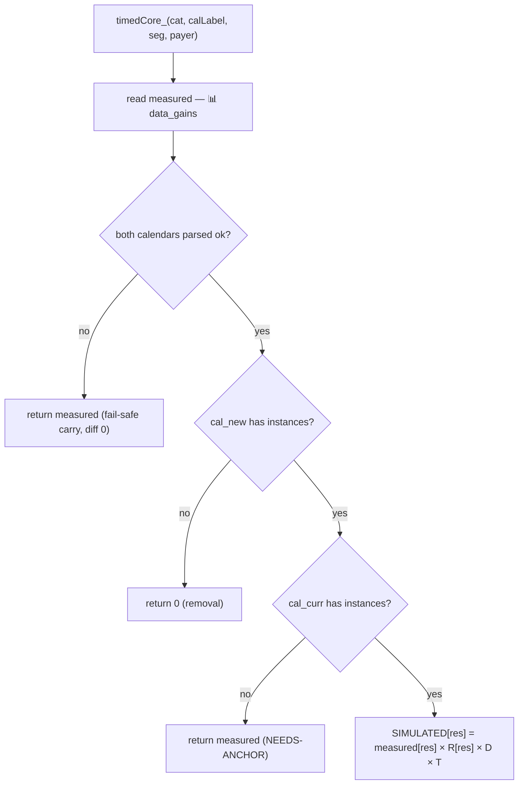

The families differ only in **what D and R are**: leaderboards force `D = 1`; collections compute D
from the accrual curve; both compute R from `data_event_inst`.

---

### 6.1 Carried sources

**Overview.** Ads, Core, Other, Team Event, Team Race, FlowerCoop, IAPs, Flock Flurry are not
listed in `SOURCES` (or Core, which is explicitly carried) — nothing about them changed in the
redesign, so SIMULATED = [measured](#measured) and DIFF = 0. Flock Flurry is carried in the gains
but still *scheduled*, so `ECOGAINS_CAL_STATS` shows its cadence. (Season Pass (Free) left this
family 2026-07-10 — it is simulated via SPT tier coupling, [§6.11](#611-season-pass-spt-tier-coupling).)

**Flow.**
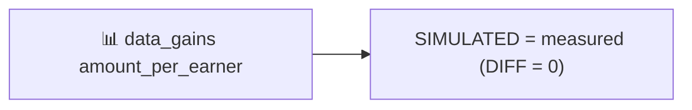

**Step by step.** `resultRow_` finds no simulator in `SOURCES` → returns
`measuredRow_(cat, seg, payer)` = [measured](#measured) unchanged.

**In plain words.** Nothing about these sources changes in the redesign, so we don't simulate them at
all. We simply copy the number telemetry says players actually earned (the "measured" value) into the
simulated column, and the difference is zero by definition.

**The formula.**

> **SIMULATED\[res] = [measured](#measured)\[res]** &nbsp;&nbsp; (and therefore **DIFF\[res] = SIMULATED\[res] − measured\[res] = 0**)

- **SIMULATED\[res]** — the simulation's answer for one resource (`res` runs over the 13 tracked
  resources: coins, boosters, unlimited-lives minutes, season-pass tokens…): what a player will earn
  from this source under the new calendar.
- **[measured](#measured)\[res]** — what players of this segment actually earned from this source in
  real life, read straight from telemetry (📊 `data_gains`). For a carried source the simulated value
  *is* the measured value, so the difference is exactly zero.

---

### 6.2 Core & Saga

**Overview.** `data_gains` splits base-game progression into **Core** (`chapter_complete`,
`PlayerLevelUpChest` — unchanged → carried) and **Saga** (`SagaPath` / `SagaChestRewards` — the nerf
line). Both are always-on, so [D](#d-duration-multiplier) = [T](#t-cadence-and-reach) = 1; only a
per-resource config ratio moves Saga.

**Flow.**
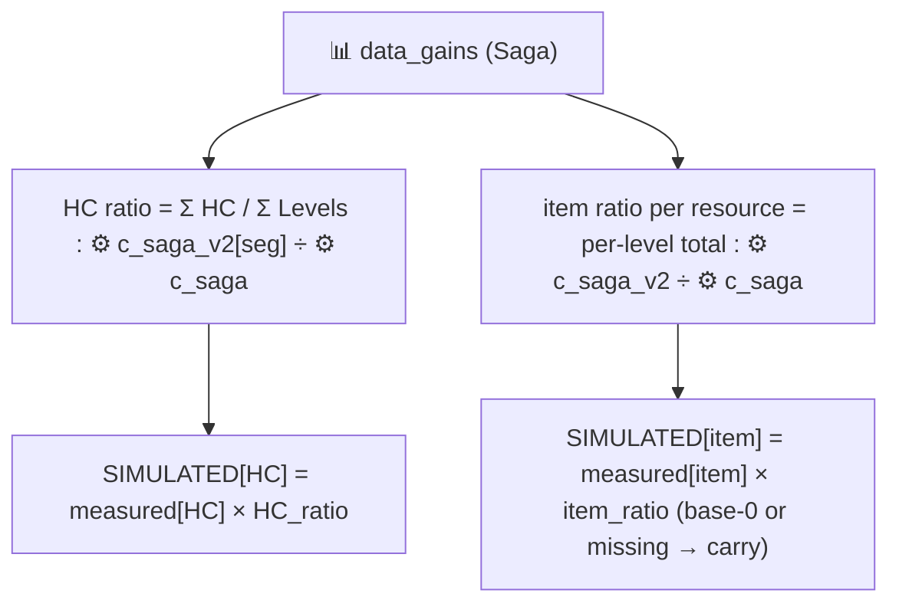

**Step by step (`simSaga`).**
1. **measured** ← 📊 `data_gains` for `Saga`.
2. **HC ratio** = `sagaCycleAvg_(v2) / sagaCycleAvg_(base)` where `cycleAvg = Σ HC_reward / Σ Levels_req`
   over the node ladder. Base ladder ← ⚙️ `c_saga`; v2 ladder ← ⚙️ `c_saga_v2` **segment column pair**
   (config-segmented D14; `readSagaV2_(seg)` picks the segment's own columns). Today = 0.80 on
   workbook (10) (0.60 v2 HC/level ÷ 0.75 base; an earlier v2 tuning gave ≈ 0.357).
3. **item ratios** (`sagaItemRatios_`) = `Σ v2 item / Σ base item` per level, from the per-node item
   columns (SPT..Unlimited Bomb) on both ⚙️ sheets. Column missing in v2 → **carry** (don't zero on a
   layout edit); base total 0 → **carry** (no anchor; a new saga item needs bottom-up).
4. `SIMULATED[HC] = measured[HC] × HC_ratio`; `SIMULATED[item] = measured[item] × item_ratio` (else
   measured). Core just returns measured.

**In plain words.** Core (rewards for finishing chapters and levelling up) didn't change, so we just
copy what players actually earned. Saga (the reward path along the level map) had its rewards re-tuned,
so we ask one question: *per level played, how much does the new reward ladder pay compared to the old
one?* For coins, we add up all the coins on the old ladder and divide by the number of levels it spans,
do the same for the new ladder, and divide the two numbers. That gives the HC ratio (how much richer or
poorer the new saga is per level — today 0.80, meaning players keep four fifths of the coins they
used to). We then multiply what players actually earned (the measured value) by that ratio — players
who only got halfway along the path in real life are still only halfway along in the simulation,
because their real progress is baked into the measured number. The same idea applies to each booster
item separately (item ratio = total of that item on the new ladder ÷ total on the old ladder). If the
old ladder never paid some item at all, there is nothing to scale — anything times zero is zero — so
that item is left at its measured value and flagged.

**The formula.**

> **Core:** SIMULATED\[res] = [measured](#measured)\[res]
>
> **Saga:** SIMULATED\[HC] = [measured](#measured)\[HC] × HC_ratio &nbsp;·&nbsp; SIMULATED\[item] = [measured](#measured)\[item] × item_ratio\[item]

where the two [ratios](https://en.wikipedia.org/wiki/Ratio) expand to:

> **HC_ratio = cycleAvg(⚙️ `c_saga_v2`) ÷ cycleAvg(⚙️ `c_saga`)**, with **cycleAvg = [Σ](https://en.wikipedia.org/wiki/Summation) HC_reward ÷ Σ Levels_req** over the ladder's nodes
>
> **item_ratio\[item] = Σ item on ⚙️ `c_saga_v2` ÷ Σ item on ⚙️ `c_saga`** &nbsp; (base total 0 or column missing → ratio treated as 1, i.e. carried)

- **[measured](#measured)** — what players actually earned from this source in real life (📊 `data_gains`).
- **[Σ (sigma)](https://en.wikipedia.org/wiki/Summation)** — the maths shorthand for "add all of these up".
- **cycleAvg** — "coins per level": all the coins printed on a saga ladder, divided by the total
  number of levels a player must clear to walk that ladder.
- **HC_ratio** — how coin-generous the new saga is per level compared to the old one (today 0.80:
  the v2 ladder pays 0.60 HC per level vs the base ladder's 0.75).
- **item_ratio\[item]** — the same comparison done separately for each booster item: total of that
  item on the new ladder ÷ total on the old ladder.
- **carried** — left at the measured value, because a ratio can't be formed (you can't scale a zero).

**How did you simulate this?** First I check what the redesign actually touches here: only the
reward config of the saga path (⚙️ `c_saga` → `c_saga_v2`). The saga runs every day in both
calendars, so there is no schedule to compare and no event length to compare — [T](#t-cadence-and-reach)
and [D](#d-duration-multiplier) never enter, and no [survival function](#s-survival-function) is
needed either (how far a player really gets along the path is already baked into their measured
number). Then I walk both config ladders node by node: I total the coins printed along one full
cycle of the path and divide by the levels it takes to walk it — "coins per level" for the old
ladder and for the new one — and divide the two, giving the HC ratio. Then I do the same per
booster item (total of that item on the new ladder ÷ total on the old). Finally I multiply what
players of this segment actually earned from the saga (📊 `data_gains`) by those ratios, resource
by resource. If the old ladder never paid an item at all, there is no anchor to scale, so that item
stays at its measured value (flagged). Core is even simpler: nothing changed, copy measured.

*Example 1 — Saga coins, 40-99 nonpayer.* The base ladder pays 75 HC across the 100 levels of one
cycle → 0.75 HC/level. The segment's `c_saga_v2` columns pay 60 HC across the same 100 levels →
0.60 HC/level. HC_ratio = 0.60 ÷ 0.75 = **0.80**. Measured saga coins are 400.44/earner, so
SIMULATED = 400.44 × 0.80 = **320.35 HC** (DIFF −80.09) — the player's real progress is kept, just
re-priced at the leaner coin tuning.

*Example 2 — booster items, same segment: one mechanism, four different fates.* Bomb boosters drop
from 0.03 to 0.01 per level → ratio ⅓ → measured 5.77 becomes **1.92**. Slingshot drops 0.01 → 0 →
ratio 0 → measured 4.31 becomes **0** (v2 deleted it, so the sim deletes it). Unlimited Lives is
untouched (2.65 → 2.65 per level, ratio 1) → the measured 577.02 minutes stay put. UL Red pays 0
on the BASE ladder → no anchor, ratio impossible → its measured 0.0004 is carried unchanged.

---

### 6.3 Daily Gift

**Overview.** A 7-day login ladder whose HC values were re-tuned in v2. Always-on
([D](#d-duration-multiplier) = [T](#t-cadence-and-reach) = 1); only HC moves, weighted by how likely
each login-streak day is reached.

**Flow.**
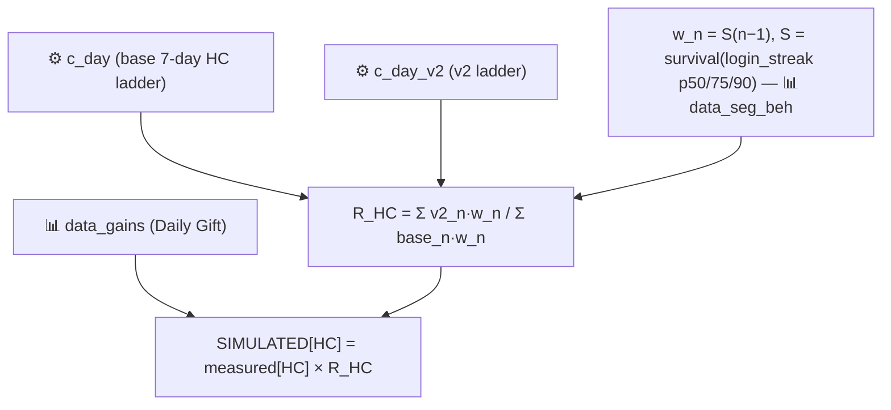

**Step by step (`simDailyGift` / `dailyGiftRatio_`).**
1. Read base and v2 ladders ← ⚙️ `c_day` / `c_day_v2`. If identical → R = 1.
2. Build [S](#s-survival-function) over `login_streak_p50/75/90` (📊 `data_seg_beh`). Weight
   `w_n = P(login streak ≥ n) = S(n−1)` for day `n = 1..7`.
3. `R_HC = Σ_n (v2_n · w_n) / Σ_n (base_n · w_n)`. Day 7's untouched 100 HC shields long-streak
   players; low-streak segments eat more of the nerf (workbook (10): R ≈ 0.61 @0-9 NP vs 0.65
   @40-99 NP vs a naive unweighted 0.714).
4. `SIMULATED[HC] = measured[HC] × R_HC`; other resources = measured.

**In plain words.** Daily Gift is a 7-day login ladder: log in day after day and each day's gift gets
bigger; miss a day and you restart at day 1. The redesign changed some of the coin amounts on that
ladder. We can't just compare the plain averages of the old and new ladders, because not every ladder
day is equally likely to be collected — almost everyone sees day 1, but only very regular players ever
see day 7. So we use login-streak data (how many days in a row players of this segment typically log
in) to estimate, for each ladder day, the share of players who actually reach it. With those shares as
weights, we compute the *weighted* average gift under the old ladder and under the new ladder, and
divide them — that is R_HC (the ratio saying how much the typical *collected* gift changed, rather
than the ladder on paper). Finally we multiply the coins players actually earned (the measured value)
by R_HC. This is why casual players eat more of a nerf than the raw config suggests: the untouched big
day-7 gift protects mostly the players who actually get there. Only coins were edited, so every other
resource is copied unchanged.

**The formula.**

> **SIMULATED\[HC] = [measured](#measured)\[HC] × R_HC** &nbsp;·&nbsp; SIMULATED\[other res] = measured\[other res]

where R_HC expands to:

> **R_HC = [Σ](https://en.wikipedia.org/wiki/Summation)ₙ (v2ₙ × wₙ) ÷ Σₙ (baseₙ × wₙ)** over ladder days n = 1…7
>
> **wₙ = [S](#s-survival-function)(n − 1)**, with **S(x) = 1 − [CDF](https://en.wikipedia.org/wiki/Cumulative_distribution_function)(x)** built from the login-streak [percentiles](https://en.wikipedia.org/wiki/Percentile) p50/p75/p90 (📊 `data_seg_beh`)

- **[measured](#measured)\[HC]** — the coins players actually collected from Daily Gift (📊 `data_gains`).
- **baseₙ / v2ₙ** — the coin gift printed on ladder day *n* in the old / new config (⚙️ `c_day` / `c_day_v2`).
- **wₙ** — day *n*'s weight: the estimated share of players who actually reach a login streak of *n*
  days (everyone "reaches" day 1; few reach day 7).
- **[S (survival function)](https://en.wikipedia.org/wiki/Survival_function)** — answers "what share
  of players is at or above x?". It is 1 minus the
  [CDF](https://en.wikipedia.org/wiki/Cumulative_distribution_function), which answers the opposite
  question, "what share is below x?".
- **[percentiles](https://en.wikipedia.org/wiki/Percentile)** — cut-points of the data: p75 = the
  streak length that 75% of players stay at or under.
- **R_HC** — the ratio of two [weighted averages](https://en.wikipedia.org/wiki/Weighted_arithmetic_mean):
  the typical *collected* gift under the new ladder ÷ under the old ladder, using the same weights on
  both sides so only the config change moves it.

**How did you simulate this?** First I read both 7-day gift ladders (⚙️ `c_day` / `c_day_v2`); if
they were identical I would stop right there with R = 1. Daily Gift is always-on, so — like the
saga — [T](#t-cadence-and-reach) and [D](#d-duration-multiplier) never enter. The one subtlety is
that comparing the two ladders by their plain totals would be wrong: the day-7 gift is only real
for players who actually log in seven days in a row. So I build a
[survival function](#s-survival-function) — this source's ONLY use of it — over the segment's
login-streak percentiles (📊 `data_seg_beh` p50/75/90): S(x) = the share of players whose login
streak reaches at least x days. Then I weight each ladder day n by wₙ = S(n−1), the share of
players who actually collect that day's gift. Then I compute the weighted total of the old ladder
and of the new ladder with the SAME weights and divide — that is R_HC. Finally I multiply the
segment's measured Daily Gift coins by R_HC; every other resource is copied unchanged (only coins
were edited).

*Example 1 — 0-9 nonpayer.* Ladders: base 22/0/0/27/0/33/100 HC, v2 10/0/0/10/0/10/100 (day 7
untouched). Login streaks p50 = 2, p75 = 5, p90 = 10 give weights w₁…w₇ = 1, .75, .50, .417, .333,
.25, .22. Weighted old = 22×1 + 27×.417 + 33×.25 + 100×.22 = 63.50; weighted new = 10 + 4.17 +
2.50 + 22.00 = 38.67. R_HC = 38.67 ÷ 63.50 = **0.609** — harsher than the naive unweighted
130 ÷ 182 = 0.714, because this casual segment rarely reaches the protected day-7 gift. Measured
120.66 HC × 0.609 = **73.47 HC**.

*Example 2 — 40-99 nonpayer, same config edit.* Longer login streaks (p50 = 3, p75 = 8, p90 = 20)
give fatter late-day weights (w₇ = 0.35): weighted old = 83.70, weighted new = 54.00, R_HC =
**0.645**. Measured 103.85 × 0.645 = **67.01 HC**. Identical nerf on paper, but the streakier
segment escapes more of it — exactly the effect the survival weighting exists to capture.

---

### 6.4 Score-based leaderboards: Kite Festival & Target Day

**Overview.** Both are **score events** — you accumulate a score/target across an instance and are
paid at instance end. **Kite Festival** pays by **rank in a zero-sum league of 60** (fixed pot
875 HC/league); **Target Day** is structurally a milestone+leaderboard hybrid, but its milestone
ladder pays 0 by design today (decision D3), so it is simulated as a **pure leaderboard**. Both pin
[D](#d-duration-multiplier) = 1 — rank/target payouts are end-state, so a longer instance barely
moves what a given placement earns — and let [T](#t-cadence-and-reach) carry the calendar movement
and [R](#r-reward-ratio) carry reward-ladder edits. They share the exact leaderboard code path with
[§6.5](#65-rank-leaderboards-bombs--chucks--reds-challenge-level-race-flash-race); the only structural
difference is that Kite's R also prices a **score-milestone term**.

*Why they are grouped apart from §6.5:* these two are the "score/target" events (a score axis the
player pushes), whereas §6.5 events are pure rank races. The PBP sim likewise calls them "score
events".

**Data at a glance:** 📊 `data_gains` (measured) · 📊 `data_seg_beh` (T) · 📊 `data_event_inst`
(`position_pXX` ranks + `final_balance_pXX` for Kite's score term) · ⚙️ `TaD`/`TaD_v2`, `Ki`/`Ki_v2`
(ladders) · 🗓️ `cal_curr`/`cal_new`.

**Flow.**
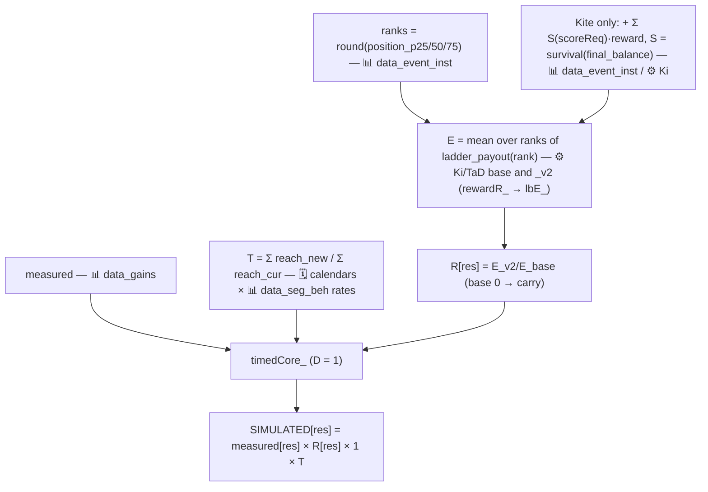

**Step by step.**
1. `simKiteFestival` / `simTargetDay` → `leaderboardSim_` → `timedCore_` with the D-function pinned to
   return **1**.
2. **measured** ← 📊 `data_gains`. Apply the shared `timedCore_` branch logic (removal / carry / both).
3. **[T](#t-cadence-and-reach)** from 🗓️ `cal_curr`/`cal_new` reach sums (📊 `data_seg_beh` rates).
   Target Day's 3×7d → 15×1d gives T ≈ 1.8 (15 one-day boards = 15 rank chances); Kite's 3×7d → 5×3d
   gives T ≈ 1.3.
4. **[R](#r-reward-ratio)** (`rewardR_` → `lbE_`): read `inst = ds.eventInst(name, seg, payer)` ← 📊
   `data_event_inst`. Ranks = `round(position_p25/50/75)`, each `max(1, ·)`. Build the ladder from ⚙️
   `Ki`/`TaD` (rows keyed by their position cell, ordinal fallback). `E = mean over the ranks of
   ladder_payout(rank)`, computed for base and `_v2`. **Kite additionally** adds
   `Σ_ms S(scoreReq_ms) × reward_ms` with [S](#s-survival-function) over `final_balance_p25/50/75` —
   so milestone-reward edits on `Ki_v2` flow. `R[res] = E_v2[res] / E_base[res]` (base 0 → carry).
5. `SIMULATED[res] = measured[res] × R[res] × 1 × T`.

**Zero semantics.** Low segments legitimately earn 0 HC (they never place top-3) — check booster
columns before declaring a row dead. **If TaD milestones ever pay rewards,** it must move to the
milestone family with a cumulative-SCORE-by-day curve (the generic token curve saturates day 1 and
would double-count — the original "Target Day is broken" bug).

**In plain words.** In these two events you play to push up a score, but what you're mostly paid for
at the end is your *rank* against other players. Rank is relative: give everyone an extra day and
everyone scores more, but the finishing order — and so the payout — barely moves. That's why event
length is deliberately ignored here (D, the duration multiplier, is pinned at 1). Two things can still
change the outcome:

- **The schedule.** T (the cadence-and-reach ratio) works like this: for every scheduled run in the
  new calendar, estimate the chance the player shows up at least once during that run (built from how
  often players of this segment play on weekdays vs weekends), and add those chances up. Do the same
  for the current calendar, and divide new by current. More runs, longer runs, or runs sitting on
  better days all push T up; T ≈ 1.3 for Kite means the new schedule gives a player about 30% more
  event participations than the old one.
- **The prize table.** R (the reward ratio) starts from where players of this segment *typically
  finish* — telemetry gives three typical finishing ranks (the 25th, 50th and 75th percentile). We
  look up what the old prize table pays at those three ranks, what the new prize table pays at the
  same three ranks, and divide the two averages. Kite has one extra piece: besides rank prizes it pays
  fixed rewards for passing score thresholds, so its R also adds, for each threshold, its reward times
  the estimated chance of reaching that score (taken from players' real final scores).

The answer is then: what players actually earned (the measured value) × R × T. If nobody edits the
prize tables, R stays exactly 1 and only the schedule change moves the number.

**The formula.**

> **SIMULATED\[res] = [measured](#measured)\[res] × [R](#r-reward-ratio)\[res] × [D](#d-duration-multiplier) × [T](#t-cadence-and-reach)**, with **D = 1** by design

the composite terms expand to:

> **R\[res] = [E](#e-and-e_day)_v2\[res] ÷ E_base\[res]**, with **E\[res] = [mean](https://en.wikipedia.org/wiki/Arithmetic_mean)( ladder(rank_p25), ladder(rank_p50), ladder(rank_p75) )** — same three ranks on both sides
>
> **Kite only:** E also adds **[Σ](https://en.wikipedia.org/wiki/Summation)ₖ [S](#s-survival-function)(scoreReq_k) × reward_k**, with **S(x) = 1 − [CDF](https://en.wikipedia.org/wiki/Cumulative_distribution_function)(x)** over the final-score [percentiles](https://en.wikipedia.org/wiki/Percentile) (📊 `data_event_inst`)
>
> **T = Σ over `cal_new` runs of [reach](#reach-and-p_day)(inst) ÷ Σ over `cal_curr` runs of reach(inst)**, with **reach(inst) = 1 − [Π](https://en.wikipedia.org/wiki/Product_%28mathematics%29) over the run's days of (1 − p_day)**

- **[measured](#measured)\[res]** — what players of this segment actually earned from this event (📊 `data_gains`).
- **[R](#r-reward-ratio)\[res]** — "did the prize table change?": the
  [expected](https://en.wikipedia.org/wiki/Expected_value) payout of the new table ÷ the old one, at
  this segment's typical finishing spots. 1 = untouched.
- **[E](#e-and-e_day)** — that expected payout: the plain
  [average](https://en.wikipedia.org/wiki/Arithmetic_mean) of what the table pays at the three ranks.
- **ladder(rank)** — what the prize table (⚙️ `Ki`/`TaD` and their `_v2`) pays at a given rank; ranks
  below the board pay 0.
- **rank_p25/50/75** — the segment's typical finishing ranks as
  [percentiles](https://en.wikipedia.org/wiki/Percentile) (📊 `data_event_inst`): a quarter of players
  finish at or above rank_p25, half at or above rank_p50, and so on.
- **[S (survival function)](https://en.wikipedia.org/wiki/Survival_function)** — "what share of
  players reaches score x?" = 1 − the
  [CDF](https://en.wikipedia.org/wiki/Cumulative_distribution_function) ("what share stays below x?").
- **[D](#d-duration-multiplier)** — the duration multiplier, deliberately pinned to 1 here: rank
  payouts are end-state, so run length barely matters.
- **[T](#t-cadence-and-reach)** — the schedule ratio: summed show-up chances in the new calendar ÷ the
  current one.
- **[reach(inst)](#reach-and-p_day)** — the chance the player touches one run at least once.
  **[Π (pi)](https://en.wikipedia.org/wiki/Product_%28mathematics%29)** means "multiply together":
  multiplying the miss-chances (1 − p_day) of every day gives the chance of missing the *whole* run,
  and 1 minus that is the chance of catching it (the
  [complement trick](https://en.wikipedia.org/wiki/Complementary_event)).
- **[p_day](#reach-and-p_day)** — the chance this segment plays on a given day: the weekend rate on
  Fri/Sat/Sun, the weekday rate otherwise (📊 `data_seg_beh`).

**How did you simulate this?** First I take what players of this segment actually earned from the
event (📊 `data_gains`). Then I deliberately DON'T touch duration: rank payouts are end-state —
give the whole league an extra day and everyone's kite score rises together, so the finishing
order (and the payout) barely moves — which is why [D](#d-duration-multiplier) is pinned at 1 and
run-length edits change nothing here. What the calendar IS allowed to move is cadence: for each
run in each calendar I compute the chance the player shows up at least once (from their
weekday/weekend activity rates), sum those chances per calendar, and divide new by current —
that is [T](#t-cadence-and-reach), the only place the calendar enters. Then the prize tables:
telemetry gives the segment's three typical finishing ranks (`position_p25/50/75`, 📊
`data_event_inst`); I look up what the old ladder (⚙️ `Ki`/`TaD`) pays at exactly those three
ranks, average them, do the same on the `_v2` ladder, and divide — that is [R](#r-reward-ratio),
per resource. Kite has one extra piece, its score milestones: for those I use the
[survival function](#s-survival-function) over players' real final kite scores
(`final_balance_p25/50/75`) — S(scoreReq) = the share of players whose banked score reaches the
threshold — and add S × reward to both sides' expected payout. (That is the only survival use in
this family; rank pricing never needs one.) The answer is measured × R × T.

*Example 1 — Kite Festival, 40-99 nonpayer.* Typical finishing ranks 3 / 6 / 14. Base ⚙️ `Ki` at
those ranks pays 150 HC + 240 SPT + 1 Shuffle · 140 SPT + 1 Slingshot · 90 SPT + 1 Chuck; ⚙️
`Ki_v2` pays 125 HC + 150 SPT + 1 Shuffle · 90 SPT + 1 Slingshot · 60 SPT + 1 Red. So E_HC drops
(150+0+0)/3 = 50 → 125/3 = 41.67 → R_HC = **0.833**, and E_SPT drops 156.67 → 100 → R_SPT =
**0.638**. The single score milestone (100 kite score → 30 min Unlimited Lives) is passed by
virtually everyone — final scores start at p25 ≈ 19,424, so S(100) = 0.999 — and is identical on
both sheets, so it contributes ratio 1. Calendar: three runs (7d + 7d + 3d, summed reach 2.48)
become five 3-day runs (reach 3.25) → T = **1.31**. Results: HC 33.11 × 0.833 × 1.31 = **36.15**;
SPT 81.28 × 0.638 × 1.31 = **67.97** (a ladder nerf that survives a cadence buff); Chuck
0.018 × 0 = **0** (rank 14's Chuck was swapped for a Red — and since the base ladder pays no Red
at these ranks there is no Red anchor, so the measured Red 0.014 is carried and just rides T).

*Example 2 — Target Day, 40-99 payer.* A pure rank event (its milestone ladder pays 0 by design,
so no survival term at all). Typical ranks 1 / 2 / 5: base ⚙️ `TaD` pays 200 HC + 1 Comet ·
100 HC + 1 Shuffle · 1 Shuffle; ⚙️ `TaD_v2` pays 50 HC + 1 Comet · 25 HC + 1 Shuffle · 1 Bomb.
E_HC = 100 → 25 → R_HC = **0.25**. Calendar: three boards (7d, 7d, and a 2-day window clip; reach
2.31) become fifteen one-day boards, all sitting on Fri–Sun (reach 15 × 0.288 = 4.33) → T =
**1.87** — fifteen separate podiums instead of three. Net: 38.73 × 0.25 × 1.87 = **18.11 HC**. The
schedule nearly doubles this segment's opportunities, but the top-rank reward nerf outweighs it —
two dials, opposite directions, one multiplication.

---

### 6.5 Rank leaderboards: Bomb's / Chuck's / Red's Challenge, Level Race, Flash Race

**Overview.** Pure rank races: your payout depends on where you **place** against other players, from
a fixed top-N pot, not on absolute accumulation. [D](#d-duration-multiplier) = 1 (rank is relative —
if everyone gets an extra day, everyone scores more but ranks barely move).
[T](#t-cadence-and-reach) carries cadence/reach; [R](#r-reward-ratio) carries rank-ladder reward
edits. Same code path as [§6.4](#64-score-based-leaderboards-kite-festival--target-day) minus the
score-milestone term.

**Data at a glance:** 📊 `data_gains` (measured) · 📊 `data_seg_beh` (T) · 📊 `data_event_inst`
(`position_pXX`) · ⚙️ `Race`/`Race_v2` (all five share this sheet, different row blocks) · 🗓️
calendars.

**Flow.**
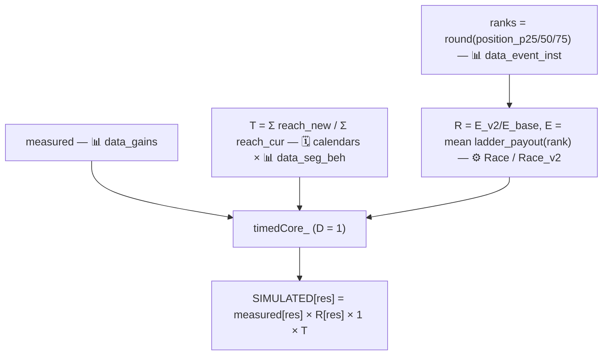

**Step by step.** Identical to [§6.4](#64-score-based-leaderboards-kite-festival--target-day) steps
1–5, except `lbE_` reads the ⚙️ `Race`/`Race_v2` block for the event and there is **no**
score-milestone term. Worked T values: Bomb 0.86, Chuck 0.69, Red 1.30, Level 0.86, Flash 0.99
(@0-9). Flash Race legitimately sims ≈0 in HC — its real payout is **SPT**, tracked as its own
column since 2026-07-10 (D16).

**Zero semantics.** As §6.4: HC 0 for a low segment with nonzero boosters is real rank economics.
Flash Race HC ≈ 0 everywhere is real (it pays SPT — check its SPT column instead).

**In plain words.** These five events are pure races: your payout depends only on where you finish
against other players, from a fixed prize table for the top ranks. The method is exactly the one
described in plain words under §6.4, minus Kite's score-threshold extra. Take what players actually
earned (the measured value); multiply by R (the reward ratio — the new prize table vs the old one,
compared at the three ranks players of this segment typically finish, so a nerf to rank 1 barely
touches a segment that usually finishes 15th); multiply by T (the cadence-and-reach ratio — how much
more or less scheduled opportunity the new calendar offers, where each run counts as the chance the
player shows up to it at all). Event length is ignored (D, the duration multiplier, = 1) because giving
everyone more time doesn't reorder the leaderboard much. One expected oddity: Flash Race shows ≈ 0
coins everywhere because its real payout is SPT (season pass tokens) — since 2026-07-10 that payout
appears in the SPT column; the coins zero is correct, not a bug.

**The formula.**

> **SIMULATED\[res] = [measured](#measured)\[res] × [R](#r-reward-ratio)\[res] × [D](#d-duration-multiplier) × [T](#t-cadence-and-reach)**, with **D = 1** by design

the composite terms expand to (identical to [§6.4](#64-score-based-leaderboards-kite-festival--target-day), minus Kite's score term):

> **R\[res] = [E](#e-and-e_day)_v2\[res] ÷ E_base\[res]**, with **E\[res] = [mean](https://en.wikipedia.org/wiki/Arithmetic_mean)( ladder(rank_p25), ladder(rank_p50), ladder(rank_p75) )** — ladder from ⚙️ `Race`/`Race_v2`, ranks from 📊 `data_event_inst`
>
> **T = [Σ](https://en.wikipedia.org/wiki/Summation) over `cal_new` runs of [reach](#reach-and-p_day)(inst) ÷ Σ over `cal_curr` runs of reach(inst)**, with **reach(inst) = 1 − [Π](https://en.wikipedia.org/wiki/Product_%28mathematics%29) over the run's days of (1 − p_day)**

- **[measured](#measured)\[res]** — what players actually earned from this race (📊 `data_gains`).
- **[R](#r-reward-ratio)\[res]** — the prize-table change: the
  [expected](https://en.wikipedia.org/wiki/Expected_value) payout at this segment's typical finishing
  ranks, new table ÷ old table. 1 while `Race_v2` is untouched.
- **[E](#e-and-e_day) / ladder(rank) / rank_p25/50/75** — as in §6.4: the
  [average](https://en.wikipedia.org/wiki/Arithmetic_mean) of the table's payouts at the three
  [percentile](https://en.wikipedia.org/wiki/Percentile) finishing ranks (a rank past the paid board
  contributes 0 — which is why low segments legitimately show 0 coins).
- **[D](#d-duration-multiplier)** — pinned to 1: extra time doesn't reorder a leaderboard much.
- **[T](#t-cadence-and-reach) / [reach](#reach-and-p_day) / [p_day](#reach-and-p_day)** — as in §6.4:
  the summed chance of showing up to each scheduled run, new calendar ÷ current, where each run's
  chance uses the [complement trick](https://en.wikipedia.org/wiki/Complementary_event)
  1 − [Π](https://en.wikipedia.org/wiki/Product_%28mathematics%29)(1 − daily activity rate).

**How did you simulate this?** Exactly the §6.4 recipe minus the score-milestone piece — so the
[survival function](#s-survival-function) is never used in this family. First I take the measured
earnings. Then [D](#d-duration-multiplier) = 1 on purpose: a race is relative, so a longer board
doesn't change who beats whom. Then [T](#t-cadence-and-reach): sum the show-up chances over each
calendar's runs (weekday/weekend rate per day, 1 − Π(1 − p_day) per run) and divide new by
current. Then [R](#r-reward-ratio): read the segment's typical finishing ranks from 📊
`data_event_inst`, price the event's ⚙️ `Race` prize block at those three ranks, price `Race_v2`
at the SAME three ranks, divide the averages per resource. A rank past the paid rows prices 0 —
and if the BASE side prices 0 for some resource, there is no anchor and that resource is carried
(factor 1). Multiply the three factors together.

*Example 1 — Red's Challenge, 40-99 nonpayer.* Typical ranks 1 / 2 / 4: the prize table pays
200 HC + 1 Comet, 100 HC + 1 Shuffle, 1 Shuffle → E_HC = (200+100+0)/3 = 100. `Race_v2` is
untouched, so E_v2 is identical and R = 1 for every resource. Calendar: four one-day boards
(summed reach 1.18) become three two-day boards (reach 3 × 0.505 = 1.52) → T = **1.28**. HC:
47.84 × 1 × 1.28 = **61.22** — the whole movement is scheduling. (Chuck's Challenge is the same
machinery pointing the other way: five boards shrink to two, T = 0.68, measured 11.98 → 8.16 HC.)

*Example 2 — Red's Challenge, 0-9 nonpayer: same event, different rank band.* This segment
typically finishes 5 / 10 / 14, and at those ranks the table pays no coins at all (1 Shuffle,
1 Slingshot, nothing) — on BOTH sheets. So E_HC(base) = 0 → no HC anchor → the small measured
1.27 HC is carried through R and just rides the schedule: 1.27 × 1.30 = **1.65 HC**. The boosters
price normally (R = 1): Slingshot 0.214 × 1.30 = 0.28. A low segment earning ≈ 0 coins from races
is real rank economics, not a missing row — check the booster columns before calling it dead.

---

### 6.6 Collections: Hatchling Hideaway, Jigsaw, Bomb's Ballet, Photoshoot

**Overview.** Accumulation-gated (bank enough tokens/progress to claim milestones) but **live with
full telemetry**, so they are anchored: `measured × R × D × T`. Unlike leaderboards, **duration
matters** — a shorter instance means less time to accumulate — and it enters through the
[D](#d-duration-multiplier) accrual curve. [R](#r-reward-ratio) uses the collection flavour
(survival over progress), so both reward and requirement edits move the sim.

**Data at a glance:** 📊 `data_gains` (measured) · 📊 `data_seg_beh` (T) · 📊 `data_event_accrual`
(D curve) · 📊 `data_event_inst` (`final_balance_pXX` progress) · ⚙️ `HH`/`J`/`BB`/`Ph` + `_v2`
(milestone ladders + requirements) · 🗓️ calendars.

**Flow.**
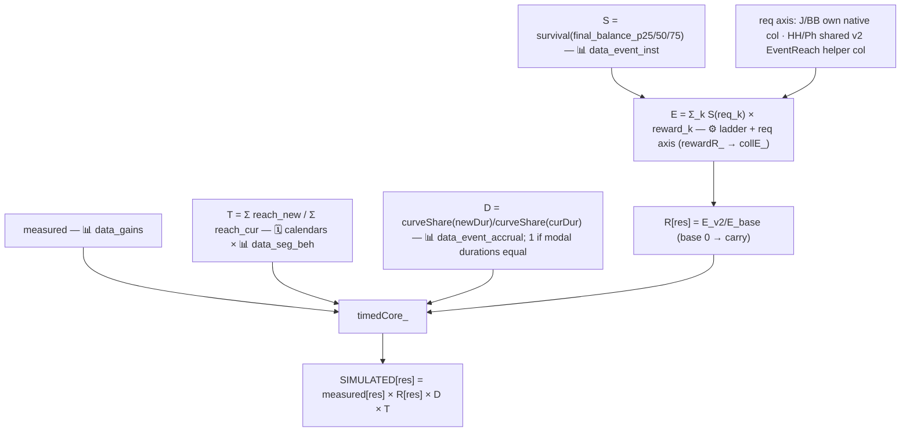

**Step by step.**
1. `simHatchlingHideaway` / `simJigsaw` / `simBombsBallet` / `simPhotoshoot` → `collectionSim_` →
   `timedCore_` with the D-function = `accrualD_` (returns 1 when [modal durations](#modaldur) are
   equal).
2. **measured** ← 📊 `data_gains`; apply `timedCore_` branch logic.
3. **[T](#t-cadence-and-reach)** from 🗓️ calendars + 📊 `data_seg_beh`.
4. **[D](#d-duration-multiplier)** = `curveShare(newDur) / curveShare(curDur)` from the 📊
   `data_event_accrual` curve for this event/payer/segment (`0-9` fallback), normalised at the
   current modal duration. Worked: HH 1.16-with-D=1 (its 3→4 day curve saturates), Bomb's Ballet
   0.94, Jigsaw 0.86, Photoshoot 0.91.
5. **[R](#r-reward-ratio)** (`rewardR_` → `collE_`): [S](#s-survival-function) = survival over
   `final_balance_p25/50/75` (📊 `data_event_inst`); `E = Σ_k S(req_k) × reward_k`. Requirement axis:
   **Jigsaw / Bomb's Ballet** read each ⚙️ sheet's **own native req column** (req edits flow fully);
   **Hatchling Hideaway / Photoshoot** have no native cumulative req column on the base sheet, so
   **both sides use the ⚙️ `_v2` EventReach helper column** as the req axis (reward edits flow; req
   edits only re-weight — flagged). Bomb's Ballet also adds a **completion row** gated at the last
   milestone's req. `R[res] = E_v2[res] / E_base[res]` (base 0 → carry).
6. `SIMULATED[res] = measured[res] × R[res] × D × T`.

**Notes / flags.** HH's endless gate is *inside* the measured number and the D curve, but the p50
curve can't see tail loopers on an added day. Photoshoot has n=1 instance on both calendars, so its T
is placement-noise-sensitive.

**In plain words.** In a collection event you gather tokens by playing and claim a reward each time
your total passes a milestone. Unlike the leaderboards, time really matters here: fewer days means
fewer tokens, which means fewer milestones reached. So we take what players actually earned (the
measured value) and scale it by three dials:

- **T (the cadence-and-reach ratio)** handles the schedule, exactly as for leaderboards: the summed
  chance of showing up to each run, new calendar ÷ current calendar.
- **D (the duration multiplier)** handles run length. Telemetry gives an "accrual curve": by day 1 a
  typical participant has banked, say, 30% of everything they will eventually collect in that run, by
  day 2 55%, by day 3 73%, by day 4 98%. If a 4-day run becomes a 3-day run, D = (share banked by
  day 3) ÷ (share banked by day 4) = 0.73 / 0.98 ≈ 0.74 — the participant keeps about three quarters
  of their old haul. If the run gets *longer*, the curve is usually already flat near the end, so D
  stays ≈ 1 (the extra day adds almost nothing).
- **R (the reward ratio)** handles config edits. For each milestone we estimate the chance that a
  player's final token total reaches its requirement (from real measured final balances — nearly
  everyone passes the early milestones, few pass the last ones), multiply that chance by the
  milestone's reward, and add it all up: the "expected payout" of the config. Compute that once for
  the old config and once for the new config; R is new ÷ old. Because the chance-of-reaching depends
  on the requirements, making milestones *harder* lowers R just like making rewards smaller does.

The answer is measured × R × D × T. With untouched reward sheets R = 1, so today only the schedule
(T) and the run lengths (D) move these events.

**The formula.**

> **SIMULATED\[res] = [measured](#measured)\[res] × [R](#r-reward-ratio)\[res] × [D](#d-duration-multiplier) × [T](#t-cadence-and-reach)**

the composite terms expand to:

> **R\[res] = [E](#e-and-e_day)_v2\[res] ÷ E_base\[res]**, with **E\[res] = [Σ](https://en.wikipedia.org/wiki/Summation)ₖ [S](#s-survival-function)(req_k) × reward_k\[res]** over the milestones k, and **S(x) = 1 − [CDF](https://en.wikipedia.org/wiki/Cumulative_distribution_function)(x)** over the final-progress [percentiles](https://en.wikipedia.org/wiki/Percentile) p25/50/75 (📊 `data_event_inst`)
>
> **D = curveShare(newDur) ÷ curveShare(curDur)**, with **curveShare(day) = the [median](https://en.wikipedia.org/wiki/Median) share of a participant's own eventual total banked by that day** (📊 `data_event_accrual`), and the durations = each calendar's [modal](https://en.wikipedia.org/wiki/Mode_%28statistics%29) run length ([modalDur](#modaldur))
>
> **T = Σ over `cal_new` runs of [reach](#reach-and-p_day)(inst) ÷ Σ over `cal_curr` runs of reach(inst)**, with **reach(inst) = 1 − [Π](https://en.wikipedia.org/wiki/Product_%28mathematics%29) over the run's days of (1 − p_day)**

- **[measured](#measured)\[res]** — what players actually earned from this event (📊 `data_gains`).
- **[R](#r-reward-ratio)\[res]** — the config change: the
  [expected](https://en.wikipedia.org/wiki/Expected_value) milestone payout under the new sheet ÷ the
  old one. Both **reward** edits and **requirement** edits move it (harder milestones → smaller S values).
- **req_k / reward_k** — milestone k's requirement (tokens needed) and reward, from ⚙️ `HH`/`J`/`BB`/`Ph`
  and their `_v2` (see the step-by-step for which sheet supplies the requirement axis).
- **[S (survival function)](https://en.wikipedia.org/wiki/Survival_function)** — "what share of players'
  final token totals reach req_k?" = 1 − the
  [CDF](https://en.wikipedia.org/wiki/Cumulative_distribution_function); built by
  [linear interpolation](https://en.wikipedia.org/wiki/Linear_interpolation) through the measured
  [percentile](https://en.wikipedia.org/wiki/Percentile) points.
- **[D](#d-duration-multiplier)** — the run-length effect: the share of their eventual haul a typical
  participant has banked by the new length ÷ by the current length. Shortening reads *inside* the
  observed curve ([interpolation](https://en.wikipedia.org/wiki/Linear_interpolation), reliable);
  lengthening reads *past* it ([extrapolation](https://en.wikipedia.org/wiki/Extrapolation),
  low-confidence — in practice ≈ 1 because the curves flatten).
- **curveShare(day)** — the accrual curve: the [median](https://en.wikipedia.org/wiki/Median)
  ("middle player") cumulative fraction banked by each day.
- **[modalDur](#modaldur)** — the most common ([mode](https://en.wikipedia.org/wiki/Mode_%28statistics%29))
  run length in that calendar, so one window-clipped fragment can't distort D.
- **[T](#t-cadence-and-reach) / [reach](#reach-and-p_day) / [p_day](#reach-and-p_day)** — the schedule
  ratio, as in the leaderboard sections: summed show-up chances new ÷ current, each run's chance being
  1 − [Π](https://en.wikipedia.org/wiki/Product_%28mathematics%29)(1 − daily activity rate) (the
  [complement trick](https://en.wikipedia.org/wiki/Complementary_event)).

**How did you simulate this?** Collections are the one family where BOTH time dials turn, and each
has its own tool — this is exactly where T-vs-D confusion usually starts, so, bluntly:
**[T](#t-cadence-and-reach)** answers *"how many runs does the player catch?"* (schedule — from
the calendars × activity rates, identical machinery to the leaderboards), while
**[D](#d-duration-multiplier)** answers *"how much can they bank inside one run?"* (run length —
from the accrual curve; leaderboards pin this to 1, collections don't). So: first I take the
measured earnings. Then T as usual: summed show-up chances, new calendar ÷ current. Then D: 📊
`data_event_accrual` tells me what share of their eventual token haul the median participant has
banked by each event day; D = share-by-new-length ÷ share-by-current-length (using each calendar's
modal run length). Shortening reads inside the observed curve (reliable interpolation);
lengthening reads past its end, where the curve is usually already flat, so D ≈ 1. Then
[R](#r-reward-ratio), where the [survival function](#s-survival-function) earns its keep: S built
over the segment's real final token balances (`final_balance_p25/50/75`, 📊 `data_event_inst`)
gives the chance of reaching each milestone requirement; E = Σ S(req) × reward, priced once on the
base sheet and once on `_v2`, and R = E_v2 ÷ E_base per resource — which is why BOTH reward edits
and requirement edits move it. Finally: measured × R × D × T.

*Example 1 — Jigsaw, 40-99 nonpayer (run shortened 4d → 3d).* Accrual curve: by day 1 the median
participant has banked 27% of their eventual puzzle-piece haul, day 2 63%, day 3 92%, day 4 100% →
D = 0.92 ÷ 1.00 = **0.92**. Schedule: T = **0.90**. R: final balances 774 / 1,410 / 1,931 pieces
give S(30) = 0.99 down to S(1,930) = 0.25 across the twelve milestones — but `J_v2` is identical
to `J`, so the two expected payouts cancel and R = **1** (the survival table is built and priced,
it just moves nothing yet). HC: 25.24 × 1 × 0.92 × 0.90 = **20.93** — the whole change is time,
split into its two distinct causes.

*Example 2 — Hatchling Hideaway, 0-9 nonpayer (run lengthened 3d → 4d).* The curve saturates:
day 1 17%, day 2 71%, day 3 100% — by the old length the median participant has already banked
everything they were ever going to, so the added day contributes nothing: D = **1**
(the flagged-low-confidence extrapolation, here simply flat). T = **1.16** (the new schedule's
runs are easier to catch). The survival side shows how shallow a casual's event really is: final
balances of 6.3 / 13.4 / 25.4 hatchlings mean S(20) = 0.36 for the first nest gate and
S(51.25) = 0 for every later one — this segment's expected config payout is one partial gate.
`HH_v2` is untouched → R = 1. HC: 2.31 × 1 × 1 × 1.16 = **2.68**.

---

### 6.7 Night Sky

> **Status: RE-WIRED 2026-07-06 but SHIPPED OFF** behind `NS_SIMULATE = false` in
> `EcoGainsSim_v4.gs`. The re-wired bottom-up model **overestimates** actual NS gains even with
> unchanged configs (cause not yet investigated — [open flag](#11-open-work--standing-flags)), so NS
> is **carried** (= measured, diff 0) in all three views until the flag is flipped. The machinery
> below is what runs when `NS_SIMULATE = true`.

**Overview.** A daily-reset win-streak ladder (config-segmented, D14) run as an **A/B test**, so the
measured value is test-diluted and is **not** a valid anchor — hence bottom-up. Night Sky is a
*rate* (resets every day), so it is priced per active day and multiplied by the expected number of
active days.

**Flow.**
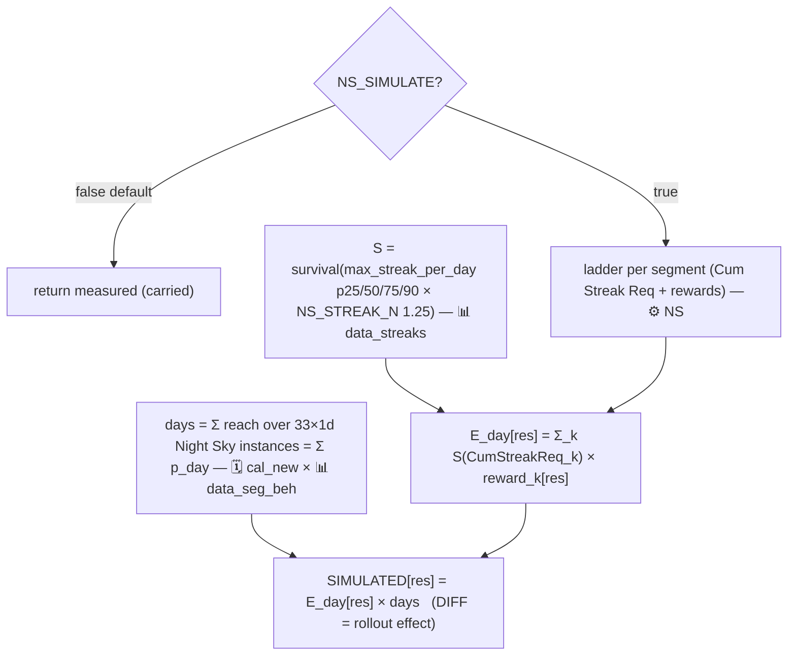

**Step by step (`simNightSky`, when ON).**
1. If `NS_SIMULATE = false` → return [measured](#measured) (the shipped default).
2. **ladder** ← ⚙️ `NS`, the segment's own 3-milestone block (`readNSLadder_(seg)`, gate column
   `Cum Streak Req`).
3. **streak** ← 📊 `data_streaks` `max_streak_per_day_p25/50/75/90`. Build [S](#s-survival-function)
   over each percentile × [NS_STREAK_N](#ns_streak_n) (= 1.25).
4. **[E_day](#e-and-e_day)** = `Σ_k S(CumStreakReq_k) × reward_k` (cumulative gating, honest — no free
   milestone).
5. **days** = `reachSum_` over 🗓️ `cal_new`'s 33 one-day Night Sky instances (📊 `data_seg_beh`
   rates) = `Σ p_day` = expected active days.
6. `SIMULATED[res] = E_day[res] × days`. Because measured is A/B-diluted, **DIFF = full-rollout − diluted
   measured = the ROLLOUT EFFECT** (labelled in-sheet, not a redesign delta). Tail past p90 accepted
   as-is; the harness prints the `S = 0 beyond p90 × N` conservative bound alongside. E_day is
   monotonic in segment, but the window TOTAL legitimately dips for 100+ (their measured `Σ p_day` is
   lower than 40-99's).

**In plain words.** Night Sky pays you each day for win streaks: chain wins without losing and you
claim rewards at streak milestones; everything resets the next day. It ran as an A/B test, so the
"what players earned" number in telemetry is watered down — many players never had the event at all —
and can't be trusted as a starting point. So instead of scaling a measured number, we build the
estimate from scratch. Telemetry tells us how long a typical player's best win-streak of the day is
(at several percentile levels). We multiply those streak lengths by 1.25 (NS_STREAK_N — a correction
factor from the standalone Night Sky study, accounting for players usually landing roughly one more
similar-sized streak over the day). From that we estimate, for each streak milestone, the share of
players who would clear it on a given day, multiply by that milestone's reward, and add it up — giving
E_day (the expected reward for one day of showing up). Then we count the days: for each of the 33
daily Night Sky slots in the calendar, the chance this player is active that day, all summed — the
expected number of active days. The simulated total is E_day × that day count. **However:** this
bottom-up estimate comes out higher than what players demonstrably earn, and we don't yet know why —
so the switch (`NS_SIMULATE`) is OFF and Night Sky is currently just copied at its measured value,
with a difference of zero, in every view.

**The formula.**

> **`NS_SIMULATE = false` (today):** SIMULATED\[res] = [measured](#measured)\[res]
>
> **`NS_SIMULATE = true`:** **SIMULATED\[res] = [E_day](#e-and-e_day)\[res] × days**

the composite terms expand to:

> **E_day\[res] = [Σ](https://en.wikipedia.org/wiki/Summation)ₖ [S](#s-survival-function)(CumStreakReq_k) × reward_k\[res]** over the segment's ⚙️ `NS` milestones k, with **S(x) = 1 − [CDF](https://en.wikipedia.org/wiki/Cumulative_distribution_function)(x)** over **max_streak_per_day [percentiles](https://en.wikipedia.org/wiki/Percentile) p25/50/75/90 × [NS_STREAK_N](#ns_streak_n)** (📊 `data_streaks`)
>
> **days = Σ over the 33 one-day Night Sky slots of [p_day](#reach-and-p_day)**

- **[measured](#measured)\[res]** — what players earned in telemetry; here it is A/B-test-diluted, which
  is exactly why the ON branch ignores it and builds bottom-up.
- **[E_day](#e-and-e_day)\[res]** — the [expected](https://en.wikipedia.org/wiki/Expected_value)
  reward for one active day: each milestone's reward, weighted by the chance of clearing it that day,
  all added up.
- **CumStreakReq_k / reward_k** — milestone k's required win-streak length and its reward, from the
  segment's own block on ⚙️ `NS`.
- **[S (survival function)](https://en.wikipedia.org/wiki/Survival_function)** — "what share of
  players' best daily streak reaches x wins?" = 1 − the
  [CDF](https://en.wikipedia.org/wiki/Cumulative_distribution_function), built through the streak
  [percentile](https://en.wikipedia.org/wiki/Percentile) points.
- **[NS_STREAK_N](#ns_streak_n) (= 1.25)** — the effective-streak correction from the standalone NS
  study: players tend to land roughly one more similar streak over the day, so every percentile is
  stretched by 25% before S is built.
- **days** — the expected number of active days in the window: since each Night Sky slot is exactly
  one day long, its reach is just [p_day](#reach-and-p_day) (the chance of playing that day —
  weekend or weekday rate, 📊 `data_seg_beh`), and adding up 33 daily chances gives the expected count
  of days played.

**How did you simulate this?** Today, honestly: I don't — `NS_SIMULATE = false`, so the row is
copied at its measured value in every view. The reason is instructive, so here is what the ON
branch does and why it is parked. Night Sky ran as an A/B test, which means its measured number is
watered down by players who never had the event — useless as an anchor, so there is nothing to
scale and no R, [D](#d-duration-multiplier) or [T](#t-cadence-and-reach) at all. Instead the ON
branch prices the event from scratch (bottom-up, the same pattern as Rainbow Maker). First I read
the segment's own three-milestone win-streak ladder (⚙️ `NS`). Then I build a
[survival function](#s-survival-function) over the segment's real best-daily-win-streak
percentiles (📊 `data_streaks` p25/50/75/90), each stretched ×1.25 ([NS_STREAK_N](#ns_streak_n) —
players tend to land roughly a second similar-sized streak over a day). S(req) × reward, summed
over the ladder, gives E_day: the expected prize haul for ONE day of showing up. Then the
calendar, entered as an absolute rather than a ratio: Night Sky is 33 one-day slots, the reach of
a one-day slot is just that day's activity rate, so the expected number of active days is
Σ p_day. SIMULATED = E_day × days.

*Example 1 — 20-39 nonpayer, the full ON-branch trace.* Streak percentiles 7 / 14 / 25 / 38 wins →
×1.25 → 8.75 / 17.5 / 31.25 / 47.5. The ladder gates at 11 / 26 / 42 wins → S = 0.686 / 0.345 /
0.151. E_day[HC] = 15×0.686 + 50×0.345 + 100×0.151 = **42.64 HC per active day**. Days = 18
weekdays × 0.330 + 15 weekend days × 0.317 = **10.69**. Window total = 42.64 × 10.69 =
**455.6 HC** — versus **86.9 HC actually measured**. That ≈ 5× gap, present even with untouched
configs, is the unexplained overestimate: until it is understood, the switch stays OFF and the
shipped answer is the measured 86.9 with diff 0.

*Example 2 — 40-99 nonpayer: same trace, same verdict.* Streaks 13 / 28 / 50 / 78 → ×1.25 → S over
gates 28 / 60 / 100 = 0.593 / 0.273 / 0.089; E_day[HC] = 50×0.593 + 120×0.273 + 250×0.089 = 84.72;
days = 9.76; total **826.8 HC** vs **180.7 measured** (≈ 4.6×). The overestimate is systematic
across segments — which is why one flag gates the whole source rather than any per-segment patch.

---

### 6.8 Rainbow Maker

**Overview.** A brand-new milestone event (accumulate matchables, claim thresholds) with **no
measured anchor**, so bottom-up survival-weighted, per instance, over the matchables distribution.

**Per-instance config split (2026-07-10, user decision — HARDCODED, see the CLAUDE.md "Rainbow
Maker split configs" note):** the 5 `cal_new` instances, ordered by **start day** (the clipped
2-day instance at days 1–2 counts as #1), read different config sheets — **#1–#3 → ⚙️ `RM_1st`**
(no SPTx2) and **#4–#5 → ⚙️ `RM_2nd`** (SPTx2 rewards). The map is the `RM_INSTANCE_SHEETS` array;
a missing/unreadable split sheet **falls back to ⚙️ `RM`** (older exports and the offline harness
keep working). All views share the mapping: 33-day + Sim per Segment via `simRainbowMaker`, the
daily view via `rmInstanceRows_` (each instance's OWN per-resource row lands on its days, so
SPTx2 shows only on the RM_2nd instances — days 20–23 / 27–30 today), PBP via `rmConfigFor_`
(day → running instance ordinal → its sheet).

**Flow.**
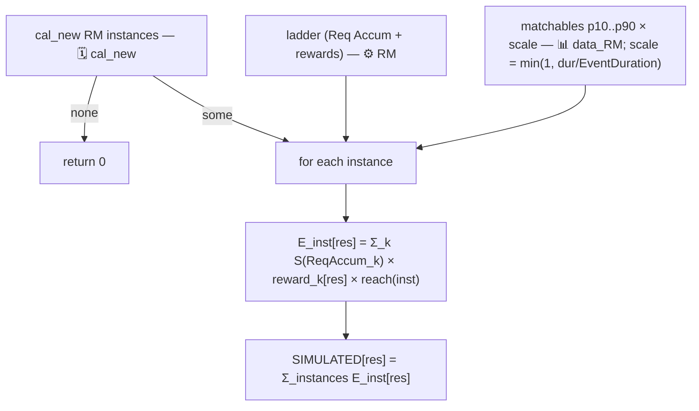

**Step by step (`simRainbowMaker` → `rmInstanceRows_`).**
1. instances ← 🗓️ `cal_new['Rainbow Maker']`, start-sorted; none → 0.
2. Per instance i: config ← `rmConfigFor_(i)` (⚙️ `RM_1st` for #1–#3, ⚙️ `RM_2nd` for #4–#5,
   fallback ⚙️ `RM`): ladder (`Req Accum` gate) + that sheet's own `EventDuration` (default 4).
   Matchables `pct` ← 📊 `data_RM` (shared — the split changes REWARDS, not player behaviour).
3. Per instance: `scale = min(1, inst.dur / cfgDur)` (a clipped 2-day instance halves the matchables
   axis — flagged linear assumption). Build [S](#s-survival-function) over `p10..p90 × scale`.
   `reach = ` [reach(inst)](#reach-and-p_day) (📊 `data_seg_beh`).
4. `E_inst[res] = Σ_k S(ReqAccum_k) × reward_k[res] × reach` **using instance i's own ladder**;
   sum over instances. (`rmInstanceRows_` keeps the per-instance rows for the daily view.)
5. **Tail sensitivity:** milestones past p90 (e.g. m30 = 1000 HC for 100+) are priced by the
   extrapolated tail — always report the conservative `S = 0 beyond p90` bound too.

**In plain words.** Rainbow Maker is a brand-new event, so there is no history to scale — we have to
price it from scratch. During a run you collect "matchables" (pieces cleared while playing normal
levels) and claim rewards at collection milestones. Telemetry from ordinary play tells us how many
matchables players of this segment clear in a typical 4-day window, from the luckiest tenth down to
the least active tenth. For each milestone we estimate the share of players whose matchable count
would reach its requirement, multiply by that milestone's reward, and add everything up — the expected
earnings for one run. We then multiply by the chance the player shows up to that run at all (from
their daily activity rates), and sum over all the runs in the new calendar. Two honest simplifications:
if a run is shorter than the standard 4 days, we shrink the matchable counts proportionally (a 2-day
run = half the matchables), and the very top milestones sit beyond the 90th percentile of the data,
where we are extrapolating — so the harness also reports a cautious lower bound that assumes nobody
past the 90th percentile reaches them.

**The formula.**

> **SIMULATED\[res] = [Σ](https://en.wikipedia.org/wiki/Summation) over the `cal_new` Rainbow Maker runs of E_inst\[res]** &nbsp; (no runs → 0)

the composite terms expand to:

> **E_inst\[res] = Σₖ [S](#s-survival-function)(ReqAccum_k) × reward_k\[res] × [reach](#reach-and-p_day)(inst)** over the ⚙️ `RM` milestones k
>
> **S(x) = 1 − [CDF](https://en.wikipedia.org/wiki/Cumulative_distribution_function)(x)** over the matchables [percentiles](https://en.wikipedia.org/wiki/Percentile) **p10…p90 × scale** (📊 `data_RM`), with **scale = min(1, run length ÷ ⚙️ `RM` EventDuration)**
>
> **reach(inst) = 1 − [Π](https://en.wikipedia.org/wiki/Product_%28mathematics%29) over the run's days of (1 − p_day)**

- **E_inst\[res]** — the [expected](https://en.wikipedia.org/wiki/Expected_value) earnings from one
  scheduled run: each milestone's reward weighted by the chance of collecting enough matchables to
  claim it, all added up, then discounted by the chance of showing up to the run at all.
- **ReqAccum_k / reward_k** — milestone k's matchable requirement and its reward (⚙️ `RM`).
- **[S (survival function)](https://en.wikipedia.org/wiki/Survival_function)** — "what share of players
  collect at least x matchables in a run?" = 1 − the
  [CDF](https://en.wikipedia.org/wiki/Cumulative_distribution_function), built through the measured
  [percentile](https://en.wikipedia.org/wiki/Percentile) points (p10 = the count even low-activity
  players beat, p90 = the count only the top tenth beats; milestones beyond p90 rely on
  [extrapolation](https://en.wikipedia.org/wiki/Extrapolation) — hence the cautious second bound).
- **scale** — the shorter-run discount: a run half the standard length is assumed to yield half the
  matchables (a flagged linear simplification); `min(1, …)` just means longer-than-standard runs are
  *not* scaled up.
- **[reach(inst)](#reach-and-p_day)** — the chance the player touches the run at least once:
  1 − the product ([Π](https://en.wikipedia.org/wiki/Product_%28mathematics%29)) of the daily
  miss-chances (the [complement trick](https://en.wikipedia.org/wiki/Complementary_event)), with
  [p_day](#reach-and-p_day) = the weekday/weekend activity rate (📊 `data_seg_beh`).

**How did you simulate this?** Rainbow Maker has never run, so there is nothing measured to
scale — this is a pure bottom-up pricing of the new calendar, run by run. First I list the
`cal_new` Rainbow Maker runs (five today), sorted by start day, and hand each its config sheet
(#1–#3 → ⚙️ `RM_1st`, #4–#5 → ⚙️ `RM_2nd` — the hardcoded split; a missing sheet falls back to
⚙️ `RM`). Then, per run: 📊 `data_RM` tells me how many matchables (pieces cleared during normal
level play) players of this segment collect in a standard 4-day window, as percentiles p10…p90.
If the run is shorter than the sheet's `EventDuration` I shrink that whole matchables axis
proportionally (a 2-day run = half the matchables — flagged linear assumption). I build the
[survival function](#s-survival-function) over the scaled percentiles and walk the milestone
ladder: S(requirement) × reward, summed — the expected haul of a player who participates in that
run. Then the calendar enters exactly once, as an absolute: multiply by
[reach](#reach-and-p_day)(run), the chance this player touches the run at all. There is no
[T](#t-cadence-and-reach) (nothing to divide by — `cal_curr` has no runs) and no
[D](#d-duration-multiplier) (run length already acted, through the axis scaling). Finally I add
the runs up.

*Example 1 — full-length run #2 (days 6–9), 40-99 nonpayer.* Matchables percentiles 24,408 /
44,118 / 83,292 / 128,357 / 185,129 (p10…p90); scale = 4/4 = 1. Survival at the coin milestones:
S(460) = 0.998, S(8,610) = 0.965, S(67,810) = 0.599, S(151,760) = 0.188, S(352,260) = 0 (beyond
p90). Expected HC = 10×0.998 + 20×0.965 + 30×0.599 + 100×0.188 + 500×0 = 66.06; × reach(4
weekdays) = 0.755 → **49.89 HC** from this run (every booster and UL-minutes column is priced the
same way from its own milestones).

*Example 2 — the clipped 2-day run #1 (days 1–2), same segment.* scale = 2/4 = 0.5 halves the
whole matchables axis (p50 becomes 41,646), so the SAME milestones suddenly sit much deeper in the
distribution: S(8,610) = 0.929, S(67,810) collapses 0.599 → 0.231, S(151,760) → 0. Expected HC =
9.96 + 18.59 + 6.92 + 0 = 35.47; × reach(2 days) = 0.505 → **17.92 HC** — roughly a third of a
full run, from fewer matchables AND a lower show-up chance at once. Summing all five runs gives
the 33-day row: 217.47 HC (plus 312.9 min Unlimited Lives, 16.4 Red, …). *Caveat: the workbook
(10) dump predates the `RM_1st`/`RM_2nd` sheets, so both examples price the shared ⚙️ `RM` ladder
via the fallback; in the live workbook runs #4–#5 read `RM_2nd` and add its SPTx2 payouts.*

---

### 6.9 River Rush

**Overview.** A real simulator on the generic collection path that today evaluates to **removal**:
`cal_new` has 0 River Rush instances, so the `timedCore_` removal branch returns 0 and
DIFF = −measured (up to −85.6 HC/earner @100+ NP on workbook (10)).

**Flow.**
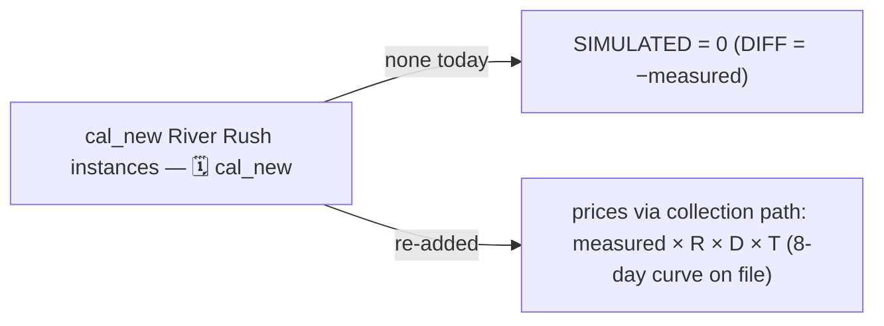

**Step by step.** `simRiverRush` → `collectionSim_`. Re-adding River Rush instances to both calendars
re-prices it with **no code change** (its 8-day 📊 `data_event_accrual` curve already exists); instances
in `cal_new` only would flag NEEDS-ANCHOR and carry.

**In plain words.** River Rush was removed from the new calendar entirely. An event with zero
scheduled runs pays nothing, so its simulated value is 0 and the difference is simply *minus
everything players currently earn from it*. Nothing about this is hard-coded: if someone drags River
Rush runs back into both calendar grids, the normal collection method (§6.6) prices it again
automatically, because all its supporting data is still on file.

**The formula.**

> **Today (0 runs in `cal_new`):** SIMULATED\[res] = 0, so **DIFF\[res] = −[measured](#measured)\[res]**
>
> **If re-added to both calendars:** the [§6.6 collection formula](#66-collections-hatchling-hideaway-jigsaw-bombs-ballet-photoshoot) — **SIMULATED\[res] = [measured](#measured)\[res] × [R](#r-reward-ratio)\[res] × [D](#d-duration-multiplier) × [T](#t-cadence-and-reach)** (see §6.6's formula block for the expansions of R, D and T)

- **[measured](#measured)\[res]** — what players currently earn from River Rush (📊 `data_gains`); with
  the event removed, the difference is exactly that amount, negative.
- **[R](#r-reward-ratio) / [D](#d-duration-multiplier) / [T](#t-cadence-and-reach)** — the collection
  dials (reward-config change, run-length change, schedule change) explained under §6.6; River Rush's
  8-day accrual curve is already in 📊 `data_event_accrual`, so no code change is needed to re-price it.

**How did you simulate this?** First I parse both calendars and look for River Rush lanes.
`cal_new` has none — and that is the entire computation: the removal branch fires and every
resource is 0. No [R](#r-reward-ratio), [D](#d-duration-multiplier), [T](#t-cadence-and-reach) or
[survival function](#s-survival-function) is ever built; the DIFF is simply minus everything
players currently earn from the event. (If runs existed in both calendars, the §6.6 collection
recipe would price it — the data is all still on file.)

*Example 1 — 100+ nonpayer.* Measured: 85.61 HC, 22.46 SPT, 49.93 SPTx2, 20.5 min UL Red, … →
SIMULATED all-zero, DIFF = −85.61 HC and so on down the row. Note the token side: −22.46 − 2×49.93
= **−122.3 SPT-equivalents per earner**, which is why this removal also drags the [§6.11 Season
Pass](#611-season-pass-spt-tier-coupling) row down two tiers for heavy players.

*Example 2 — 10-19 nonpayer: same branch, different loss profile.* Only −10.15 HC, but −5.67 min
UL Bomb and −12.40 SPTx2. For low-mid segments River Rush was mostly a booster-and-token source,
so the removal reads as a small coin line and a big token line — check the non-HC columns before
judging the impact of a removal.

---

### 6.10 A. 0 appendix

**Overview.** A.0 players barely play and have **no behaviour / accrual / streak / matchables data**,
so `ECOGAINS_SIM(payer, 'A. 0')` returns an appendix row set: everything carried at measured value
**except config-only changes**.

**Flow.**
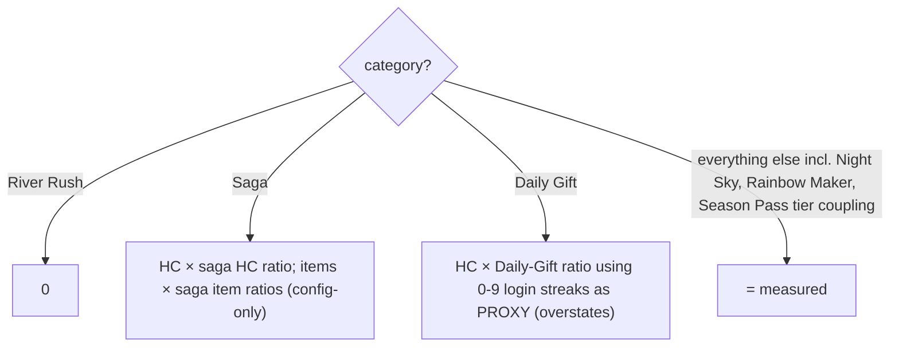

**Step by step (`appendixRow_`).** River Rush → 0 (universal removal). Saga → apply the
[§6.2](#62-core--saga) HC + item ratios to measured. Daily Gift → apply the [§6.3](#63-daily-gift)
ratio computed from **0-9** login streaks as a proxy (flagged: overstates A.0's remaining gains).
Everything else, including Night Sky, Rainbow Maker and the [§6.11](#611-season-pass-spt-tier-coupling)
Season Pass tier coupling, carries measured.

**In plain words.** "A. 0" players finished zero levels in the measurement window — they barely touch
the game, so none of the behaviour data (activity rates, streaks, event progress, matchables) exists
for them. Simulating their event participation would be inventing numbers, so almost every row is just
copied at its measured value (what they actually earned). The only exceptions are changes that don't
depend on behaviour at all: River Rush is zeroed (it's removed for everyone); Saga coins and items are
scaled by the same config ratios as everyone else (§6.2 — the reward ladder itself changed); and Daily
Gift coins are scaled by the §6.3 ratio computed with the 0-9 segment's login streaks as a stand-in.
That stand-in is flagged: real A. 0 players log in less often than 0-9 players, so this likely
overstates how much of the Daily Gift nerf they escape.

**The formula.** One rule per category (a
[piecewise](https://en.wikipedia.org/wiki/Piecewise_function) definition — a different formula
depending on which case you're in):

> **River Rush:** SIMULATED\[res] = 0 &nbsp; (DIFF = −[measured](#measured)\[res])
>
> **Saga:** SIMULATED\[HC] = [measured](#measured)\[HC] × HC_ratio · SIMULATED\[item] = measured\[item] × item_ratio — the [§6.2 ratios](#62-core--saga) (see §6.2's formula block for their expansion)
>
> **Daily Gift:** SIMULATED\[HC] = [measured](#measured)\[HC] × R_HC — the [§6.3 ratio](#63-daily-gift), but with its weights **wₙ = [S](#s-survival-function)(n−1)** built from the **0-9 segment's** login-streak [percentiles](https://en.wikipedia.org/wiki/Percentile) as a stand-in
>
> **Everything else (incl. Night Sky, Rainbow Maker, Season Pass):** SIMULATED\[res] = [measured](#measured)\[res]

- **[measured](#measured)\[res]** — what A. 0 players actually earned (📊 `data_gains`); for this
  segment it is almost always the whole answer, because no behaviour data exists to scale it with.
- **HC_ratio / item_ratio** — the coins-per-level and per-item config ratios from
  [§6.2](#62-core--saga): pure ladder-vs-ladder comparisons, no behaviour data needed, so they apply
  to A. 0 unchanged.
- **R_HC** — the [§6.3](#63-daily-gift) [weighted-average](https://en.wikipedia.org/wiki/Weighted_arithmetic_mean)
  ladder ratio; its weights need login-streak data A. 0 doesn't have, so the 0-9 segment's
  [survival function](https://en.wikipedia.org/wiki/Survival_function) is borrowed (flagged: it
  overstates how deep into the ladder A. 0 players get).

---

### 6.11 Season Pass (SPT tier coupling)

**Overview (added 2026-07-10, decision D16).** Season pass tokens (SPT / SPTx2) are what makes this
source different from every other: **SPT earned across ALL sources drives progression along the
season-pass reward track**, so a redesign that changes SPT payouts anywhere (Kite's ladder, River
Rush's removal, Level Race's cadence…) moves how far players get on the track — and therefore how
much the "Season Pass (Free)" row itself pays. `simSeasonPass` couples the two: it collects the
per-earner SPT window totals (measured vs simulated), maps each onto the track's cumulative points
ladder to get a tier reached, and scales the measured Season Pass row by the ratio of cumulative
track rewards through those tiers. A Season Pass Challenge reward-config ratio (`SP_lb_v2`/`SP_lb`
pot ratio) and the calendar T factor multiply on top; D is pinned 1 (tier rewards are end-state
claims, like leaderboard payouts).

**Data at a glance:** 📊 `data_gains` (measured row + the SPT/SPTx2 amounts of every category) ·
⚙️ `SP` / `SP_v2` (30-tier track: `Cumul` points ladder, FREE cols D–W, PAID cols X–AQ, headers
row 4, tiers rows 5–34; `Season Length (days)` config label read from anywhere on the sheet) ·
⚙️ `SP_lb` / `SP_lb_v2` (challenge rank ladder, headers row 6, ranks rows 7+) · 🗓️ calendars
(`Season Pass` lane → T). **`SP_v2` / `SP_lb_v2` may be absent** — the base sheet then serves both
sides and every ratio degrades to 1.

**Flow.**
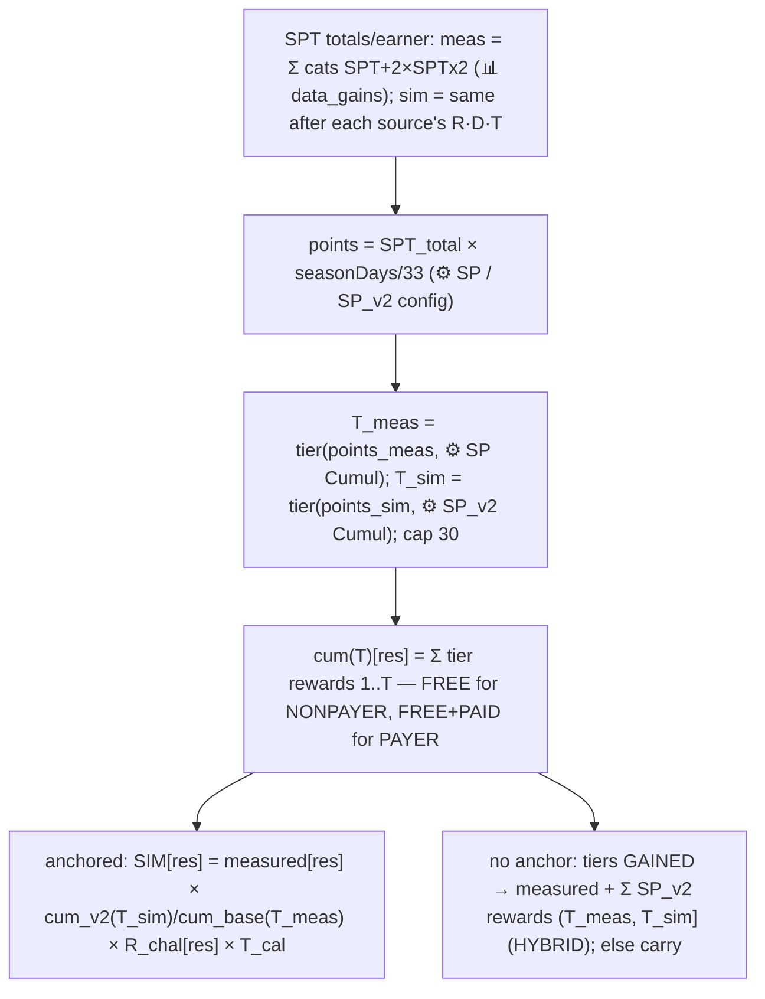

**Step by step (`simSeasonPass`).**
1. Branch discipline as `timedCore_`: calendars unparsed → carry; no `Season Pass` lane in
   `cal_new` → 0 (removal); none in `cal_curr` → carry; `SP` sheet unreadable → carry.
2. **SPT totals** (`sptTotals_`, cached on the execution context): per earner,
   `meas = Σ over every category of [SPT + 2×SPTx2]` from 📊 `data_gains` (the additive-projection
   convention — same as the NET blocks); `sim` = the same sum using each category's **simulated**
   SPT/SPTx2 (i.e. after that category's own R·D·T). The Season Pass category itself contributes
   its *measured* SPT to BOTH sides — single pass, no recursion (the track pays no SPT, so there is
   no feedback loop through the config either; `ctx._sptBusy` is a defensive backstop).
3. **Points & tier:** `points = SPT_total × seasonDays/33` (seasonDays from the `Season Length
   (days)` label on ⚙️ `SP` for the measured side / `SP_v2` for the simulated side; absent → 33,
   i.e. window = season, **flagged assumption**). `tier(points)` = highest tier whose `Cumul` ≤
   points (0 below tier 1, capped at 30 — a maxed track gains nothing from extra SPT).
4. **Cumulative track rewards** `cum(T)[res]` = Σ of tiers 1..T rewards per resource — FREE track
   only for NONPAYER; FREE+PAID for PAYER (**flagged assumption**: the measured '(Free)' category
   is presumed to contain payers' paid-track claims too — the telemetry label doesn't split
   tracks). Base side reads ⚙️ `SP`, simulated side ⚙️ `SP_v2`.
5. **R_challenge** (`spChallengeR_`) = per resource, Σ `SP_lb_v2` rank ladder ÷ Σ `SP_lb` rank
   ladder — a zero-sum POT ratio (Kite-style), because the Dream Pass rows in 📊 `data_event_inst`
   are empty (no position distribution to price at). Base pot 0 → 1 (no anchor → carry).
6. **T_cal** = the usual cadence×reach ratio over the `Season Pass` calendar lane (identical in
   both calendars today → 1). **D pinned 1.**
7. Per resource: `measured > 0 AND cum_base(T_meas) > 0` →
   `SIM = measured × cum_v2(T_sim)/cum_base(T_meas) × R_challenge × T_cal`. **No anchor** (measured
   0, or the track never paid this resource by T_meas): tiers GAINED (`T_sim > T_meas`) → `SIM =
   measured + Σ SP_v2 rewards of tiers (T_meas, T_sim]` (absolute config values on a measured row —
   **HYBRID, flagged**); no tier gain → carry (never deletes a measured value; e.g. the row's own
   SPT stays carried). **A. 0**: fully carried ([§6.10](#610-a-0-appendix)).

**Worked numbers (workbook (10), 40-99 NONPAYER, SP_v2 absent):** SPT_meas 318.65/earner → tier 8
(Cumul 317 — only 1.65 pts above the edge, so NEVER hardcode tiers in checks); SPT_sim 224.44
(River Rush removal −14.8, Kite ×0.638×1.31, Level Race ×T) → tier 6. Free-track cums 8→6: Coins
20→20 (×1), Chuck 2→1 (×0.5), UL Lives 75→60 (×0.8) — exactly what the harness gate asserts.

**In plain words.** The season pass is a punch-card: every season-pass token (SPT) you earn anywhere
in the game punches points into it, and each filled row (tier) hands you a bundle of rewards. The
redesign changes how many tokens players earn — removing River Rush deletes its tokens, nerfing
Kite's token ladder shrinks those, rescheduling events moves theirs. So we first total up the
tokens a typical player earned per source in real life, and the tokens the simulation says they'd
earn under the new calendar (double-value tokens count twice). Each total lands somewhere on the
track's points ladder — that's the tier reached, before vs after. Then we ask: through the tier
you reach, how much of each resource does the track hand out, new world vs old? That ratio scales
what players actually earned from the pass (payers get the paid track's rewards counted too, since
they own the pass). If the track pays something the player's measured history can't anchor (they
never reached a tier that pays it), we only ever ADD newly unlocked tier rewards on top — we never
delete a measured value. Editing the SP_v2 sheet (cheaper tiers, richer rewards, longer season) or
the challenge leaderboard's SP_lb_v2 ladder flows straight into this row; until those v2 sheets
exist, everything reads the base sheets and only the SPT volume changes move the row.

**The formula.**

> **anchored:** SIMULATED\[res] = [measured](#measured)\[res] × ( cum_v2(T_sim)\[res] ÷ cum_base(T_meas)\[res] ) × R_chal\[res] × [T](#t-cadence-and-reach) &nbsp;&nbsp; (D = 1 by design)
>
> **no anchor, tiers gained:** SIMULATED\[res] = measured\[res] + [Σ](https://en.wikipedia.org/wiki/Summation) over tiers t ∈ (T_meas, T_sim] of ⚙️`SP_v2` reward_t\[res] &nbsp;&nbsp; **· no anchor otherwise:** SIMULATED\[res] = measured\[res]

with the composite terms expanding to:

> **T_x = tier( SPT_x × seasonDays_x ÷ 33 , Cumul ladder )** — the highest tier whose cumulative points requirement is met, capped at 30
>
> **SPT_meas = Σ over all categories of ( SPT + 2×SPTx2 ) per earner** (📊 `data_gains`) · **SPT_sim = the same sum after each category's own simulation** (Season Pass itself measured on both sides)
>
> **cum(T)\[res] = Σ tiers 1..T of track reward\[res]** — FREE track for NONPAYER, FREE+PAID for PAYER
>
> **R_chal\[res] = Σ ⚙️`SP_lb_v2` ladder\[res] ÷ Σ ⚙️`SP_lb` ladder\[res]** (zero-sum pot ratio; base 0 → 1)

- **[measured](#measured)\[res]** — what players actually earned from the season pass (📊 `data_gains`).
- **SPT_meas / SPT_sim** — the per-earner season-pass-token totals over the 33-day window, before vs
  after the redesign; the double token (SPTx2) counts twice. Summing per-earner amounts across
  categories is the project's additive-projection convention (an average player is assumed to touch
  each source at its per-earner rate).
- **tier / Cumul** — the track's points ladder: tier 1 costs 10 points, tier 30 cumulatively 3,557.
- **cum(T)** — everything the track has handed out through tier T, per resource; the ratio of the two
  worlds' cums is what scales the row (both = 1 while `SP_v2` is untouched and the tier doesn't move).
- **R_chal** — the Season Pass Challenge reward-edit ratio: total prize pot of the redesigned rank
  ladder ÷ the current one (no per-rank pricing — the Dream Pass telemetry needed for it is empty).
- **[T](#t-cadence-and-reach)** — the usual cadence×reach ratio on the `Season Pass` calendar lane
  (1 today: the lane is identical in both calendars).

**How did you simulate this?** This source is a coupling, not an event: the pass pays by TIER, and
tiers are bought with season-pass tokens earned everywhere else in the game. So first I total, per
earner, SPT + 2×SPTx2 across every category in 📊 `data_gains` — the measured token income. Then I
total the same thing AFTER simulation, i.e. with each category's own R·D·T already applied (River
Rush contributes 0, Kite's nerfed ladder less, rescheduled races more or less; the Season Pass row
itself enters as measured on both sides — that is the recursion guard). Each total × seasonDays/33
becomes points on the ⚙️ `SP` `Cumul` ladder, and the highest tier whose cumulative cost is
covered is the tier reached — once for the measured world, once for the simulated one. Then I sum
the track's rewards from tier 1 through each of those tiers (FREE track for nonpayers, FREE+PAID
for payers — flagged assumption), and the ratio of the two sums scales the measured row per
resource, × the `SP_lb_v2`/`SP_lb` challenge pot ratio × calendar [T](#t-cadence-and-reach) (both
1 today; [D](#d-duration-multiplier) pinned 1 — tier rewards are end-state claims). No
[survival function](#s-survival-function) appears anywhere: tier reach is a deterministic ladder
lookup, not a probability. And where a resource has no measured anchor, I only ever ADD newly
unlocked tier rewards on top — never delete a measured value.

*Example 1 — 40-99 nonpayer.* Measured tokens: 318.65 (Level Race 98.9 + Kite 81.3 + Other 43.2 +
Flock Flurry 24.5 + River Rush 14.8 + 2×25.8 + …). Simulated: 224.44 (River Rush → 0, Kite
81.3 → 68.0, Level Race 98.9 → 84.3). Points (season = window, so ×1): 318.65 lands on tier 8
(Cumul 317 — only 1.65 points above the edge, which is why tier numbers must never be hardcoded in
checks); 224.44 lands on tier 6 (177 ≤ 224 < 247). Free-track sums through tier 8 vs tier 6: HC
20 → 20 (×1), Chuck 2 → 1 (×0.5), UL Lives 75 → 60 (×0.8). Row: HC 67.92 unchanged; Chuck
2.289 × 0.5 = **1.144**; UL Lives 73.83 × 0.8 = **59.06**. The event was not touched at all — the
row moves purely because the rest of the redesign starves it of tokens.

*Example 2 — 100+ payer (the paid track counts too).* Tokens 416.40 → tier 9; simulated 303.86 →
tier 7. FREE+PAID sums through 9 vs 7: HC 70 → 70 (166.62 unchanged), UL Red 20 → 10 →
32.68 × 0.5 = **16.34**, and Slingshot 1 → 0 — the track's only slingshot sits on tier 8 or 9, so
the anchored ratio is 0/1 and the measured 1.50 drops to **0**. Same coupling, but on the payer
track a two-tier slip can zero a resource outright.

---

# Part C — Views, plumbing, verification

## 7. The per-day view (`EcoGainsSim_Daily.gs`) — allocation, not re-simulation

`ECOGAINS_DAILY(payer, segment, source, block)` (block = CURRENT | NEW | DIFF | SPEND | CURNET |
NEWNET) spills 33×13. The gain blocks re-use the engine's window totals (CURRENT = measured, NEW =
simulated) and ONLY distribute them over days — column sums reconcile with the main sim to ~1e-13.
"Claim-day realistic" rules:

| Source type | Instance split | Within-instance placement |
|---|---|---|
| leaderboard (incl. Kite, Target Day) | ∝ [reach(inst)](#reach-and-p_day) | **all on the LAST day** (rank rewards at event end) |
| collections | ∝ reach(inst) | accrual-curve **marginal** share/day (`share(d) − share(d−1)`) |
| Rainbow Maker | each instance places its OWN per-resource row (`rmInstanceRows_` — split configs RM_1st ×3 / RM_2nd ×2, so SPTx2 lands only on RM_2nd instance days; the clipped 2-day instance gets its true smaller share, not a reach-proportional slice) | ∝ [p_day](#reach-and-p_day) within instance (no curve — flagged) |
| Core/Saga/Daily Gift | — | every day ∝ p_day |
| Night Sky | — | over its 33×1d instances ∝ p_day (carried while `NS_SIMULATE = false`) |
| Season Pass (Free) | ∝ reach(inst) over the `Season Pass` lane | ∝ p_day within instance (tier claims are continuous — same as RM; the lane covers all 33 days today) |
| non-calendar (Ads, Teams, Other, IAPs; River Rush current side) | — | flat ÷33 (diff uniform) |

Expected reading: weekday/weekend texture from always-on sources, end-day spikes from leaderboard
instances, RM/collection humps across instance days.

**The NET blocks (added 2026-07-09, per EARNER — display sheet `EcoGainsSim_Daily_v2`, spills at
AN9/AZ9/BL9, net Δ formulas at BX:CH).** Unlike the gain blocks these are NOT an allocation of
window totals — they read **actual per-day telemetry** from the 📊 `data_econ_daily` sheet
(`segment | payer_flag | currency | day_index → gain_per_earner_day / spend_per_earner_day`,
window-earner denominator so the 33 days sum to `data_econ`'s window totals; see
`sqls/data_econ_daily_PROMPT.md`):
- **SPEND**(day) = actual per-earner spend that day.
- **CURNET**(day) = actual gain(day) − actual spend(day).
- **NEWNET**(day) = actual gain(day) + [sim NEW(day) − sim CURRENT(day), summed over all
  categories] − actual spend(day) — the sim's day-shift is **added onto** the actual gains (spend
  held constant; since 2026-07-10 §13.3 uses the SAME additive model, so the two views reconcile:
  Daily net-Δ TOTAL == SPS net Δ == M − G), so **net Δ ≡ the DIFF block** and the 33 days still
  sum to the window totals.
- **Blank semantics:** the NET blocks spill a 33×13 grid of `''` when the Source filter ≠ ALL
  (spend is game-wide, not attributable to one event) or when `data_econ_daily` is missing / lacks
  the expected headers / has no rows for the segment. The `''` cells (not empty, not 0) are
  load-bearing: the net-Δ sheet formulas subtract them, error, and IFERROR to blank — truly empty
  cells would coerce to 0 and display a false "net Δ = 0". The TOTAL row uses
  `IF(COUNT(…)=0,"",SUM(…))` for the same reason.

---

## 8. Display & recalculation plumbing (Google Sheets specifics an LLM must know)

- **Custom functions only re-run when their ARGUMENTS change**, and results are cached on argument
  values. `SpreadsheetApp` reads inside the function are invisible to the dependency graph, so config
  edits don't recalc by themselves. Solution (nonce model, 2026-07-09): every `ECOGAINS_*` formula on
  `REFRESH_SHEETS = ['EcoGainsSim_HC','EcoGainsSim_Daily','cal_new']` carries a trailing
  `sim_refresh!$A$1` argument (hidden one-cell sheet, ignored by the functions); `AUTO_REFRESH = true`
  (top of engine) + a simple `onEdit` trigger watching every input sheet (`REFRESH_WATCH`, which
  includes `data_streaks`, `data_event_inst`, `data_econ` and `data_econ_daily` — note `data_econ`
  edits also require re-running menu ▸ Fill Sim per Segment, since that sheet is filled by a menu
  script, not a custom function) → `refreshSims_()` writes a timestamp into `sim_refresh!A1` — one
  atomic write, every sim formula re-runs. Calendar MERGE edits fire no trigger → the Precompute menu
  action refreshes instead. Manual: menu ▸ Refresh simulations.
  **History — the disappearing-formula bug:** the pre-nonce `refreshSims_` forced recalc by clearing
  and re-setting every `ECOGAINS_` formula. `onEdit` is a simple trigger with a ~30 s hard kill that
  skips `finally` and commits partial writes — a kill mid-restore left formulas blank (signature:
  `EcoGainsSim_Daily` kept D9 but lost everything right of column P; `cal_new` lost E38). The nonce
  model never clears anything, so there is no state to lose. `refreshSims_` also self-maintains: it
  appends the nonce to any sim formula missing it (fresh imports / hand-typed), repairs `#REF!$A$1`
  decay if `sim_refresh` was deleted, and heals missing anchors from a per-sheet formula snapshot in
  document properties (so even a manual delete un-deletes on the next refresh; after restructuring a
  sheet, run one refresh to update the snapshot). `builders/_restore_formulas.py` remains the manual
  fallback.
- **Custom functions & spills:** `ECOGAINS_SIM/ECOGAINS_DIFF(payer, segment)` spill 25×13 per segment
  block (blocks anchored at `$B$6/35/64/93/122/151`, the last being A. 0; since the 13-resource
  layout the sim block is C..O and the DIFF anchor moved from O to **Q** — Q..AC);
  `ECOGAINS_CAL_STATS("cal_curr"|"cal_new")` spills 25×2 (instance count, total event-days — REAL
  days) for the AE:AF / AH:AI columns (moved from AB/AE, which now sit inside the diff block).
  Spill target ranges must be empty.
- **`SimPerSegmentFill.gs`** is deliberately NOT a custom function: `fillSimPerSegment()` (menu ▸ Fill
  Sim per Segment) writes the grouped rollup (PAID/ADS/CORE/META × segments × payers × 13 resources,
  `SPS_GROUPS` editable at the top) as static values + Total/Δ formulas.
- **Sheet-generation:** display sheets are generated by Python/openpyxl builders (`builders/_build_*.py`)
  and imported into the Google workbook. Google-only formulas (LET, custom functions) are written as
  strings and only compute after import.
- **Apps Script namespace:** one global scope across all project files; duplicate function names
  silently override (file order decides). Never re-define engine names in helper files.

---

## 9. Zero-value semantics (debugging decision table)

| Observation | Verdict |
|---|---|
| Event HC = 0 for a low segment, boosters nonzero | REAL (rank-gated economics) |
| Flash Race HC ≈ 0 everywhere | REAL (it pays SPT — check the SPT column, live since D16) |
| Missing `data_gains` row | REAL measured 0 (query emits only >0) |
| Season Pass row == measured on every resource | EXPECTED when `SP_v2` is absent AND the tier didn't move (SPT_sim lands in the same Cumul band); with workbook (10) data the tier DROPS, so an all-equal row means the coupling isn't running — check the `SP` sheet headers (row 4) and the `Season Pass` calendar lane |
| Season Pass SPT (its own row) diff = 0 while other resources move | SPEC (the track pays no SPT → no anchor → carried; D16 fallback rule) |
| River Rush SIMULATED = 0, diff = −measured | SPEC (removed from cal_new) |
| Night Sky diff = 0 everywhere | EXPECTED (`NS_SIMULATE = false` — carried) |
| A source with measured>0 sims 0 and it's not River Rush | BUG — check calendar labels, `cal_parsed` staleness, seg/payer labels |
| EVERY timed event = measured (diff 0) at once | calendar parse fail-safe engaged — run Precompute; check the Kite canary (must differ from measured) |
| Whole segment block zero | segment tag cell / label mismatch (`SEG_TO_GAINS`), or data sheet headers not on row 1 |
| `.length of undefined` errors | duplicate function name in another project file (§8) |

---

## 10. Verification workflow (do this after ANY engine change)

Offline Node harness (no Sheets needed): `python harness/_dump_mockdata.py` dumps the workbook to
`_mockdata.json` (sheets: `data_*`, config pairs incl. **both base and `_v2`** for the R term, RM,
NS, calendars with merges); `_mock_run.js` / `_mock_daily.js` / `_mock_pbp.js` mock `SpreadsheetApp`
and `eval` the `.gs` files. Checks that must stay green:
- **Gates** (plan §5): Bomb T≈0.86, Chuck 0.69, Red 1.30, Level 0.86, Flash 0.99, TaD 1.81, HH D=1,
  BB D 0.94, Jigsaw 0.86, Photoshoot 0.91, saga HC ratio 0.357 + item ratios, Daily Gift R 0.74@0-9,
  **Kite = measured × R × T (canary: must differ from measured)**.
- **Conservation:** measured Core + Saga = old Core (88.16 @0-9 NP); daily columns sum to window
  totals (~1e-13); Σ single-source daily series = ALL.
- **Placement:** Kite/Target Day pay only on instance last days; RM only on its instance days; NS
  daily.
- **R gates** (2026-07-06 R term; made v2-edit-aware 2026-07-09): R == 1 exactly for every event
  whose `_v2` config region is IDENTICAL to base — pairs with real edits (workbook (8) ships
  `TaD_v2` HC ×0.25 / Shuffle ×0.5 / Slingshot→0 and `Ki_v2` HC ×0.833 / Chuck→0) are excluded from
  that assertion and REPORTED instead; Kite == measured × R × T exactly; `TaD_v2` Coins ×2 → Target
  Day HC ×2; `J_v2` Coins ×0.5 → Jigsaw HC ×0.5; `J_v2` reqs ×10 → Jigsaw HC collapses (requirement
  edits flow); `Race_v2` Red Coins = 0 → Red Challenge HC 0; all mutations restore to baseline.
- **Daily NET gates** (2026-07-09, `_mock_daily.js`, synthetic `data_econ_daily` fixture): missing
  sheet → 33×13 grid of `''`; SPEND == fixture; CURNET == gain − spend; **NEWNET − CURNET == DIFF**
  elementwise; blank when Source ≠ ALL; blank for a segment absent from the sheet.
- **SPT gates** (2026-07-10, D16 — all data-aware: tiers/ratios recomputed through the engine's own
  functions, never hardcoded, because 40-99 NP sits ~1.65 pts above a tier edge): spill width 13;
  **Kite SPT == measured × R_SPT × T with R_SPT ≠ 1** (the real `Ki_v2` SPT cut, pot 2960→1890 —
  the SPT canary); `SP_v2`/`SP_lb_v2` absent → base-sheet fallback; SPT_sim < SPT_meas (RR removal
  et al.) → tier drops → the Season Pass row matches the tier-coupling identity per resource
  (workbook (10): Chuck ×0.5, UL Lives ×0.8, HC ×1) with its own SPT carried; synthetic `SP_v2`
  with Cumul ×0.5 → tier rises, the no-anchor additive path pays newly unlocked rewards, and the
  mutation restores to baseline.
- **NS gates** (behind the switch): default OFF → NS carried (diff 0) for every segment; flip ON →
  simulated NS HC nonzero, E_day monotonic in segment (window TOTAL not asserted monotone), NS still
  carried for A. 0, daily NS sums == the simulated 33-day NS row, PBP seed-averaged Sampled NS ≈ E_day.
- **RM split gates** (2026-07-10 hardcode): `RM_1st`/`RM_2nd` absent → every instance falls back to
  `RM` and the per-instance rows sum to the baseline RM row exactly; synthetic split (`RM_2nd` =
  `RM` clone with `SPT x2` = 2 per milestone) → RM SPTx2 comes ONLY from start-sorted instances
  #4–#5, HC unchanged, mutation restores; daily: SPTx2 lands only on instance #4–#5 days and the
  daily sums still equal the 33-day RM row per resource.
- **Collision resilience:** engine results identical when a foreign `{start,end,dur}` parser overrides
  `parseCalendarInstances_`.

---

## 11. Open work & standing flags

1. **Night Sky: RE-WIRED but SHIPPED OFF** (`NS_SIMULATE = false`). OPEN: the model overestimates
   actual NS gains even without config changes (cause not investigated — candidates: the N=1.25
   factor, the every-milestone-daily assumption, the linear tail). Also: N uniform across
   segments/payers; tail past p90 as-is; A/B-arm telemetry unused for validation.
2. **Target Day:** if milestones ever pay, build the cumulative-SCORE-by-day curve and move it to the
   milestone family; reconcile its calendar (7d) vs data (`instance_length = 2`) duration.
3. **Level Race:** no accrual curve (D forced 1 — fine for rank rewards, revisit if ever priced on D).
4. **Rainbow Maker:** per-instance vs per-window interpretation of `data_RM` (verify); 2-day ×0.5
   linear scaling; tail sensitivity (report both bounds). **Split configs are HARDCODED**
   (2026-07-10: `RM_INSTANCE_SHEETS = ['RM_1st'×3, 'RM_2nd'×2]`, start-sorted, fallback `RM`) —
   revisit with a general per-instance-config mechanism; if the calendar's RM instance count or
   order changes, the 3+2 split silently mis-assigns (see the CLAUDE.md note).
5. **HH endless gate:** p50 curve can't see tail loopers on an added day (§6.6).
6. **Photoshoot:** n=1 instance both calendars → T is placement-noise-sensitive.
7. **Saga items:** base-0 → v2-positive additions carried (need bottom-up if it ever happens); same
   rule for base-0 → v2-positive on any `_v2` reward ladder (e.g. new TaD milestone rewards).
8. **A. 0 appendix:** Daily Gift ratio uses the 0-9 streak proxy (overstates their remaining gains).
9. Measured anchors reflect a specific telemetry window; re-running the SQL refreshes the world —
   labels/headers must stay stable. Note the Athena 0–9999 currency-gain cap and that Night Sky logs
   as *Dream Heist*.
10. **Season Pass (D16) standing flags:** (a) *paid-track-in-measured* — the FREE+PAID cum for
    PAYERs presumes the measured 'Season Pass (Free)' row contains paid-track claims (telemetry
    label doesn't split; unverified). (b) *Dream Pass telemetry is empty* in `data_event_inst`
    (participation 0, balances blank) — no position pricing for the challenge R (pot ratio used)
    and no independent validation of the tier mapping; re-request if the pipeline ever fixes it.
    (c) The no-anchor ADDITIVE fallback mixes absolute `SP_v2` config values into a measured row
    (the only hybrid outside RM/NS). (d) *seasonDays* defaults to 33 (window = season) until the
    `Season Length (days)` config panels exist on SP / SP_v2. (e) The PBP session view tracks SPT
    as event payouts only — season-pass tier claims are NOT simulated there. (f) The repo SQL's
    SPT/SPTx2 CTEs stay commented: the delivered `m_item` identifiers aren't recorded in the repo
    (confirm with the Query LLM before any re-run, or the refresh silently drops the SPT rows).
    (g) Measured SPT under 'Season Pass (Free)' exists (~3–9/earner) although the track config
    pays 0 SPT — likely the Season Pass Challenge bucketed under the category; carried.

---

## 12. Play-by-play session sim (`EcoGainsSim_PBP.gs` — the EcoGainsSim_PlybyPly sheet)

A different lens on the same data: ONE typical `(segment × payer)` player, ONE calendar day,
simulated play by play, to show how concurrently-running events interact inside a session. Requires
`EcoGainsSim_v4.gs` (Context, calendars, ladder readers, `NS_STREAK_N`, `NS_SIMULATE`) plus workbook
(6) with `data_streaks` and `data_event_inst`.

**Custom functions** (all spill, header row included):
- `ECOGAINS_PBP(calendar, day, segment, payer, mode, luck, seed, [levels], [startLevel])` — the
  24-column ledger (11 chrome + 13 resources since D16), ONE CLAIM PER ROW: **S block**
  (session-start claims: Daily Gift, Flock Flurry 60-min UL opt-in) + **N play rows** + **E block**
  (day-end claims: leaderboard payouts + Night Sky nightly milestones) + Session Summary per source
  × 13 resources. SPT/SPTx2 appear as event payouts only — season-pass tier claims are NOT
  simulated in the session view.
- `ECOGAINS_PBP_EVENTS(...)` — the Active Events table (6 columns).
- `ECOGAINS_PBP_PROFILE(segment, payer)` — the 7-row behaviour block with plain-language notes.

**Model.** N plays / win rate p / streak persistence q from 📊 `data_streaks`
(`attempts_per_day_mean`, `win_rate_mean`, `p_continue_after_win`). Win draws: 2-state Markov chain,
`P(W|W)=q`, `P(W|L)` solved so the stationary rate is p. Expected mode builds a deterministic
representative day (win quota N×p in runs of `mean_streak_len`); Sampled uses a seeded mulberry32
PRNG. Event progress at session start = `final_balance_pXX` (Luck dial) × accrual-curve `share(k−1)`.

**Per-win earning is MECHANICAL where documented:** Hatchling Hideaway 1.5 tokens/win; Bomb's Ballet
`tokensPerLevel` (5) on first-try wins only; Jigsaw completion-bonus tiers 3/5/7/10; Photoshoot
first-try streak multiplier ×1/2/4/6/10 calibrated to the measured day total; Rainbow Maker per-win
matchables rounded. Saga pays the **FULL node bundle** (HC + boosters + UL minutes) from
`c_saga`/`c_saga_v2`. Daily Gift is **ALWAYS claimed** at S (one concrete config variant, never an
average). Score events (Kite, Target Day) stay streak-driven with their config step ladders, scaled
to hit the measured day target. Leaderboard payouts land on E only for instances ending that day, at
the Luck percentile of `position_pXX`.

**Night Sky (re-wired 2026-07-06; gated on `NS_SIMULATE`, default OFF → no NS claims anywhere):** pays
on the E row — effective streak = base × [NS_STREAK_N](#ns_streak_n) (1.25); base =
`max_streak_per_day_p50` (Expected) or the trace's longest realized win run (Sampled). EVERY milestone
whose `Cum Streak Req` is cleared pays, each on its own row (honest cumulative gate). Seed-averaging
Sampled NS reproduces the 33-day sim's per-active-day E_day (within the harness's ×0.5..×2 gate).

**Verification:** `python harness/_dump_mockdata.py && node harness/_mock_pbp.js` — ~32 checks incl.
determinism per seed, TOTAL == sum of ledger bundles == final inventory, mechanical accrual texts, and
the NS switch (default-off no-claims + flipped-on pays-all-reached).

**Display sheet:** `display/EcoGainsSim_PlybyPly_v6.xlsx` (`builders/_build_pbp_v6.py`), imported into
workbook (6) in the green-simulation style (Arial, no gridlines/merges/em dashes).

---

## 13. The Sim per Segment rollup (`SimPerSegmentFill.gs` — the 'Sim per Segment' sheet)

A grouped rollup of the 33-day window totals: per **resource × segment × payer**, the gains collapsed
into 4 source **groups**, plus a per-EARNER **NET** view answering *"if player spend behaviour
doesn't change, what happens to the net position of this currency?"* (NET switched from per active
player to per earner 2026-07-09, so it sits on the same basis as the gains block next to it.)
Menu-run (`fillSimPerSegment`, menu ▸ **Fill Sim per Segment**) — NOT a custom function, because it
writes both values and formulas. Layout built by `builders/_build_sps.py` (v3); filled by
`engine/SimPerSegmentFill.gs`.

### 13.1 Layout
One table per resource (11 tables, `PITCH = 19` rows). Each table has a **NONPAYER** block and a
**PAYER** block; each block is 5 segment rows + a **`overall`** row. Columns:

| Block | Cols | Content |
|---|---|---|
| **GAINS — current** (per earner) | C:F, **G** | the 4 groups PAID / ADS / CORE / META, **Total G = SUM** |
| **GAINS — simulated** (per earner) | I:L, **M** | same groups simulated, **Total M = SUM** |
| **GAINS — Δ** | O:S | `=sim/cur − 1` per group + total |
| **NET / earner** | **U** `cur spend` · **V** `cur net` · **W** `new net` · **X** `net Δ` | see §13.3 |

### 13.2 The gains block (per earner)
One engine pass per `(payer, segment)`: `resultRow_` (simulated) and `measuredRow_` (current) for all
25 categories. Each category is summed into its group per `SPS_GROUPS` (PAID = IAPs; ADS = Ads;
CORE = Core/Saga/Daily Gift/Night Sky; META = everything else). The two **Total** columns are the
symbols the NET block uses: **`G` = the current gains Total (column G) = Σ current groups**, and
**`M` = the simulated gains Total (column M) = Σ simulated groups**. This block is on the engine's
**per-earner** basis (`amount_per_earner`), unchanged from the original sheet.

### 13.3 The NET block — how the net payouts are derived (per EARNER)
**Key modelling decision: spend is held constant.** We do *not* try to simulate how config changes
shift player spending; we ask what the net becomes **if behaviour doesn't change at all**. Everything
here is **per earner** (denominator = `resource_earners`, the same "distinct players who gained >0 of
this resource in the window" count that underpins the gains block), so the NET columns sit on the
same basis as the gains Totals next to them.

Inputs, per `(resource, segment, payer)`:
- **`gain_pe`, `spend_pe`, `resource_earners`** = current per-earner gain / spend of the resource +
  the earner count, from the 📊 `data_econ` sheet (`segment | payer_flag | currency →
  gain_per_earner, spend_per_earner, resource_earners`; see `sqls/data_econ_PROMPT.md` v2). Note the
  deliberate denominator: spend is ALSO divided by the *gainer* count (not distinct spenders), so
  gain and spend net cleanly — a player who spends without gaining inflates per-earner spend slightly.
- **`movement = M − G`** = the engine's **absolute** simulated-minus-current gain movement for this
  resource, where **[`G`](#132-the-gains-block-per-earner) = the CURRENT gains Total** (column G on
  the sheet) and **[`M`](#132-the-gains-block-per-earner) = the SIMULATED gains Total** (column M)
  for this `(segment, payer)` — both defined in [§13.2](#132-the-gains-block-per-earner), both per
  earner.

Then (**ADDITIVE projection** — decision 2026-07-10, same model as the
[§7 Daily NET blocks](#7-the-per-day-view-ecogainssim_dailygs--allocation-not-re-simulation), so the
two views reconcile):
```
cur_net  = gain_pe − spend_pe
new_net  = gain_pe + (M − G) − spend_pe      // engine movement ADDED on; spend UNCHANGED
net_diff = new_net − cur_net = M − G
```
`cur spend` (U) = `spend_pe`; `cur net` (V) = `cur_net`; `new net` (W) = `new_net`; `net Δ` (X) is the
live formula `=W−V` (= `M − G`, which also equals the Daily sheet's net-Δ TOTAL). **Why additive and
not `gain_pe × (M/G)`:** the engine's `G` covers only the 25 modelled categories, while `data_econ`'s
gain covers the whole faucet — workbook (9) showed `gain_pe ≈ 1.8 × G` for HC and Slingshot, so the
ratio form silently extrapolated the redesign onto faucets the engine doesn't model and overstated
the movement by that same ×1.8. Additive moves exactly what the engine actually simulates and
carries everything else. A negative net (spend > gain) renders in red. If `data_econ` is absent — or
is an old per-active-player pull without the `gain_per_earner` / `spend_per_earner` /
`resource_earners` columns — the NET block is left blank and the gains block still fills.

> **📐 Worked example — NET (HC, one segment).** Suppose per earner this segment currently
> **gains 700 HC** and **spends 600 HC** (from `data_econ`), while the engine's modelled categories
> total `G = 250` current vs `M = 235` simulated (movement `M − G = −15`).
> - `cur_net  = 700 − 600 = +100` (net-positive: a coin faucet).
> - `new_net  = 700 − 15 − 600 = +85`.
> - `net_diff = 85 − 100 = −15` — exactly the engine's movement, no more.
>
> The old ratio form would have said `700 × (235/250) − 600 = +58`, i.e. a −42 swing — treating the
> 450 HC of *unmodelled* gains as if the redesign nerfed them too. If instead gains were **40** and
> spend **50** (`cur_net = −10`, a deficit), the same movement gives `new_net = 40 − 15 − 50 = −25` —
> a deeper deficit, shown red.

### 13.4 The `overall` row (weighted average — two weights)
The last row of each payer block is a **weighted average** of its 5 segments, with the weight
matching each block's basis:
```
gains groups : overall_X = Σ_seg (X_seg × unique_players_seg)   / Σ_seg unique_players_seg
NET columns  : overall_X = Σ_seg (X_seg × resource_earners_seg) / Σ_seg resource_earners_seg
```
`unique_players` comes from 📊 `data_seg_beh`; `resource_earners` (per resource!) comes from 📊
`data_econ`. The NET weighting is exactly "the average earner of this resource". For the per-earner
gains groups the unique_players weighting remains an approximation (it weights by all players, not
just earners) — accepted for a headline rollup, and the residual basis mismatch now lives only there.

### 13.5 Basis caveats (read before comparing columns)
Both blocks are **per earner** since 2026-07-09, so `cur_net + cur_spend ≈ Total G` is now a
meaningful cross-check — but only *approximately*, for two reasons:
- **Scope:** `data_econ`'s gain covers every faucet the telemetry sees, while the engine's `G` sums
  the 25 modelled categories from 📊 `data_gains` (built on `client_events` with the 0–9999 cap and
  a ≥50-earner cell filter). Workbook (9) measured the gap at **`gain_pe ≈ 1.8 × G`** for HC and
  Slingshot — this is exactly why the NET projection is **additive** (§13.3): the movement `M − G`
  is applied as an absolute amount instead of scaling the whole (partly unmodelled) faucet by `M/G`.
- **Spend denominator:** per-earner spend divides by *gainers*; players who spend from stash without
  gaining in the window inflate it slightly (flagged in the SQL prompt).
- **Cross-view reconciliation:** with the additive model everywhere, SPS `net Δ` == the Daily
  sheet's net-Δ TOTAL == `M − G` exactly, and SPS `cur net` == the Daily CURNET TOTAL **provided**
  `data_econ_daily` honours its sum invariant (Σ days == window; the workbook (9) pull missed it by
  ~2.5% and used its own earner counts — being re-delivered).

### 13.6 Data & running it
- **Data required:** the `data_econ` sheet **with the v2 per-earner columns** (`resource_earners`,
  `gain_per_earner`, `spend_per_earner`, `net_per_earner` — see `sqls/data_econ_PROMPT.md`).
  `unique_players` (the gains overall weight) is already in `data_seg_beh`; the gains ratio comes
  from the engine.
- **To populate:** import the sheet, add/refresh `data_econ`, then run menu ▸ **Fill Sim per
  Segment**. The NET columns stay blank until the per-earner columns exist (a v1 per-active-player
  `data_econ` no longer fills them).
