# ABDB Economy Simulation — Methodology Reference

**Audience:** an LLM (or human) continuing this work. It explains HOW every source is simulated,
how the calendar drives cadence and duration, how segmentation flows through everything, and the
conceptual differences between leaderboard, streak, and milestone events. It reflects the code as
shipped in `EcoGainsSim_v4.gs` / `EcoGainsSim_Daily.gs` / `EcoGainsSim_PBP.gs` /
`SimPerSegmentFill.gs` against workbook `NEW_LIVEOPS_CALENDAR_ECO (6).xlsx`.

**Reading order for a new session:** `HAND_OFF.md` (project history) → `SIMULATION_PLAN.md`
(per-source specs + decisions log D1–D15) → this document (method) → `source_docs/` (per-source
game mechanics) → the code. `CLAUDE.md` holds workspace conventions.

**How this document is organised**
- **Part A — Model & machinery** (§1–§5): the core equation, the [variable glossary](#3-variables--data-sources-the-glossary) (every formula symbol links here), and the shared machinery.
- **Part B — Per-source simulations** (§6): one subsection per source, each written as **Overview → Flow chart → Step by step**. The three families you most often touch have their own clearly-named sections:
  - [§6.4 Score-based leaderboards: Kite Festival & Target Day](#64-score-based-leaderboards-kite-festival--target-day)
  - [§6.5 Rank leaderboards: Bomb's / Chuck's / Red's Challenge, Level Race, Flash Race](#65-rank-leaderboards-bombs--chucks--reds-challenge-level-race-flash-race)
  - [§6.6 Collections: Hatchling Hideaway, Jigsaw, Bomb's Ballet, Photoshoot](#66-collections-hatchling-hideaway-jigsaw-bombs-ballet-photoshoot)
- **Part C — Views, plumbing, verification** (§7–§13). Includes the [§13 Sim per Segment rollup](#13-the-sim-per-segment-rollup-simpersegmentfillgs--the-sim-per-segment-sheet) (gains + per-active-player NET).

**Data-source markers (used throughout Part B):** 📊 = a telemetry sheet (`data_*`, the measured / statistical inputs) · ⚙️ = a config/ladder sheet (rewards, requirements, durations) · 🗓️ = a calendar grid (`cal_curr` / `cal_new`).

---

# Part A — Model & machinery

## 1. The core idea: anchor on telemetry, simulate only what changed

The simulation compares two 33-day LiveOps calendars — `cal_curr` (what runs today) and `cal_new`
(the redesign) — per **engagement segment × payer flag × source category × resource**. The output
unit is **per-earner gains over the 33-day window** ("what a player who earned this resource from
this source got, on average").

The central equation for anchored sources is:

> **[SIMULATED](#measured)\[res] = [measured](#measured)\[res] × [R](#r-reward-ratio)\[res] × [D](#d-duration-multiplier) × [T](#t-cadence-and-reach)**

Anchoring means we never price a live event's rewards bottom-up from config when telemetry exists;
we only *scale reality* by what changed. This automatically absorbs mechanics we can't model
(matchmaking, rank distributions, endless gates, loop grinding) because they are already inside the
measured number.

**Three departures from anchoring:**
- **Carried sources** (nothing changed / no schedule): SIMULATED = measured, DIFF = 0.
- **Bottom-up sources** (no valid anchor): [Rainbow Maker](#68-rainbow-maker) (brand-new, measured ≈ 0) and [Night Sky](#67-night-sky) (measured is A/B-diluted) are priced from their config ladder × a population distribution instead of a measured anchor.
- **Removal**: a simulated event with zero `cal_new` instances gets SIMULATED = 0 ([River Rush](#69-river-rush)).

**[DIFF](#measured) = SIMULATED − measured** is the deliverable: the real per-earner movement caused
by the redesign. Cadence differences are *supposed* to show up there.

---

## 2. Registry & dispatch (one function per source — decision D15)

`CATEGORY_ORDER` (25 rows, must match the `EcoGainsSim_HC` block rows 8–32) drives the spill order.
The `SOURCES` registry maps each category → its own named simulator; **anything unlisted is
carried**:

| Category | Simulator | §  | Model |
|---|---|---|---|
| Ads, Core, Other, Season Pass (Free), Team Event, Team Race, FlowerCoop, IAPs, Flock Flurry | *(carried)* | [6.1](#61-carried-sources) | = measured |
| Core | `simCore` | [6.2](#62-core--saga) | = measured (carried) |
| Saga | `simSaga` | [6.2](#62-core--saga) | measured × per-resource ratio |
| Daily Gift | `simDailyGift` | [6.3](#63-daily-gift) | measured, HC × streak-weighted ratio |
| Kite Festival, Target Day | `simKiteFestival`, `simTargetDay` | [6.4](#64-score-based-leaderboards-kite-festival--target-day) | measured × R × T (D=1) |
| Bomb / Chuck / Red Challenge, Level Race, Flash Race | `simBombChallenge` … `simFlashRace` | [6.5](#65-rank-leaderboards-bombs--chucks--reds-challenge-level-race-flash-race) | measured × R × T (D=1) |
| Hatchling Hideaway, Jigsaw, Bomb's Ballet, Photoshoot | `simHatchlingHideaway` … `simPhotoshoot` | [6.6](#66-collections-hatchling-hideaway-jigsaw-bombs-ballet-photoshoot) | measured × R × D × T |
| Daily Night Sky Prize | `simNightSky` | [6.7](#67-night-sky) | bottom-up (shipped OFF → carried) |
| Rainbow Maker | `simRainbowMaker` | [6.8](#68-rainbow-maker) | bottom-up survival-weighted |
| River Rush | `simRiverRush` | [6.9](#69-river-rush) | calendar-driven → 0 today |

Each function is a thin module declaring its inputs (calendar label, accrual key, config sheet) and
delegating math to the shared helpers described in the [glossary](#3-variables--data-sources-the-glossary):
`timedCore_`, `leaderboardSim_`, `collectionSim_`, `rewardR_`, `survival_`, `reachSum_`,
`accrualD_`.

---

## 3. Variables & data sources (the glossary)

Every formula symbol used in Part B links here. All inputs are read **LIVE at recalc** (decision
D12: no numbers in code).

### The data sheets (📊 telemetry)

| Sheet | Key → value | Used for |
|---|---|---|
| `data_gains` | `engagement_segment \| payer_flag \| category \| resource` → `amount_per_earner` | the [measured](#measured) anchor. Segments are RAW labels `A. 0`, `B. 1-9` … `F. 100+`. The query emits only amount>0 rows ⇒ **a missing row is a legitimate measured 0.** |
| `data_seg_beh` | `segment \| payer_flag` (merged labels `0-9`…`100+`) | `weekday_active_rate`/`weekend_active_rate` ([p_day](#reach-and-p_day) for reach), `login_streak_p50/75/90` (Daily Gift). (`daily_max_streak_p*` still present but no longer used — Night Sky moved to `data_streaks`.) |
| `data_event_accrual` | `event_name \| payer_flag \| segment \| event_day` → `cum_token_share_p50` | the duration curves ([D](#d-duration-multiplier)) for collections. |
| `data_event_kite_accrual` | same shape | Kite's score-based curve. **PBP-only** since Kite was re-classified as a leaderboard (the 33-day engine no longer applies a D to Kite). |
| `data_RM` | `segment \| payer_flag` → `p10/p25/p50/p75/p90_matchables_window` | Rainbow Maker matchables distribution (per one 4-day window). |
| `data_streaks` | `segment \| payer_flag` → `max_streak_per_day_p25/50/75/90` | Night Sky streak distribution (clean, un-A/B-diluted; `ds.nsStreak`). Also the PBP sim's behaviour source. |
| `data_event_inst` | `event_name \| segment \| payer_flag` → `position_p25/50/75`, `final_balance_p25/50/75` | the [R-term](#r-reward-ratio) player distribution (`ds.eventInst`): rank quantiles for leaderboard R, progress survival for collection R. Also the PBP sim's placement/progress source. |
| `cal_curr` / `cal_new` (🗓️) | visual grids | instances → [T](#t-cadence-and-reach), [D](#d-duration-multiplier) durations (§5). |
| config pairs (⚙️) `c_saga(_v2)`, `c_day(_v2)`, `Race(_v2)`, `Ki/HH/BB/J/Ph/TaD(_v2)`, `RM`, `NS` | | ladders, requirements, durations, R ratios. |

**Segment label mapping (`SEG_TO_GAINS`, decision D8).** Display segments are
`0-9, 10-19, 20-39, 40-99, 100+`. `SEG_TO_GAINS` maps `'0-9' → 'B. 1-9'` (NOT a merge of
A.0 ∪ B.1-9): every non-gains "0-9" dataset already describes B.1-9 players only, because A.0
players barely play and are excluded from behaviour queries. **A. 0** is a separate appendix
([§6.10](#610-a-0-appendix)).

**The 11-resource universe (fixed order, append-only):** HC (coins ONLY), Slingshot, Shuffle,
Comet, Red, Chuck, Bomb, UL Bomb, UL Chuck, UL Red, Unlimited Lives. SPT/COOP/Avatar/Dly items are
out of scope (this is why Flash Race legitimately shows ≈0 — it pays SPT).

---

### measured

The telemetry ground truth for the CURRENT calendar: `amount_per_earner` for this
`(segment, payer, category, resource)` from 📊 `data_gains` (`ds.dataRow`). SIMULATED is a scaling
of this number for every anchored source. **DIFF = SIMULATED − measured** is the headline output.
A *missing* `data_gains` row is a real measured 0, not a bug.

### R (reward ratio)

**What it represents:** how the reward config changed, per resource. `R[res] = E_v2 / E_base`,
where `E` is the ladder's expected payout for this `(segment, payer)` under the **measured player
distribution**. Because the base sheet holds the config that produced the [measured](#measured)
anchor, **R = 1 exactly until a `_v2` reward or requirement is edited** (project fact: `_v2`
initially changed only `EventDuration`; verified by a harness gate). Wired for **every timed source**
since 2026-07-06 (`rewardR_`).

Two flavours of `E`, by family:

- **Leaderboards** ([§6.4](#64-score-based-leaderboards-kite-festival--target-day),
  [§6.5](#65-rank-leaderboards-bombs--chucks--reds-challenge-level-race-flash-race)) — `lbE_`:
  `E = mean over the measured rank quantiles {position_p25, p50, p75} of ladder_payout(rank)`. Ranks
  come from 📊 `data_event_inst`; the ladder comes from the ⚙️ `Race` / `TaD` / `Ki` sheet (base)
  and its `_v2`. Because the ranks are held fixed across base and v2, R isolates the reward-per-rank
  change. No position data → falls back to the **pot ratio** (`Σ ladder_v2 / Σ ladder_base`,
  segment-blind). Kite additionally prices a **score-milestone term** (`Σ S(scoreReq) × reward`,
  [S](#s-survival-function) over `final_balance`).
- **Collections** ([§6.6](#66-collections-hatchling-hideaway-jigsaw-bombs-ballet-photoshoot)) —
  `collE_`: `E = Σ_k S(req_k) × reward_k`, [S](#s-survival-function) = survival over the measured
  `final_balance_p25/50/75` (📊 `data_event_inst`). Reward **and** requirement edits both move E. The
  requirement axis: Jigsaw / Bomb's Ballet read each sheet's **own native req column** (req edits flow
  fully); Hatchling Hideaway / Photoshoot have no native cumulative req column on the base sheet, so
  **both sides share the `_v2` EventReach helper column** as the req axis (reward edits flow; req
  edits only re-weight, flagged).

**Base-0 → v2-positive rule:** if `E_base = 0` but `E_v2 > 0`, there is no anchor to scale, so the
resource is **carried** (R left undefined → treated as 1). This is why adding *new* milestone rewards
to `TaD_v2` won't flow — TaD milestones pay 0 in the base config; that rework needs a bottom-up
score-reach model. Same rule as Saga items.

> **📐 Worked example — leaderboard `R[res]` (Red Challenge, segment 40-99).** `R[res]` is a
> **per-resource ratio of expected payout at your typical finishing rank** — a mean over 3 rank
> quantiles, *not* a sum over the whole ladder.
> - **Ladder** (⚙️ `Race`, HC by rank): `1→200, 2→100, 3→50, 4–10→20, 11+→(not on the board)`.
> - **Where this segment finishes** (📊 `data_event_inst` `position_p25/50/75`): ranks **3, 8, 15**.
> - `E_base[HC] = (ladder(3) + ladder(8) + ladder(15)) / 3 = (50 + 20 + 0) / 3 = 23.3` — rank 15 is
>   past the top-10 board, so it contributes **0** (this is why deep-finishing low segments get small `E`).
> - If `Race_v2` nerfs those ranks to `40 / 15 / 0`: `E_v2[HC] = (40 + 15 + 0)/3 = 18.3`.
> - **`R[HC] = E_v2 / E_base = 18.3 / 23.3 = 0.79`**, so `SIMULATED[HC] = measured × 0.79 × D(=1) × T`.
>
> The ranks are the **same** for base and v2 (the redesign changes rewards, not who finishes where), so
> `R` isolates the reward-per-rank change. **Today every event's `R = 1`** — only durations changed in
> `_v2`; `R` only moves once you edit a `_v2` reward (harness gate: `TaD_v2` Coins ×2 → Target Day HC ×2).

### D (duration multiplier)

**What it represents:** how an instance getting longer/shorter changes what one participant earns.
`D = curveShare(newDur) / curveShare(curDur)`, normalised at the CURRENT [modal duration](#modaldur)
(`accrualD_`). `curveShare(day)` = the median fraction of a participant's *own eventual instance
total* earned by day N, from the 📊 `data_event_accrual` curve (`cum_token_share_p50`), keyed
`(event, payer, segment)` with a `0-9` fallback.

- **Only collections use a real D.** Leaderboards pin **D = 1** (rank payouts are end-state; more days
  barely move relative rank). Always-on and bottom-up sources don't use D.
- **Shortening = interpolation** on observed days → reliable. **Lengthening = extrapolation** past
  observed days → marginal-slope extrapolation capped at proportional, low-confidence (moot today:
  every lengthening case sits on a saturated curve → D = 1).
- The curve is a p50 curve, so tail behaviour (heavy loopers on an added day) is invisible. Flagged,
  accepted.

> **📐 Worked example — `D` and `curveShare` (Photoshoot, 4d → 3d).** `curveShare(day)` = the median
> cumulative fraction of a participant's *own eventual total* banked by day N (📊 `data_event_accrual`).
> Photoshoot's curve: `day1 0.30 · day2 0.55 · day3 0.73 · day4 0.98`.
> - **Shortening 4→3:** `D = curveShare(3) / curveShare(4) = 0.73 / 0.98 = 0.74`. A participant in the
>   3-day version banks ~74% of the 4-day haul (one fewer day to accumulate → fewer milestones), so
>   `SIMULATED = measured × R(=1) × 0.74 × T`.
> - **Lengthening usually gives `D ≈ 1`** because the curve *saturates*: HH 3d→4d with `day3 0.99,
>   day4 1.00` → `D = 1.00 / 0.99 ≈ 1` (the extra day adds almost nothing).
> - **Segment-dependence** (historical Kite score curve): `D = 0.34 @0-9` rising to `0.57 @100+` —
>   whales bank score early, so a shorter event costs them less. (Kite is now a leaderboard with `D = 1`,
>   so this curve is PBP-only — but it's the clearest illustration of why the curve is kept per segment.)

### T (cadence and reach)

**What it represents:** how the *schedule* changed — how many times an event runs, how long each run
is, and which weekdays it occupies. `T = Σ_new reach(inst) / Σ_cur reach(inst)` (`timingRatio_`),
summed over the event's instances in each calendar. It is **not** an instance-count ratio — a longer
run catches more of a non-daily population, and weekend slots reach differently than weekday slots.
Uses 📊 `data_seg_beh` active rates via [reach](#reach-and-p_day), so T is per `(segment, payer)`.
Both sides 0 (no rate data) → T = 1 (fail-safe carry).

> **📐 Worked example — `T` (cadence).** Segment 0-9, weekday [reach](#reach-and-p_day) of a 1-day run
> ≈ `0.287`, a 2-day run ≈ `0.491`.
> - **Red's Challenge grows** (4×1d → 3×2d): `T = (3 × 0.491) / (4 × 0.287) = 1.474 / 1.147 = 1.29`.
>   *Fewer* instances but `T > 1` — three 2-day runs out-reach four 1-day runs.
> - **Chuck's shrinks** (5×1d → 2×2d): `T = (2 × 0.491) / (5 × 0.287) = 0.982 / 1.434 = 0.69`.
>
> So `T` is **reach-weighted, not an instance-count ratio** (that would be 0.75 and 0.40). And because
> `p_day` differs weekday vs weekend, **Flash Race** (15×1d on both sides, but slots moved
> weekday→weekend) lands at `T ≈ 0.99` — same count and length, but the weekend rate is a hair below weekday.

### reach and p_day

For one instance, **`reach(inst) = 1 − Π over inst.days of (1 − p_day)`** (`reachOne_`): the
probability the player touches the event at least once during its run. **`p_day`** is the player's
active rate that day: `weekend_active_rate` if the day is a weekend else `weekday_active_rate`, both
from 📊 `data_seg_beh`. **Weekend rule:** both calendars start Wednesday, so a day is a weekend
(Fri/Sat/Sun) when `((day − 1) % 7) ∈ {2, 3, 4}` (`isWeekend_`). A 1-day instance has
`reach = p_day` exactly — this is why summing reach over Night Sky's 33 one-day instances gives
`Σ p_day` = the player's expected number of active days.

> **📐 Worked example — `reach` (segment 0-9, `p_weekday ≈ 0.287`, all-weekday instance).**
> `reach = 1 − (1 − 0.287)^days`:
>
> | instance length | reach |
> |---|---|
> | 1 day | `1 − 0.713¹ = 0.287` |
> | 2 days | `1 − 0.713² = 0.491` |
> | 3 days | `1 − 0.713³ = 0.637` |
>
> Note the **diminishing returns**: a 2-day run reaches ~1.7× a 1-day run, *not* 2× — a player active on
> day 1 is already counted. This non-linearity is exactly why doubling an instance's length while halving
> its count does **not** cancel out in [T](#t-cadence-and-reach).

### S (survival function)

`survival_(points)` builds `S(x) = 1 − CDF(x)` from a piecewise-linear CDF through `(0,0)` plus the
given `(x, percentile)` points, with a linear tail beyond the last point at the preceding slope,
capped at 1. `S(req)` = the fraction of players whose relevant quantity reaches threshold `req`.
Degenerate input (no positive percentiles) → null → the caller carries. Three users, three
distributions:
- **Collection / leaderboard R** — over `final_balance_pXX` (progress), 📊 `data_event_inst`.
- **[Night Sky](#67-night-sky)** — over `max_streak_per_day_p25/50/75/90 × ` [NS_STREAK_N](#ns_streak_n), 📊 `data_streaks`.
- **[Rainbow Maker](#68-rainbow-maker)** — over `p10..p90_matchables_window × scale`, 📊 `data_RM`.
- **[Daily Gift](#63-daily-gift) weights** — over `login_streak_p50/75/90`, 📊 `data_seg_beh`.

For anything priced off the tail (past p90), also report the conservative `S = 0 beyond p90` bound
(the harness prints both).

### E and E_day

`E` = an **expected ladder payout per resource** under a population distribution — the building block
of both [R](#r-reward-ratio) (`lbE_` / `collE_`) and the bottom-up sims. `E_day` = the
[Night Sky](#67-night-sky) per-active-day expected payout, `E_day[res] = Σ_k S(CumStreakReq_k) × reward_k[res]`.

### modalDur

`modalDur_(instances)` = the **most common** instance duration in a calendar for one event. Used as
the current/new duration fed to [D](#d-duration-multiplier). A lone clipped instance (cut by the
window edge, e.g. a 2-day fragment of a longer run at the start of the window) is outvoted by the
modal duration, so it doesn't distort D — but its *real* day list is still used for
[reach](#reach-and-p_day).

### NS_STREAK_N

`NS_STREAK_N = 1.25` — the [Night Sky](#67-night-sky) **effective-streak factor** from the standalone
NS Excel study: a player tends to land ~a second streak of similar size over a day, and the factor
absorbs streak resets. Every streak percentile is multiplied by it before [S](#s-survival-function)
is built. Shared by the 33-day engine and the PBP sim.

---

## 4. Calendar machinery (parsing, precompute, canary)

### 4.1 The verified merge rule
The calendars are visual grids, rows 5–25, columns B..AH; **day = column − 1** (B = day 1, AH =
day 33). Rule: **each MERGED range = ONE instance whose duration is its column width; each filled
NON-merged cell = one 1-day instance; adjacent same-event cells are NEVER collapsed** (three filled
1-day cells = three 1-day events; two 2-wide merges side by side = two 2-day events). Aliases folded
before lookup: `Mystery Puzzle`/`Mystery Box` → `Jigsaw Puzzle`, `Chuck's Flash Race` → `Flash Race`.
Parsed instances are `{start, dur, days:[...]}` (1-indexed days).

### 4.2 Robustness (learned the hard way)
- Custom functions sometimes can't read merges → menu **EcoGainsSim ▸ Precompute calendars** parses
  with full permissions and writes `[calendar, event, start, dur]` rows to a hidden `cal_parsed`
  sheet, which the engine PREFERS over live parsing. Re-run it after editing merges (value edits are
  caught by `onEdit`; merge edits fire no trigger).
- **Namespace collision trap:** all Apps Script files share one global namespace; a test file
  defining `parseCalendarInstances_` with a different shape once silently overrode the engine's
  parser. `Context.get()` therefore passes every parsed calendar through `sanitizeCal_` (rebuilds
  `days` from `start/dur` whatever the shape), and `calParseTest.gs` defines no parser of its own.
- If a whole calendar parses EMPTY, [`timedCore_`](#62-core--saga) fail-safes to carried (diff 0,
  reads as "no change") rather than zeros.

### 4.3 The parse canary
**The Kite Festival row must GROW ≈ ×1.3** vs measured (`measured × ` [T](#t-cadence-and-reach); Kite
was re-classified 2026-07-06 — before that the canary direction was SHRINK via the old score-curve D).
If every timed event row equals measured, the calendar read failed → run Precompute.

---

# Part B — Per-source simulations

Each subsection below is **Overview → Flow chart → Step by step**. Formulas declare their variables
and link them to the [glossary](#3-variables--data-sources-the-glossary); data sources are marked
📊 (telemetry) / ⚙️ (config) / 🗓️ (calendar).

All calendar-driven sources ([§6.4](#64-score-based-leaderboards-kite-festival--target-day)–[§6.6](#66-collections-hatchling-hideaway-jigsaw-bombs-ballet-photoshoot),
[§6.9](#69-river-rush)) share one dispatcher, `timedCore_`, whose branch logic is identical
everywhere:

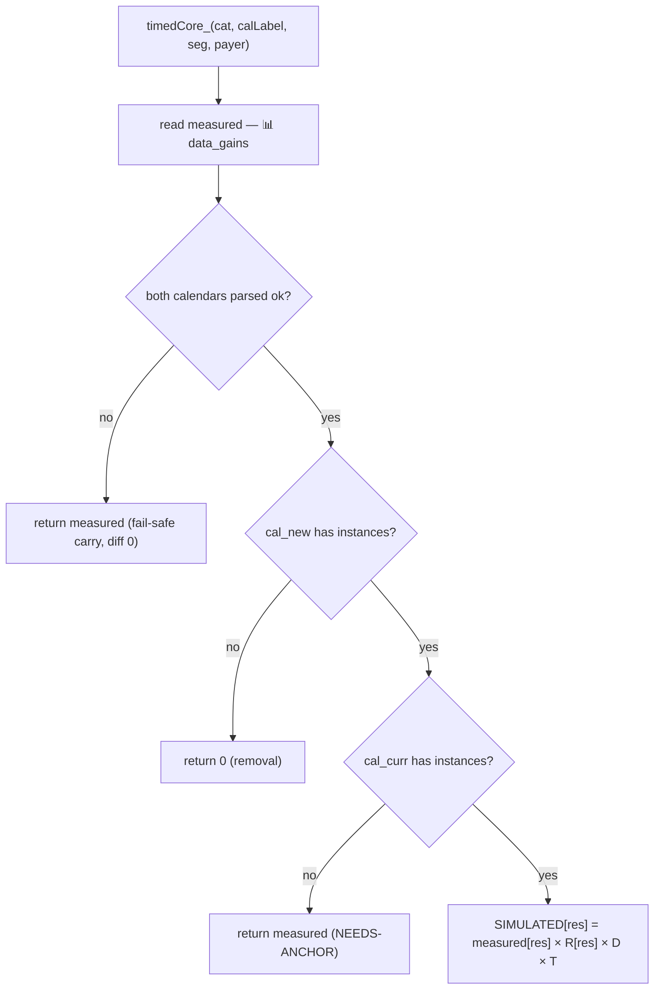

The families differ only in **what D and R are**: leaderboards force `D = 1`; collections compute D
from the accrual curve; both compute R from `data_event_inst`.

---

### 6.1 Carried sources

**Overview.** Ads, Core, Other, Season Pass (Free), Team Event, Team Race, FlowerCoop, IAPs, Flock
Flurry are not listed in `SOURCES` (or Core, which is explicitly carried) — nothing about them
changed in the redesign, so SIMULATED = [measured](#measured) and DIFF = 0. Flock Flurry is carried
in the gains but still *scheduled*, so `ECOGAINS_CAL_STATS` shows its cadence.

**Flow.**
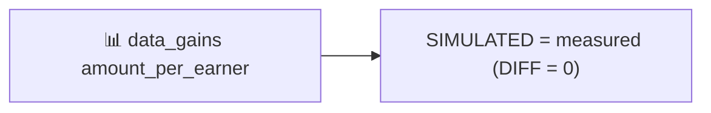

**Step by step.** `resultRow_` finds no simulator in `SOURCES` → returns
`measuredRow_(cat, seg, payer)` = [measured](#measured) unchanged.

---

### 6.2 Core & Saga

**Overview.** `data_gains` splits base-game progression into **Core** (`chapter_complete`,
`PlayerLevelUpChest` — unchanged → carried) and **Saga** (`SagaPath` / `SagaChestRewards` — the nerf
line). Both are always-on, so [D](#d-duration-multiplier) = [T](#t-cadence-and-reach) = 1; only a
per-resource config ratio moves Saga.

**Flow.**
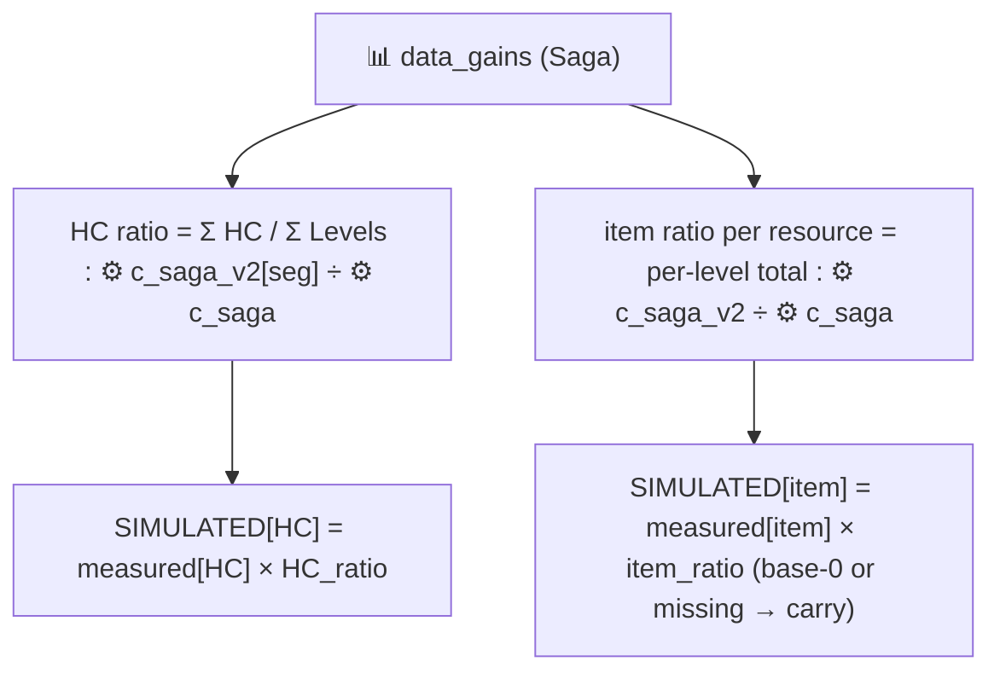

**Step by step (`simSaga`).**
1. **measured** ← 📊 `data_gains` for `Saga`.
2. **HC ratio** = `sagaCycleAvg_(v2) / sagaCycleAvg_(base)` where `cycleAvg = Σ HC_reward / Σ Levels_req`
   over the node ladder. Base ladder ← ⚙️ `c_saga`; v2 ladder ← ⚙️ `c_saga_v2` **segment column pair**
   (config-segmented D14; `readSagaV2_(seg)` picks the segment's own columns). Today ≈ 0.357.
3. **item ratios** (`sagaItemRatios_`) = `Σ v2 item / Σ base item` per level, from the per-node item
   columns (SPT..Unlimited Bomb) on both ⚙️ sheets. Column missing in v2 → **carry** (don't zero on a
   layout edit); base total 0 → **carry** (no anchor; a new saga item needs bottom-up).
4. `SIMULATED[HC] = measured[HC] × HC_ratio`; `SIMULATED[item] = measured[item] × item_ratio` (else
   measured). Core just returns measured.

---

### 6.3 Daily Gift

**Overview.** A 7-day login ladder whose HC values were re-tuned in v2. Always-on
([D](#d-duration-multiplier) = [T](#t-cadence-and-reach) = 1); only HC moves, weighted by how likely
each login-streak day is reached.

**Flow.**
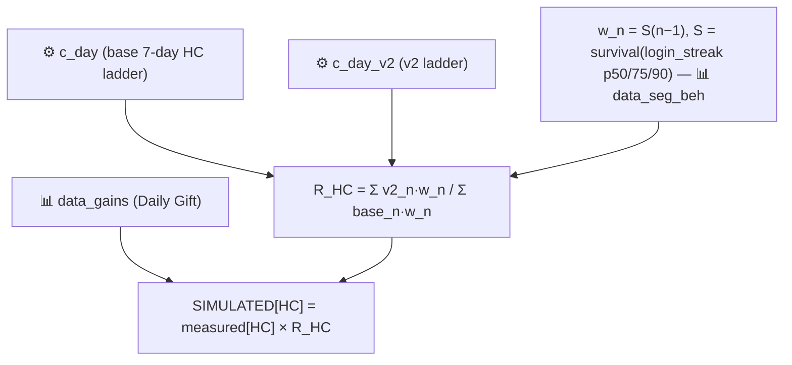

**Step by step (`simDailyGift` / `dailyGiftRatio_`).**
1. Read base and v2 ladders ← ⚙️ `c_day` / `c_day_v2`. If identical → R = 1.
2. Build [S](#s-survival-function) over `login_streak_p50/75/90` (📊 `data_seg_beh`). Weight
   `w_n = P(login streak ≥ n) = S(n−1)` for day `n = 1..7`.
3. `R_HC = Σ_n (v2_n · w_n) / Σ_n (base_n · w_n)`. Day 7's untouched 100 HC shields long-streak
   players; low-streak segments eat more of the nerf (R ≈ 0.74 @0-9 NP vs a naive 0.835).
4. `SIMULATED[HC] = measured[HC] × R_HC`; other resources = measured.

---

### 6.4 Score-based leaderboards: Kite Festival & Target Day

**Overview.** Both are **score events** — you accumulate a score/target across an instance and are
paid at instance end. **Kite Festival** pays by **rank in a zero-sum league of 60** (fixed pot
875 HC/league); **Target Day** is structurally a milestone+leaderboard hybrid, but its milestone
ladder pays 0 by design today (decision D3), so it is simulated as a **pure leaderboard**. Both pin
[D](#d-duration-multiplier) = 1 — rank/target payouts are end-state, so a longer instance barely
moves what a given placement earns — and let [T](#t-cadence-and-reach) carry the calendar movement
and [R](#r-reward-ratio) carry reward-ladder edits. They share the exact leaderboard code path with
[§6.5](#65-rank-leaderboards-bombs--chucks--reds-challenge-level-race-flash-race); the only structural
difference is that Kite's R also prices a **score-milestone term**.

*Why they are grouped apart from §6.5:* these two are the "score/target" events (a score axis the
player pushes), whereas §6.5 events are pure rank races. The PBP sim likewise calls them "score
events".

**Data at a glance:** 📊 `data_gains` (measured) · 📊 `data_seg_beh` (T) · 📊 `data_event_inst`
(`position_pXX` ranks + `final_balance_pXX` for Kite's score term) · ⚙️ `TaD`/`TaD_v2`, `Ki`/`Ki_v2`
(ladders) · 🗓️ `cal_curr`/`cal_new`.

**Flow.**
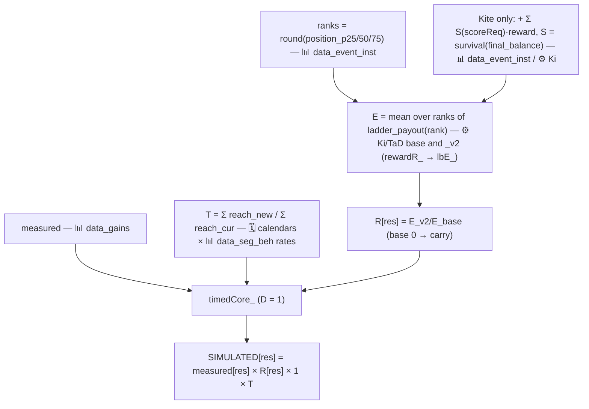

**Step by step.**
1. `simKiteFestival` / `simTargetDay` → `leaderboardSim_` → `timedCore_` with the D-function pinned to
   return **1**.
2. **measured** ← 📊 `data_gains`. Apply the shared `timedCore_` branch logic (removal / carry / both).
3. **[T](#t-cadence-and-reach)** from 🗓️ `cal_curr`/`cal_new` reach sums (📊 `data_seg_beh` rates).
   Target Day's 3×7d → 15×1d gives T ≈ 1.8 (15 one-day boards = 15 rank chances); Kite's 3×7d → 5×3d
   gives T ≈ 1.3.
4. **[R](#r-reward-ratio)** (`rewardR_` → `lbE_`): read `inst = ds.eventInst(name, seg, payer)` ← 📊
   `data_event_inst`. Ranks = `round(position_p25/50/75)`, each `max(1, ·)`. Build the ladder from ⚙️
   `Ki`/`TaD` (rows keyed by their position cell, ordinal fallback). `E = mean over the ranks of
   ladder_payout(rank)`, computed for base and `_v2`. **Kite additionally** adds
   `Σ_ms S(scoreReq_ms) × reward_ms` with [S](#s-survival-function) over `final_balance_p25/50/75` —
   so milestone-reward edits on `Ki_v2` flow. `R[res] = E_v2[res] / E_base[res]` (base 0 → carry).
5. `SIMULATED[res] = measured[res] × R[res] × 1 × T`.

**Zero semantics.** Low segments legitimately earn 0 HC (they never place top-3) — check booster
columns before declaring a row dead. **If TaD milestones ever pay rewards,** it must move to the
milestone family with a cumulative-SCORE-by-day curve (the generic token curve saturates day 1 and
would double-count — the original "Target Day is broken" bug).

---

### 6.5 Rank leaderboards: Bomb's / Chuck's / Red's Challenge, Level Race, Flash Race

**Overview.** Pure rank races: your payout depends on where you **place** against other players, from
a fixed top-N pot, not on absolute accumulation. [D](#d-duration-multiplier) = 1 (rank is relative —
if everyone gets an extra day, everyone scores more but ranks barely move).
[T](#t-cadence-and-reach) carries cadence/reach; [R](#r-reward-ratio) carries rank-ladder reward
edits. Same code path as [§6.4](#64-score-based-leaderboards-kite-festival--target-day) minus the
score-milestone term.

**Data at a glance:** 📊 `data_gains` (measured) · 📊 `data_seg_beh` (T) · 📊 `data_event_inst`
(`position_pXX`) · ⚙️ `Race`/`Race_v2` (all five share this sheet, different row blocks) · 🗓️
calendars.

**Flow.**
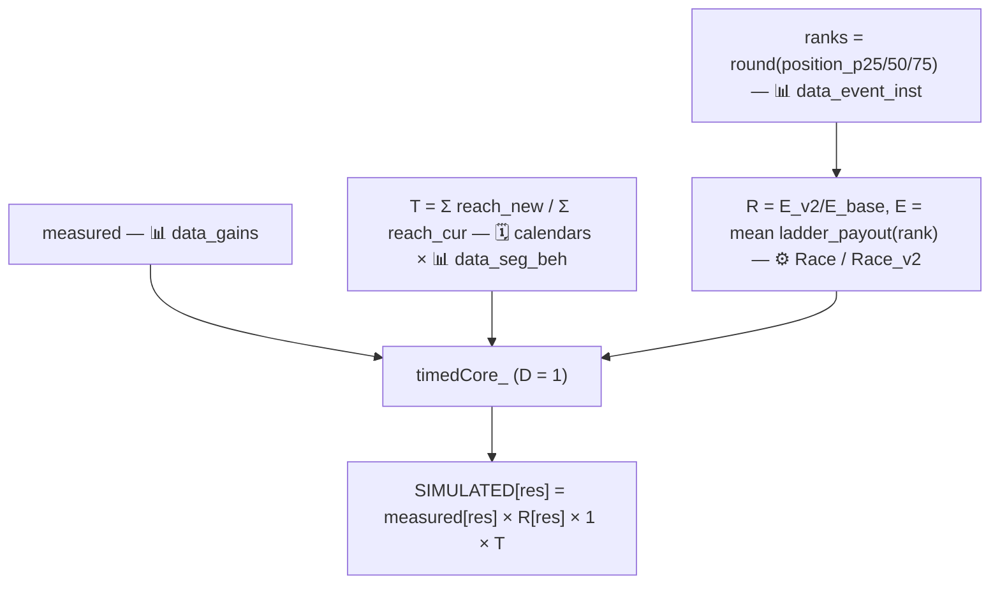

**Step by step.** Identical to [§6.4](#64-score-based-leaderboards-kite-festival--target-day) steps
1–5, except `lbE_` reads the ⚙️ `Race`/`Race_v2` block for the event and there is **no**
score-milestone term. Worked T values: Bomb 0.86, Chuck 0.69, Red 1.30, Level 0.86, Flash 0.99
(@0-9). Flash Race legitimately sims ≈0 in HC — it pays **SPT**, outside the 11 resources.

**Zero semantics.** As §6.4: HC 0 for a low segment with nonzero boosters is real rank economics.
Flash Race ≈ 0 everywhere is real (SPT).

---

### 6.6 Collections: Hatchling Hideaway, Jigsaw, Bomb's Ballet, Photoshoot

**Overview.** Accumulation-gated (bank enough tokens/progress to claim milestones) but **live with
full telemetry**, so they are anchored: `measured × R × D × T`. Unlike leaderboards, **duration
matters** — a shorter instance means less time to accumulate — and it enters through the
[D](#d-duration-multiplier) accrual curve. [R](#r-reward-ratio) uses the collection flavour
(survival over progress), so both reward and requirement edits move the sim.

**Data at a glance:** 📊 `data_gains` (measured) · 📊 `data_seg_beh` (T) · 📊 `data_event_accrual`
(D curve) · 📊 `data_event_inst` (`final_balance_pXX` progress) · ⚙️ `HH`/`J`/`BB`/`Ph` + `_v2`
(milestone ladders + requirements) · 🗓️ calendars.

**Flow.**
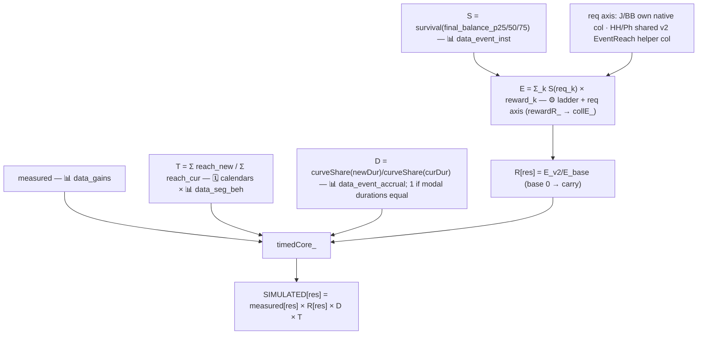

**Step by step.**
1. `simHatchlingHideaway` / `simJigsaw` / `simBombsBallet` / `simPhotoshoot` → `collectionSim_` →
   `timedCore_` with the D-function = `accrualD_` (returns 1 when [modal durations](#modaldur) are
   equal).
2. **measured** ← 📊 `data_gains`; apply `timedCore_` branch logic.
3. **[T](#t-cadence-and-reach)** from 🗓️ calendars + 📊 `data_seg_beh`.
4. **[D](#d-duration-multiplier)** = `curveShare(newDur) / curveShare(curDur)` from the 📊
   `data_event_accrual` curve for this event/payer/segment (`0-9` fallback), normalised at the
   current modal duration. Worked: HH 1.16-with-D=1 (its 3→4 day curve saturates), Bomb's Ballet
   0.94, Jigsaw 0.86, Photoshoot 0.91.
5. **[R](#r-reward-ratio)** (`rewardR_` → `collE_`): [S](#s-survival-function) = survival over
   `final_balance_p25/50/75` (📊 `data_event_inst`); `E = Σ_k S(req_k) × reward_k`. Requirement axis:
   **Jigsaw / Bomb's Ballet** read each ⚙️ sheet's **own native req column** (req edits flow fully);
   **Hatchling Hideaway / Photoshoot** have no native cumulative req column on the base sheet, so
   **both sides use the ⚙️ `_v2` EventReach helper column** as the req axis (reward edits flow; req
   edits only re-weight — flagged). Bomb's Ballet also adds a **completion row** gated at the last
   milestone's req. `R[res] = E_v2[res] / E_base[res]` (base 0 → carry).
6. `SIMULATED[res] = measured[res] × R[res] × D × T`.

**Notes / flags.** HH's endless gate is *inside* the measured number and the D curve, but the p50
curve can't see tail loopers on an added day. Photoshoot has n=1 instance on both calendars, so its T
is placement-noise-sensitive.

---

### 6.7 Night Sky

> **Status: RE-WIRED 2026-07-06 but SHIPPED OFF** behind `NS_SIMULATE = false` in
> `EcoGainsSim_v4.gs`. The re-wired bottom-up model **overestimates** actual NS gains even with
> unchanged configs (cause not yet investigated — [open flag](#11-open-work--standing-flags)), so NS
> is **carried** (= measured, diff 0) in all three views until the flag is flipped. The machinery
> below is what runs when `NS_SIMULATE = true`.

**Overview.** A daily-reset win-streak ladder (config-segmented, D14) run as an **A/B test**, so the
measured value is test-diluted and is **not** a valid anchor — hence bottom-up. Night Sky is a
*rate* (resets every day), so it is priced per active day and multiplied by the expected number of
active days.

**Flow.**
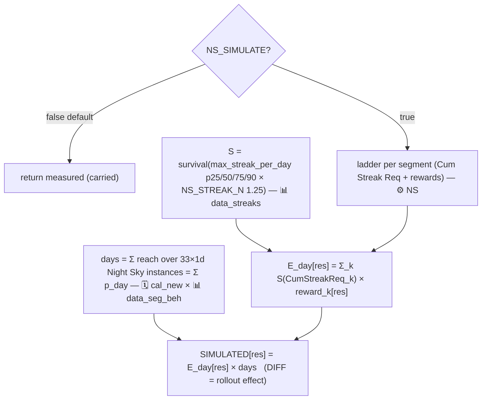

**Step by step (`simNightSky`, when ON).**
1. If `NS_SIMULATE = false` → return [measured](#measured) (the shipped default).
2. **ladder** ← ⚙️ `NS`, the segment's own 3-milestone block (`readNSLadder_(seg)`, gate column
   `Cum Streak Req`).
3. **streak** ← 📊 `data_streaks` `max_streak_per_day_p25/50/75/90`. Build [S](#s-survival-function)
   over each percentile × [NS_STREAK_N](#ns_streak_n) (= 1.25).
4. **[E_day](#e-and-e_day)** = `Σ_k S(CumStreakReq_k) × reward_k` (cumulative gating, honest — no free
   milestone).
5. **days** = `reachSum_` over 🗓️ `cal_new`'s 33 one-day Night Sky instances (📊 `data_seg_beh`
   rates) = `Σ p_day` = expected active days.
6. `SIMULATED[res] = E_day[res] × days`. Because measured is A/B-diluted, **DIFF = full-rollout − diluted
   measured = the ROLLOUT EFFECT** (labelled in-sheet, not a redesign delta). Tail past p90 accepted
   as-is; the harness prints the `S = 0 beyond p90 × N` conservative bound alongside. E_day is
   monotonic in segment, but the window TOTAL legitimately dips for 100+ (their measured `Σ p_day` is
   lower than 40-99's).

---

### 6.8 Rainbow Maker

**Overview.** A brand-new milestone event (accumulate matchables, claim thresholds) with **no
measured anchor**, so bottom-up survival-weighted, per instance, over the matchables distribution.

**Flow.**
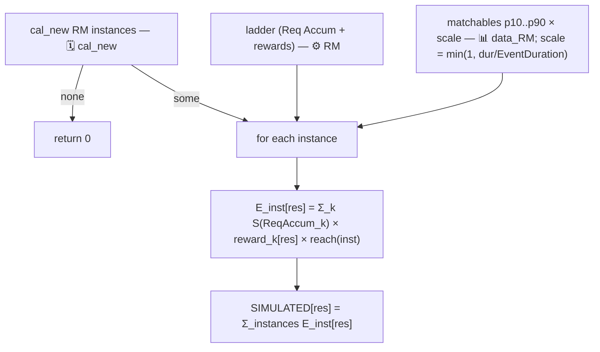

**Step by step (`simRainbowMaker`).**
1. instances ← 🗓️ `cal_new['Rainbow Maker']`; none → 0.
2. ladder ← ⚙️ `RM` (`Req Accum` gate); matchables `pct` ← 📊 `data_RM`; `cfgDur` ← ⚙️ `RM`
   `EventDuration` (default 4).
3. Per instance: `scale = min(1, inst.dur / cfgDur)` (a clipped 2-day instance halves the matchables
   axis — flagged linear assumption). Build [S](#s-survival-function) over `p10..p90 × scale`.
   `reach = ` [reach(inst)](#reach-and-p_day) (📊 `data_seg_beh`).
4. `E_inst[res] = Σ_k S(ReqAccum_k) × reward_k[res] × reach`; sum over instances.
5. **Tail sensitivity:** milestones past p90 (e.g. m30 = 1000 HC for 100+) are priced by the
   extrapolated tail — always report the conservative `S = 0 beyond p90` bound too.

---

### 6.9 River Rush

**Overview.** A real simulator on the generic collection path that today evaluates to **removal**:
`cal_new` has 0 River Rush instances, so the `timedCore_` removal branch returns 0 and
DIFF = −measured (up to −102.6 HC/earner @100+ NP).

**Flow.**
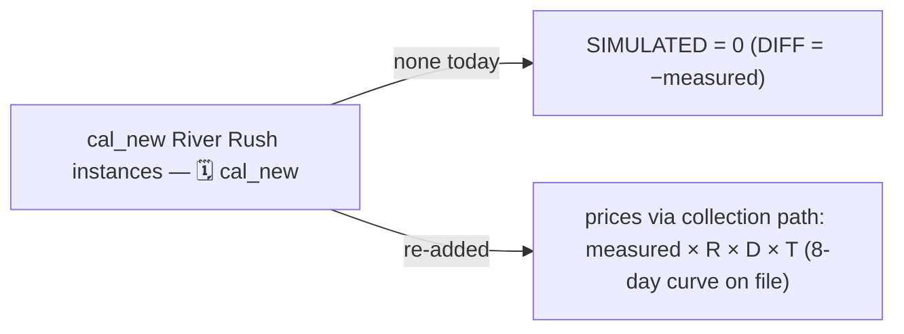

**Step by step.** `simRiverRush` → `collectionSim_`. Re-adding River Rush instances to both calendars
re-prices it with **no code change** (its 8-day 📊 `data_event_accrual` curve already exists); instances
in `cal_new` only would flag NEEDS-ANCHOR and carry.

---

### 6.10 A. 0 appendix

**Overview.** A.0 players barely play and have **no behaviour / accrual / streak / matchables data**,
so `ECOGAINS_SIM(payer, 'A. 0')` returns an appendix row set: everything carried at measured value
**except config-only changes**.

**Flow.**
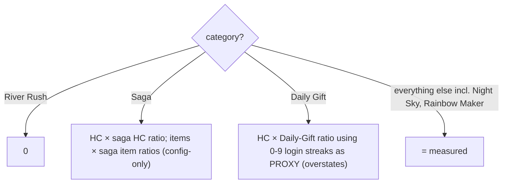

**Step by step (`appendixRow_`).** River Rush → 0 (universal removal). Saga → apply the
[§6.2](#62-core--saga) HC + item ratios to measured. Daily Gift → apply the [§6.3](#63-daily-gift)
ratio computed from **0-9** login streaks as a proxy (flagged: overstates A.0's remaining gains).
Everything else, including Night Sky and Rainbow Maker, carries measured.

---

# Part C — Views, plumbing, verification

## 7. The per-day view (`EcoGainsSim_Daily.gs`) — allocation, not re-simulation

`ECOGAINS_DAILY(payer, segment, source, block)` (block = CURRENT | NEW | DIFF) spills 33×11. It
re-uses the engine's window totals (CURRENT = measured, NEW = simulated) and ONLY distributes them
over days — column sums reconcile with the main sim to ~1e-13. "Claim-day realistic" rules:

| Source type | Instance split | Within-instance placement |
|---|---|---|
| leaderboard (incl. Kite, Target Day) | ∝ [reach(inst)](#reach-and-p_day) | **all on the LAST day** (rank rewards at event end) |
| collections | ∝ reach(inst) | accrual-curve **marginal** share/day (`share(d) − share(d−1)`) |
| Rainbow Maker | ∝ reach(inst) | ∝ [p_day](#reach-and-p_day) within instance (no curve — flagged) |
| Core/Saga/Daily Gift | — | every day ∝ p_day |
| Night Sky | — | over its 33×1d instances ∝ p_day (carried while `NS_SIMULATE = false`) |
| non-calendar (Ads, Teams, SP, Other, IAPs; River Rush current side) | — | flat ÷33 (diff uniform) |

Expected reading: weekday/weekend texture from always-on sources, end-day spikes from leaderboard
instances, RM/collection humps across instance days.

---

## 8. Display & recalculation plumbing (Google Sheets specifics an LLM must know)

- **Custom functions only re-run when their ARGUMENTS change**, and results are cached on argument
  values. `SpreadsheetApp` reads inside the function are invisible to the dependency graph, so config
  edits don't recalc by themselves. Solution: `AUTO_REFRESH = true` (top of engine) + a simple
  `onEdit` trigger watching every input sheet (`REFRESH_WATCH`, which now includes `data_streaks` and
  `data_event_inst`) → `refreshSims_()` clears and re-sets every `ECOGAINS_` formula on
  `REFRESH_SHEETS = ['EcoGainsSim_HC','EcoGainsSim_Daily']`. Calendar MERGE edits fire no trigger →
  the Precompute menu action refreshes instead. Manual: menu ▸ Refresh simulations.
- **Custom functions & spills:** `ECOGAINS_SIM/ECOGAINS_DIFF(payer, segment)` spill 25×11 per segment
  block (blocks anchored at `$B$6/35/64/93/122/151`, the last being A. 0);
  `ECOGAINS_CAL_STATS("cal_curr"|"cal_new")` spills 25×2 (instance count, total event-days — REAL
  days) for the AB:AC / AE:AF columns. Spill target ranges must be empty.
- **`SimPerSegmentFill.gs`** is deliberately NOT a custom function: `fillSimPerSegment()` (menu ▸ Fill
  Sim per Segment) writes the grouped rollup (PAID/ADS/CORE/META × segments × payers × 11 resources,
  `SPS_GROUPS` editable at the top) as static values + Total/Δ formulas.
- **Sheet-generation:** display sheets are generated by Python/openpyxl builders (`builders/_build_*.py`)
  and imported into the Google workbook. Google-only formulas (LET, custom functions) are written as
  strings and only compute after import.
- **Apps Script namespace:** one global scope across all project files; duplicate function names
  silently override (file order decides). Never re-define engine names in helper files.

---

## 9. Zero-value semantics (debugging decision table)

| Observation | Verdict |
|---|---|
| Event HC = 0 for a low segment, boosters nonzero | REAL (rank-gated economics) |
| Flash Race ≈ 0 everywhere | REAL (pays SPT, outside the 11 resources) |
| Missing `data_gains` row | REAL measured 0 (query emits only >0) |
| River Rush SIMULATED = 0, diff = −measured | SPEC (removed from cal_new) |
| Night Sky diff = 0 everywhere | EXPECTED (`NS_SIMULATE = false` — carried) |
| A source with measured>0 sims 0 and it's not River Rush | BUG — check calendar labels, `cal_parsed` staleness, seg/payer labels |
| EVERY timed event = measured (diff 0) at once | calendar parse fail-safe engaged — run Precompute; check the Kite canary (must GROW) |
| Whole segment block zero | segment tag cell / label mismatch (`SEG_TO_GAINS`), or data sheet headers not on row 1 |
| `.length of undefined` errors | duplicate function name in another project file (§8) |

---

## 10. Verification workflow (do this after ANY engine change)

Offline Node harness (no Sheets needed): `python harness/_dump_mockdata.py` dumps the workbook to
`_mockdata.json` (sheets: `data_*`, config pairs incl. **both base and `_v2`** for the R term, RM,
NS, calendars with merges); `_mock_run.js` / `_mock_daily.js` / `_mock_pbp.js` mock `SpreadsheetApp`
and `eval` the `.gs` files. Checks that must stay green:
- **Gates** (plan §5): Bomb T≈0.86, Chuck 0.69, Red 1.30, Level 0.86, Flash 0.99, TaD 1.81, HH D=1,
  BB D 0.94, Jigsaw 0.86, Photoshoot 0.91, saga HC ratio 0.357 + item ratios, Daily Gift R 0.74@0-9,
  **Kite = measured × T (canary GROWS)**.
- **Conservation:** measured Core + Saga = old Core (88.16 @0-9 NP); daily columns sum to window
  totals (~1e-13); Σ single-source daily series = ALL.
- **Placement:** Kite/Target Day pay only on instance last days; RM only on its instance days; NS
  daily.
- **R gates** (2026-07-06 R term): R == 1 exactly for every event with untouched v2 configs;
  Kite == measured × T exactly; `TaD_v2` Coins ×2 → Target Day HC ×2; `J_v2` Coins ×0.5 → Jigsaw HC
  ×0.5; `J_v2` reqs ×10 → Jigsaw HC collapses (requirement edits flow); `Race_v2` Red Coins = 0 →
  Red Challenge HC 0; all mutations restore to baseline.
- **NS gates** (behind the switch): default OFF → NS carried (diff 0) for every segment; flip ON →
  simulated NS HC nonzero, E_day monotonic in segment (window TOTAL not asserted monotone), NS still
  carried for A. 0, daily NS sums == the simulated 33-day NS row, PBP seed-averaged Sampled NS ≈ E_day.
- **Collision resilience:** engine results identical when a foreign `{start,end,dur}` parser overrides
  `parseCalendarInstances_`.

---

## 11. Open work & standing flags

1. **Night Sky: RE-WIRED but SHIPPED OFF** (`NS_SIMULATE = false`). OPEN: the model overestimates
   actual NS gains even without config changes (cause not investigated — candidates: the N=1.25
   factor, the every-milestone-daily assumption, the linear tail). Also: N uniform across
   segments/payers; tail past p90 as-is; A/B-arm telemetry unused for validation.
2. **Target Day:** if milestones ever pay, build the cumulative-SCORE-by-day curve and move it to the
   milestone family; reconcile its calendar (7d) vs data (`instance_length = 2`) duration.
3. **Level Race:** no accrual curve (D forced 1 — fine for rank rewards, revisit if ever priced on D).
4. **Rainbow Maker:** per-instance vs per-window interpretation of `data_RM` (verify); 2-day ×0.5
   linear scaling; tail sensitivity (report both bounds).
5. **HH endless gate:** p50 curve can't see tail loopers on an added day (§6.6).
6. **Photoshoot:** n=1 instance both calendars → T is placement-noise-sensitive.
7. **Saga items:** base-0 → v2-positive additions carried (need bottom-up if it ever happens); same
   rule for base-0 → v2-positive on any `_v2` reward ladder (e.g. new TaD milestone rewards).
8. **A. 0 appendix:** Daily Gift ratio uses the 0-9 streak proxy (overstates their remaining gains).
9. Measured anchors reflect a specific telemetry window; re-running the SQL refreshes the world —
   labels/headers must stay stable. Note the Athena 0–9999 currency-gain cap and that Night Sky logs
   as *Dream Heist*.

---

## 12. Play-by-play session sim (`EcoGainsSim_PBP.gs` — the EcoGainsSim_PlybyPly sheet)

A different lens on the same data: ONE typical `(segment × payer)` player, ONE calendar day,
simulated play by play, to show how concurrently-running events interact inside a session. Requires
`EcoGainsSim_v4.gs` (Context, calendars, ladder readers, `NS_STREAK_N`, `NS_SIMULATE`) plus workbook
(6) with `data_streaks` and `data_event_inst`.

**Custom functions** (all spill, header row included):
- `ECOGAINS_PBP(calendar, day, segment, payer, mode, luck, seed, [levels], [startLevel])` — the
  22-column ledger, ONE CLAIM PER ROW: **S block** (session-start claims: Daily Gift, Flock Flurry
  60-min UL opt-in) + **N play rows** + **E block** (day-end claims: leaderboard payouts + Night Sky
  nightly milestones) + Session Summary per source × 11 resources.
- `ECOGAINS_PBP_EVENTS(...)` — the Active Events table (6 columns).
- `ECOGAINS_PBP_PROFILE(segment, payer)` — the 7-row behaviour block with plain-language notes.

**Model.** N plays / win rate p / streak persistence q from 📊 `data_streaks`
(`attempts_per_day_mean`, `win_rate_mean`, `p_continue_after_win`). Win draws: 2-state Markov chain,
`P(W|W)=q`, `P(W|L)` solved so the stationary rate is p. Expected mode builds a deterministic
representative day (win quota N×p in runs of `mean_streak_len`); Sampled uses a seeded mulberry32
PRNG. Event progress at session start = `final_balance_pXX` (Luck dial) × accrual-curve `share(k−1)`.

**Per-win earning is MECHANICAL where documented:** Hatchling Hideaway 1.5 tokens/win; Bomb's Ballet
`tokensPerLevel` (5) on first-try wins only; Jigsaw completion-bonus tiers 3/5/7/10; Photoshoot
first-try streak multiplier ×1/2/4/6/10 calibrated to the measured day total; Rainbow Maker per-win
matchables rounded. Saga pays the **FULL node bundle** (HC + boosters + UL minutes) from
`c_saga`/`c_saga_v2`. Daily Gift is **ALWAYS claimed** at S (one concrete config variant, never an
average). Score events (Kite, Target Day) stay streak-driven with their config step ladders, scaled
to hit the measured day target. Leaderboard payouts land on E only for instances ending that day, at
the Luck percentile of `position_pXX`.

**Night Sky (re-wired 2026-07-06; gated on `NS_SIMULATE`, default OFF → no NS claims anywhere):** pays
on the E row — effective streak = base × [NS_STREAK_N](#ns_streak_n) (1.25); base =
`max_streak_per_day_p50` (Expected) or the trace's longest realized win run (Sampled). EVERY milestone
whose `Cum Streak Req` is cleared pays, each on its own row (honest cumulative gate). Seed-averaging
Sampled NS reproduces the 33-day sim's per-active-day E_day (within the harness's ×0.5..×2 gate).

**Verification:** `python harness/_dump_mockdata.py && node harness/_mock_pbp.js` — ~32 checks incl.
determinism per seed, TOTAL == sum of ledger bundles == final inventory, mechanical accrual texts, and
the NS switch (default-off no-claims + flipped-on pays-all-reached).

**Display sheet:** `display/EcoGainsSim_PlybyPly_v6.xlsx` (`builders/_build_pbp_v6.py`), imported into
workbook (6) in the green-simulation style (Arial, no gridlines/merges/em dashes).

---

## 13. The Sim per Segment rollup (`SimPerSegmentFill.gs` — the 'Sim per Segment' sheet)

A grouped rollup of the 33-day window totals: per **resource × segment × payer**, the gains collapsed
into 4 source **groups**, plus a per-active-player **NET** view answering *"if player spend behaviour
doesn't change, what happens to the net position of this currency?"* Menu-run (`fillSimPerSegment`,
menu ▸ **Fill Sim per Segment**) — NOT a custom function, because it writes both values and formulas.
Layout built by `builders/_build_sps.py`; filled by `engine/SimPerSegmentFill.gs`.

### 13.1 Layout
One table per resource (11 tables, `PITCH = 19` rows). Each table has a **NONPAYER** block and a
**PAYER** block; each block is 5 segment rows + a **`overall`** row. Columns:

| Block | Cols | Content |
|---|---|---|
| **GAINS — current** (per earner) | C:F, **G** | the 4 groups PAID / ADS / CORE / META, **Total G = SUM** |
| **GAINS — simulated** (per earner) | I:L, **M** | same groups simulated, **Total M = SUM** |
| **GAINS — Δ** | O:S | `=sim/cur − 1` per group + total |
| **NET / active player** | **U** `cur spend` · **V** `cur net` · **W** `new net` · **X** `net Δ` | see §13.3 |

### 13.2 The gains block (per earner)
One engine pass per `(payer, segment)`: `resultRow_` (simulated) and `measuredRow_` (current) for all
25 categories. Each category is summed into its group per `SPS_GROUPS` (PAID = IAPs; ADS = Ads;
CORE = Core/Saga/Daily Gift/Night Sky; META = everything else). The two **Total** columns are the
symbols the NET block uses: **`G` = the current gains Total (column G) = Σ current groups**, and
**`M` = the simulated gains Total (column M) = Σ simulated groups**. This block is on the engine's
**per-earner** basis (`amount_per_earner`), unchanged from the original sheet.

### 13.3 The NET block — how the net payouts are derived (per ACTIVE PLAYER)
**Key modelling decision: spend is held constant.** We do *not* try to simulate how config changes
shift player spending; we ask what the net becomes **if behaviour doesn't change at all**. Everything
here is **per active player** (denominator = `unique_players`), so gains and spend are directly
nettable.

Inputs, per `(resource, segment, payer)`:
- **`gain_pp`, `spend_pp`** = current per-active-player gain / spend of the resource, from the
  📊 `data_econ` sheet (`segment | payer_flag | currency → gain_per_active_player,
  spend_per_active_player`; see `sqls/data_econ_PROMPT.md`).
- **`ratio = M / G`** = the engine's **simulated ÷ current** gains ratio for this resource, where
  **[`G`](#132-the-gains-block-per-earner) = the CURRENT gains Total** (column G on the sheet) and
  **[`M`](#132-the-gains-block-per-earner) = the SIMULATED gains Total** (column M) for this
  `(segment, payer)` — both defined in [§13.2](#132-the-gains-block-per-earner). They are per-earner
  totals, but a ratio is basis-free, so it transfers to the per-player gain. (`M/G − 1` is exactly the
  gains **Δ** shown in column S.)

Then:
```
cur_net  = gain_pp − spend_pp
new_net  = gain_pp × (M/G) − spend_pp        // gain scaled by the sim; spend UNCHANGED
net_diff = new_net − cur_net = gain_pp × (M/G − 1)
```
`cur spend` (U) = `spend_pp`; `cur net` (V) = `cur_net`; `new net` (W) = `new_net`; `net Δ` (X) is the
live formula `=W−V`. Because spend is constant, **`net_diff` equals the per-player gain change** — it
mirrors the gains Δ in ratio terms; the genuinely *new* information is the absolute **net level**
(surplus vs deficit). A negative net (spend > gain) renders in red. If `data_econ` is absent, the NET
block is left blank and the gains block still fills.

> **📐 Worked example — NET (HC, one segment).** Suppose per active player this segment currently
> **gains 700 HC** and **spends 600 HC** (from `data_econ`), and the sim nerfs HC gains so
> `M/G = 0.94`.
> - `cur_net  = 700 − 600 = +100` (net-positive: a coin faucet).
> - `new_net  = 700 × 0.94 − 600 = 658 − 600 = +58`.
> - `net_diff = 58 − 100 = −42` — the per-player coin surplus shrinks by 42.
>
> If instead gains were **40** and spend **50** (`cur_net = −10`, a deficit), the same 0.94 nerf gives
> `new_net = 40 × 0.94 − 50 = −12.4`, `net_diff = −2.4` — a deeper deficit, shown red.

### 13.4 The `overall` row (unique_players-weighted)
The last row of each payer block is the **population-weighted average** of its 5 segments, for **both**
the gains groups and the net columns:
```
overall_X = Σ_seg (X_seg × unique_players_seg) / Σ_seg unique_players_seg
```
`unique_players` comes from 📊 `data_seg_beh`. For the per-player NET columns this weighting is exactly
"the average player across all segments"; for the per-earner gains groups it is an approximation
(it weights by all players, not just earners) — accepted for a headline rollup.

### 13.5 Basis caveat (read before comparing columns)
The **GAINS** block is **per earner**; the **NET** block is **per active player**. These are different
denominators *by design* (the per-active-player basis is what makes net meaningful). So `cur_net +
cur_spend` does **not** equal the per-earner `Total G` — they are on different bases, labelled
accordingly on the sheet.

### 13.6 Data & running it
- **New data required:** the `data_econ` sheet (per-active-player gain/spend + optional percentiles).
  `unique_players` (the overall weight) is already in `data_seg_beh` — no other data needed; the gains
  ratio comes from the engine.
- **To populate:** import the sheet, add `data_econ`, then run menu ▸ **Fill Sim per Segment**. The
  NET columns stay blank until `data_econ` exists.
